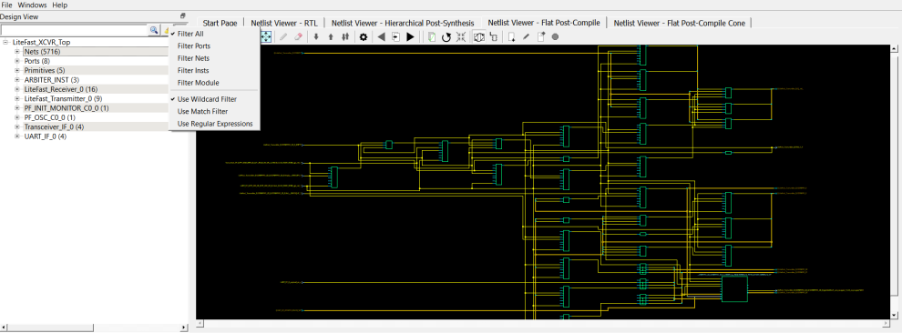

# Filter

The display of design objects in this view can be filtered based on:

-   Ports—displays all ports only, including component level ports.
-   Nets—displays all nets only, including component level nets.
-   Instances—displays all instances only, including component level instances.
-   Modules—displays all modules only.
-   Filter All—displays all design objects only.
-   Use Wildcard Filter
-   Use Match Filter
-   Use Regular Expressions

Click the **Filter** button at the top-right corner of  the Design view to filter design objects.

**Parent topic:**[Design Tree Window](GUID-F1CA73AE-851B-462A-B740-588FC80F85D7.md)

