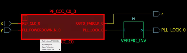
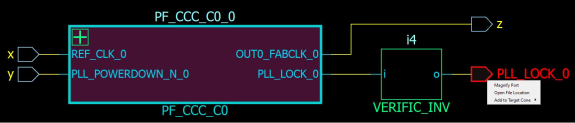

# Push

To go down one level of hierarchy in the Netlist Viewer:

1.  Click to select the instance.
2.  Click the **Push** icon on the Toolbar or right click and select **Push Instance &lt;Instance\_name&gt;** or double click a pushable instance \(not at the bottom of the design hierarchy\) to push into the instance.

**Important:** The right-mouse click push instance menu item is not available at the bottom of the design hierarchy.

You can also select one pin of an instance, and then choose **Push** from the  right click menu to move the focus to that pin. For example, if you select pin N\_972 of  UCORE and choose **Push** from the right click menu as shown in the  following figure, Netlist Viewer centers on the port corresponding to the pin you  selected as shown.

**Parent topic:**[Vertical Navigation](GUID-99ADB4D6-A6A7-4EE4-ACC4-6D7C406E74EC.md)

