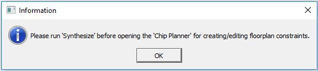
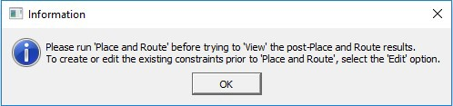
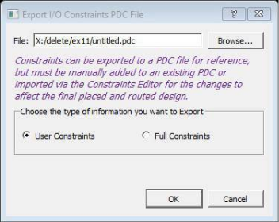
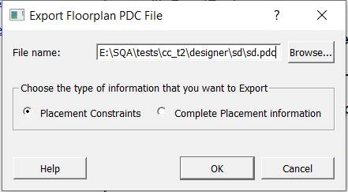

# About Chip Planner

## Supported Families and Platforms

Chip Planner supports SmartFusion® 2, IGLOO® 2, RTG4™, PolarFire®, and PolarFire SoC devices and runs  on Windows® and Linux® systems.

**Important:** Depending on the device selected, some UI elements such as icons, options, and dialog boxes may vary slightly in appearance and/or content. Basic Chip Planner functionality remains the same, regardless of the device chosen.

## Invoking Chip Planner

Invoke the Chip Planner as follows:

-   **Design Flow window &gt; Manage Constraints &gt; Open Constraints Manager view &gt; Constraint Manager &gt; Floor Planner &gt; Edit**

The **Edit**option in the Constraint Manager allows you to save or commit  your changes to PDC files.

The **View**option shows the post-Place and Route design, including the  final placement in read-only mode. The **View** option does not allow you to save or  commit changes made in Chip Planner. However, you can export physical constraints with the  **Edit** and **View** options, save them to disk, and use them later in your  design as input files, depending on the design requirements.

 

 

**Note:** Complete the Synthesis step before invoking Chip Planner from the Constraint Manager using the **Edit**option. If you try to open Chip Planner before Synthesis, the following pop-up message appears.

 

 

**Note:** Complete the Synthesis step before invoking Chip Planner from the Constraint Manager using the **View**option. If you try to open Chip Planner using the **View**option before running Place and Route, the following pop-up message appears.

 

 

## Chip Planner and PDC Commands/Files

When Chip Planner opens, only the PDC file\(s\) associated with Place and  Route are loaded into Chip Planner for reading. PDC files in your project that are not  associated with Place and Route are ignored.

When you make an I/O or floorplanning change in Chip Planner, commit and  save. The change is saved to a `*.pdc` file that you set as a target in the  Constraint Manager. If no PDC constraint file is set as target, the change is written to a  new `user.pdc` file.

If the change is related to floorplanning, the `user.pdc`  file appears in the **Floor Planner** tab. Interactive floorplanning  actions in Chip Planner have corresponding PDC commands that can be made part of a  constraint file for Place and Route.

If the change is related to I/Os, the `user.pdc` file  appears in the **I/O Attributes** tab. The I/O PDC files are located in the  `<proj>\constraints\io` folder.

The Floorplanning PDC files are located in the  `<proj>\constraints\fp` folder.

For details about Libero® SoC PDC commands, see the [PDC Commands User Guide for PolarFire FPGA](http://coredocs.s3.amazonaws.com/Libero/2025_1/Tool/pf_pdc_ug.pdf) or the [PDC Commands User Guide for SmartFusion2, IGLOO2, and RTG4](http://coredocs.s3.amazonaws.com/Libero/2025_1/Tool/pdc_ug.pdf).

Chip Planner and I/O Editor can access and write to the same PDC file\(s\).  If more than one of these tools are opened, making and saving changes from one tool is not  allowed. This behavior prevents you from overwriting the constraints in the PDC file\(s\). A  message alerts you to the modification conflict and identifies open tool\(s\) that must be  closed.

To fix the modification conflict:

1. Close all tools except one.

2. Make the changes in the tool, and then save them.

### Export Physical Design Constraint \(PDC\)

Chip Planner allows you to export the physical design constraints \(I/O  Constraints and Floorplan Constraints\) of the design to a PDC file saved to any  location. Options allow you to:

-   Export the user constraints of the design.
-   Export the full constraints of the design.

    The I/O  PDC file can be exported using **File** &gt; **Export** &gt; **I/O Constraint PDC** as shown in the following figure.

    

    The `<untitled>.pdc` file can  be exported using: **File &gt; Export &gt; I/O Constraint \(PDC\) &gt; Floorplan Constraints** as shown  in the following figure.

     

    

     

