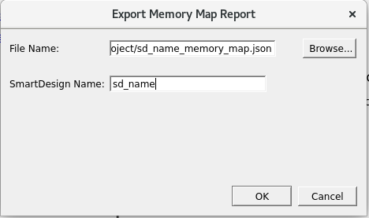

# Exporting Memory Map Report

The **Export Memory Map Report** functionality enables exporting all necessary<br /> data about BIF connections in a `.json` or `.html` file.<br /> It contains the data about the initiator pins, target pins, and their respective<br /> connections on the SmartDesign canvas. It also includes information about specified<br /> start address and range of every target BIF connected to respective initiator BIF in the<br /> processor.

To export the memory map report, perform the following steps:

1.  On the menu, click **File** &gt; **Export** &gt; **Memory Map Report**. The **Export Memory Map Report** dialog box appears.

    

2.  Click **OK**. A `.json` formatted memory map report file is created, which you can open in any text editor.

    **Note:** You can choose to export the memory map to a different location and with a different filename in either `.json` or `.html` format as required.


## Sample Memory Map Report

```
{
	"title": "Memory Map Report",
	"date": "Tue Feb  17 00:00:17 2023",
	"project_name": "MSS_ICICLE",
	"project_location": "/home/user/MSS_ICICLE",
	"SmartDesign name": "FIC_1_PERIPHERALS",
	"Initiator/Bus/Bridge/Target OffsetAddress Range HighAddress":[
	{"Node name":"AXI4mmaster0",
	"Type":"Initiator",
		"Connected Node":[
			{"Node name":"FIC_1_INITIATOR_0:AXI4mmaster0",
			"Component name":"FIC_1_INITIATOR",
			"Type":"Bus",
				"Connected Node":[
			{"Node name":"PCIE:AXI_1_SLAVE",
			"Component name":"PF_PCIE_C0",
			"Offset Address":"0x0_0000_0000",
			"Range":"256GB",
			"High Address":"0x3F_FFFF_FFFF",
			"Type":"Target"
			},
			{"Node name":"FIC_1_PERIPHERALS:AXI4mslave0",
			"Component name":"PCIE_INITIATOR",
			"Offset Address":"0x0_6000_0000",
			"Range":"126GB",
			"High Address":"0x1F_FFFF_FFFF",
			"Type":"Target"
			}				]			}		]
	}
,
	{"Node name":"PCIE:AXI_1_MASTER",
	"Component name":"PF_PCIE_C0",
	"Type":"Initiator",
		"Connected Node":[
			{"Node name":"AXI_ADDRESS_SHIM_0:AXI4_TARGET",
			"Component name":"AXI_ADDRESS_SHIM",
			"Type":"Bus"
			}		]
	}
	]
}
```

