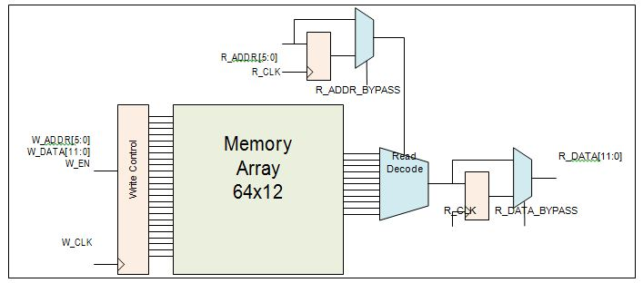

# RAM64x12

The RAM64x12 block contains 768 memory bits and is a two-port memory providing one write port and one read port. Write operations to the RAM64x12 memory are synchronous. Read operations can be asynchronous or synchronous for setting up the address and reading out the data. Enabling synchronous operation at the read-address port improves setup timing for the read-address and its enable signals. Enabling synchronous operation at the read-data port improves clock-to-out delay. Each data port on the RAM64x12 memory is configured to a fixed configuration of 64x12.

Functionality

The main features of the RAM64x12 memory block are as follows:

-   There is one read-data port and one write-data port.
-   Both read-data and write-data ports are configured to 64x12.
-   The write operation is always synchronous. The write-address, write-data and write-enable inputs are registered.
-   Setting up the read-address can be synchronous or asynchronous. The read-address registers have an independent enable, synchronous-load and asynchronous-load for synchronous mode operation, which can be bypassed for asynchronous mode operation.
-   The read-data pipeline registers have an independent enable, synchronous-load and asynchronous-load for pipeline mode operation, which can be bypassed for asynchronous mode operation.
-   Therefore, there are four read operation modes:
    -   Synchronous read-address without read-data pipeline registers \(sync-async\)
    -   Synchronous read-address with read-data pipeline registers \(sync-sync\)
    -   Asynchronous read-address with read-data pipeline registers \(async-sync\)
    -   Asynchronous read-address without read-data pipeline registers \(async-async\)
-   There is an independent clock for each port. The memory will be triggered at the rising edge of the clock.
-   Read and write on the same location at the same time results in unknown data to be read.

There is no collision prevention or detection. However, correct data is  expected to be written into the memory.

Port List

The following table gives the port descriptions.

|Pin Name|Pin Direction|Type|Description|Polarity|
|--------|-------------|----|-----------|--------|
|W\_EN|Input|Dynamic|Write port enable|High|
|W\_CLK|Input|Dynamic|Write clock. All write-address, write-data and write-enable inputs must be set up before the rising edge of the clock. The write operation begins with the rising edge.|Rising|
|W\_ADDR\[5:0\]|Input|Dynamic|Write address|—|
|W\_DATA\[11:0\]|Input|Dynamic|Write-data|—|
|BLK\_EN|Input|Dynamic|Read port block select. When High, read operation is performed. When Low, read-data will be forced to zero. BLK\_EN signal is registered through R\_CLK when R\_ADDR\_BYPASS is Low.|High|
|R\_CLK|Input|Dynamic|Read registers clock. All read-address, block- port select and read-enable inputs must be set up before the rising edge of the clock. The read operation begins with the rising edge.|Rising|
|R\_ADDR\[5:0\]|Input|Dynamic|Read-address|—|
|R\_ADDR\_BYPASS|Input|Static|Read-address and BLK\_EN register select.|Low|
|R\_ADDR\_EN|Input|Dynamic|Read-address register enable.|High|
|R\_ADDR\_SL\_N|Input|Dynamic|Read-address register synchronous load.|Low|
|R\_ADDR\_SD|Input|Static|Read-address register synchronous load data.|High|
|R\_ADDR\_AL\_N|Input|Dynamic|Read-address register asynchronous load.|Low|
|R\_ADDR\_AD\_N|Input|Static|Read-address register asynchronous load data.|Low|
|R\_DATA\[11:0\]|Output|Dynamic|Read-data|—|
|R\_DATA\_BYPASS|Input|Static|Read-data pipeline register select.|Low|
|R\_DATA\_EN|Input|Dynamic|Read-data pipeline register enable.|High|
|R\_DATA\_SL\_N|Input|Dynamic|Read-data pipeline register synchronous load.|Low|
|R\_DATA\_SD|Input|Static|Read-data pipeline register synchronous load data.|High|
|R\_DATA\_AL\_N|Input|Dynamic|Read-data pipeline register asynchronous load.|Low|
|R\_DATA\_AD\_N|Input|Dynamic|Read-data pipeline register asynchronous load data.|Low|
|BUSY\_FB|Input|Static|Lock access to FCB.|High|
|ACCESS\_BUSY|Output|Dynamic|Busy signal from FCB.|High|

**Tip:** Static inputs are defined at design time and need to be tied to 0 or 1.

Read-address and Read-data Pipeline Register Control Signals

The following table describes the functionality of the control signals on  the R\_ADDR and R\_DATA registers.

|\_AL\_N|\_AD\_N|\_BYPASS|\_CLK|\_EN|\_SL\_N|\_SD|D|Qn+1|
|-------|-------|--------|-----|----|-------|----|---|----|
|0|ADn|X|X|X|X|X|X|!ADn|
|1|X|0|Not rising|X|X|X|X|Qn|
|1|X|0|?|0|X|X|X|Qn|
|1|X|0|?|1|0|SD|X|SD|
|1|X|0|?|1|1|X|D|D|
|1|X|1|X|X|X|X|D|D|

