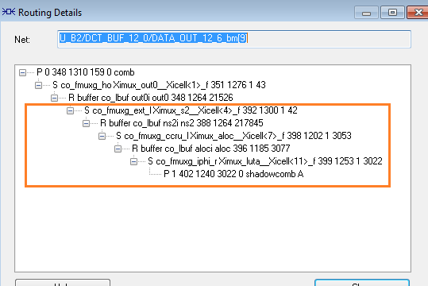

# Checking Internal Nets for a Given Block

MSVT checks the separation of internal nets corresponding to a given block from external nets as per the specified separation criteria. If any of the nets of the design fails to satisfy separation criteria, then information related to the violating net is listed in the `Checking internal nets for block <block name>` section of the report and MSVT treats this as an error. This section is empty if your design does not have any net violating separation criteria.

## MSVT Output Report

The following example shows that the internal net<br /> `block4_0/MIV_RV32IMC_C2_0/MIV_RV32IMC_C2_0/u_opsrv_0/un2_apb_mstr_int_sel`<br /> of the `block4_0` block is failing separation criteria and the net can<br /> access untrusted net<br /> `block3_0/APB_dp_fp_1/U0/i_post_norm_mul/s_frac2a_3_157` through net<br /> `block3_0/APB_dp_fp_1/U0/i_post_norm_mul/m16_4_03_0` through switches<br /> present at the specified coordinates.

## Checking internal nets for block block4\_0

```
-----------------------------------------------------------------------------------------------------------------------------------------
Checking internal nets for block block4_0 ...
====================================================================

   Net block4_0/MIV_RV32IMC_C2_0/MIV_RV32IMC_C2_0/u_opsrv_0/un2_apb_mstr_int_sel
      can be observed by cell block3_0/APB_dp_fp_1/U0/i_post_norm_mul/s_frac2a_3_157
      through net block3_0/APB_dp_fp_1/U0/i_post_norm_mul/m16_4_03_0
      with cluster separation (13,0) due to 2 failing switches:
      When a routed Mux at (1185,81) fails
      The path is also driven by  constant '1'  signal
         Through an existing routed Buffer at (1185,81)
         Through an existing routed Buffer at (1113,81)
      When a routed Mux at (1053,81) fails
      The path is also driven by  block3_0/APB_dp_fp_1/U0/i_post_norm_mul/m16_4_03_0 signal
         Through an existing routed Buffer at (1053,81)
         Through an existing routed Mux at (1055,96)
         Through an existing routed Buffer at (1055,96)
         Through an existing routed Mux at (1024,96)
         Through an existing routed Mux at (1024,96)
         Through an existing routed Buffer at (1024,96)
         Through an existing routed Mux at (1026,96)
-----------------------------------------------------------------------------------------------------------------------------------------
```

## Routing Details

You can view the routing details of the untrusted net \(“U\_B2/DCT\_BUF\_12\_0/DATA\_OUT\_12\_6\_bm\[9\]“ in the preceding example\) by viewing routing details from ChipPlanner till the point where the switch is in the ON state.



**Parent topic:**[MSVT Report Sections](GUID-85B5B29F-544B-4AC0-A737-2C4A3FBB1A97.md)

