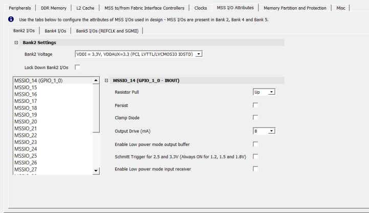
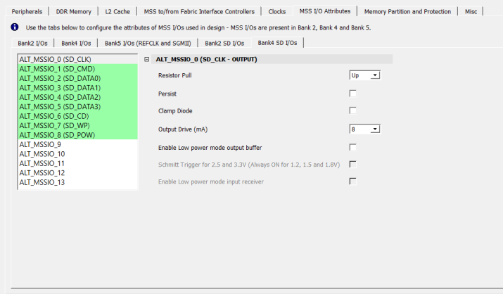
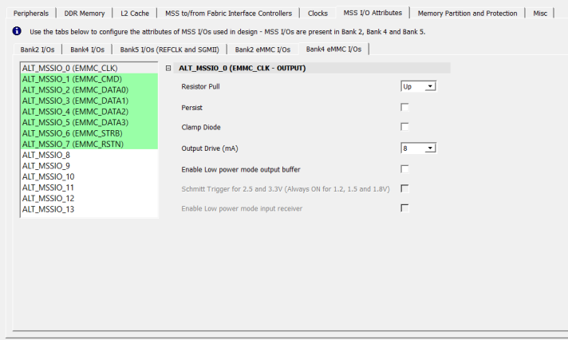
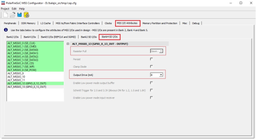

# MSS I/O Attributes

MSS I/Os are present in Bank2, Bank4, and Bank5. The following sections describe the supported  attributes for each bank.

**Parent topic:**[Using the PolarFire SoC MSS Configurator GUI](GUID-E11D45E3-7975-4122-BA81-72D6BDD0CD1A.md)

**Previous topic:**[I2C Port Configuration for Fabric I/O](GUID-0AC3B2D1-58D4-421A-8D77-DD8A57F0A773.md)

**Next topic:**[DDR Memory](GUID-A29420D1-4E36-4920-B9BB-DD0B63F5E787.md)

## Bank2 I/Os

The MSS I/Os are available across Bank2. The **Bank2 I/Os** tab allows  you to select the electrical characteristics of the MSS I/Os. Each MSS I/O along with  the settings must be enabled one-by-one.

 

 

**Note:** Enable the Lock Down Bank2 I/Os option to lock all the Bank2 MSSIOs.

The following table lists the I/O standards and the output drive.

**Important:** This is applicable to Bank2 and Bank4 MSSIOs only.

|Protocol|Speed Mode|LVCMOS Standard|Output Current Drive|Supported Out Drive Values|
|--------|----------|---------------|--------------------|--------------------------|
|USB 2.0|High|3.3V|8 mA-20 mA|8, 12, 16, and 20 mA|
|2.5V|6 mA-16 mA|6, 8, 12, and 16 mA|
|1.8V|6 mA-12 mA|6, 8, 10, and 12 mA|
|eMMC|Default speed|3.3V|3.3V =&gt; 2-20 mA|2, 4, 8, 12, 16, and 20 mA|
|1.8V|1.8V =&gt; 2-10 mA|2, 4, 6, 8, and 10 mA|
|1.2V|1.2V =&gt; 2-8 mA|2, 4, 6, and 8 mA|
|High speed|3.3V|3.3V =&gt; 4-20 mA|4, 8, 12, 16, and 20 mA|
|1.8V|1.8V =&gt; 4-10 mA|4, 6, 8, and 10 mA|
|1.2V|1.2V =&gt; 4-8 mA|4, 6, and 8 mA|
|High speed DDR|3.3V|3.3V =&gt; 2-20 mA|2, 4, 8, 12, 16, and 20 mA|
|1.8V|1.8V =&gt; 2-10 mA|2, 4, 6, 8, and 10 mA|
|1.2V|1.2V =&gt; 2-8 mA|2, 4, 6, and 8 mA|
|HS200|1.8V|1.8V =&gt; 6-10 mA|6, 8, and 10 mA|
|1.2V|1.2V =&gt; 4-8 mA|4, 6, and 8 mA|
|HS400|1.8V|1.8V =&gt; 4-10 mA|4, 6, 8, and 10 mA|
|1.2V|1.2V =&gt; 4-8 mA|4, 6, and 8 mA|
|HS400-ES|1.8V|1.8V =&gt; 4-10 mA|4, 6, 8, and 10 mA|
|1.2V|1.2V =&gt; 4-8 mA|4, 6, and 8 mA|
|SDIO|Low Speed|3.3V|2 mA-20 mA|2, 4, 8, 12, 16, and 20 mA|
|Full Speed|3.3V|2 mA-20 mA|2, 4, 8, 12, 16, and 20 mA|
|SD|Default speed|3.3V|2 mA-20 mA|2, 4, 8, 12, 16, and 20 mA|
|High speed|3.3V|4 mA-20 mA|4, 8, 12, 16, and 20 mA|
|SDR12|1.8V|2 mA-10 mA|2, 4, 6, 8, and 10 mA|
|SDR25|1.8V|4 mA-10 mA|4, 6, 8, and 10 mA|
|SDR50|1.8V|4 mA-10 mA|4, 6, 8, and 10 mA|
|DDR50|1.8V|4 mA-10 mA|4, 6, 8, and 10 mA|
|SDR104|1.8V|6 mA-10 mA|6, 8, and 10 mA|
|CAN|—|3.3V|2 mA-20 mA|2, 4, 8, 12, 16, and 20 mA|
|QSPI| |3.3V|3.3V =&gt; 8-20 mA|8, 12, 16, and 20 mA|
|2.5V|2.5V =&gt; 8-16 mA|8, 12, and 16 mA|
|1.8V|1.8V =&gt; 8-12 mA|8, 10, and 12 mA|
|1.5V|1.5V =&gt; 8-10 mA|8 mA|
|1.2V|1.2V =&gt; 6-8 mA|6 and 8 mA|
|SPI|​Initiator​|3.3V|3.3V =&gt; 8-20 mA|8, 12, 16, and 20 mA|
|2.5V|2.5V =&gt; 8-16 mA|8, 12, and 16 mA|
|1.8V|1.8V =&gt; 8-12 mA|8, 10, and 12 mA|
|1.5V|1.5V =&gt; 8-10 mA|8 mA|
|1.2V|1.2V =&gt; 6-8 mA|6 and 8 mA|
|Target|3.3V|3.3V =&gt; 8-20 mA|8, 12, 16, and 20 mA|
|2.5V|2.5V =&gt; 8-16 mA|8, 12, and 16 mA|
|1.8V|1.8V =&gt; 8-12 mA|8, 10, and 12 mA|
|1.5V|1.5V =&gt; 8 - 10 mA|8 mA|
|1.2V|1.2V =&gt; 6-8 mA|6 and 8 mA|
|MMUART|—|3.3V|3.3V =&gt; 2-20 mA|2, 4, 8, 12, 16, and 20 mA|
|2.5V|2.5V =&gt; 4-16 mA|4, 6, 8, 12, and 16 mA|
|1.8V|1.8V =&gt; 4-12 mA|4, 6, 8, 10, and 12 mA|
|I2C|Standard|3.3V|3.3V =&gt; 2-20 mA|2, 4, 8, 12, 16, and 20 mA|
|1.8V|1.8V =&gt; 2 - 10 mA|2, 4, 6, 8, and 10 mA|
|Fast|3.3V|3.3V =&gt; 2-20 mA|2, 4, 12, 16, and 20 mA|
|1.8V|1.8V =&gt; 2-10 mA|2, 4, 6, 8, and 10 mA|
|Ethernet MAC\(MDIO\)|PHY Management Interface|3.3V|3.3V =&gt; 8-20 mA|8, 12, 16, and 20 mA|
|2.5V|2.5V =&gt; 8-16 mA|8, 12, and 16 mA|
|1.8V|1.8V =&gt; 8-12 mA|8, 10 and 12 mA|
|1.5V|1.5V =&gt; 8 - 10 mA|8 mA|
|1.2V|1.2V =&gt; 6-8 mA|6 and 8 mA|
|GPIO|—|3.3V|3.3V =&gt; 2-20 mA|2, 4, 8, 12, 16, and 20 mA|
|2.5V|2.5V =&gt; 2-16 mA|2, 4, 6, 8, 12, and 16 mA|
|1.8V|1.8V =&gt; 2-12 mA|2, 4, 6, 8, 10, and 12 mA|
|1.5V|1.5V =&gt; 2-8 mA|2, 4, 6, and 8 mA|
|1.2V|1.2V =&gt; 2-8 mA|2, 4, 6, and 8 mA|

When a peripheral supports multiple speed modes, the following must be followed:

-   I/O standard check must be specific for the peripheral and the speed mode is selected.
-   Support for out drive values depends on the peripheral type, the speed mode, and the I/O standard.

## Bank4 I/Os

The MSS I/Os are available across Bank 4. The **Bank4 I/Os** tab allows you to  select the electrical characteristics of the MSS I/Os. Each MSS  I/O along with the settings must be enabled one by one.

**Important:** Enable the Lock Down Bank4 I/Os option to lock all the Bank4 MSSIOs.

## Bank5 I/Os \(REFCLK and SGMII\)

Using the Bank5 I/Os \(REFCLK and SGMII\) tab, you can select the electrical  characteristics of the Bank5 I/Os, as shown in the following figure. The tool generates  a warning in the log window for unsupported selections.

 Tab with RefClk I/O Setting Option Selected")

**Important:** Enable the Lock Down SGMII I/Os option to lock all the SGMII I/Os.

PolarFire SoC supports two full-duplex SGMII channels \(Channel0 and Channel1\). Each  channel has one RX and one TX. There are two input and two output I/Os that must be  configured for SGMII, and all I/Os are differential.

**SGMII Inputs**

MAC\_0 \(Channel0\) RX and MAC\_1 \(Channel1\) RX are inputs and have the following  options:

-   I/O Standard

    **Important:** The IOSTD must match the bank voltage in the **Refclk I/O Setting** section. For example, if the bank 5 voltage VDDI is 3.3 V, you cannot set SGMII I/Os to any IOSTD, which is 2.5 V such as LVDS25, RSDS25, MINILVDS25, SUBLVDS25, PPDS25, and LCMDS25.

-   Resistor Pull
-   VCM Range
-   On Die Termination \(Ω\)

The following figure shows the SGMII RX.

 Tab with Gigabit Ethernet MAC_0 RX Option Selected")

**SGMII RX Register Settings**

The following table lists the Channel 0/Channel 1 RX register settings.

|GUI Labels/Parameter  Name|Options|
|---------------------------------------------|-------|
|  I/O Standard |  LVDS33, LVDS25, RSDS33, RSDS25, MINILVDS33, MINILVDS25,  SUBLVDS33, SUBLVDS25, PPDS33, PPDS25, LCMDS33, LCMDS25 |
|  Resistor Pull |  None, Up, Down |
|  VCM Input Range |  MID, LOW |
|  On Die Termination \(Ohm\) |  OFF, 100 |

**SGMII Outputs**

MAC\_0 \(Channel0\) TX and MAC\_1 \(Channel1\) TX are outputs and have the following  options:

-   I/O Standard
-   Resistor Pull
-   Output Drive
-   Source Termination \(Ohm\)

The following figure shows the SGMII TX.

 Tab with Gigabit Ethernet MAC_1 TX Option Selected")

**SGMII TX Register Settings**

The following table lists the Channel 0/Channel 1 TX register settings.

|GUI Labels/Parameter  Name|Options|
|---------------------------------------------|-------|
|  I/O Standard |  LVDS33, LVDS25, RSDS33, RSDS25, MINILVDS33, MINILVDS25,  SUBLVDS33, SUBLVDS25, PPDS33, PPDS25, LCMDS33, LCMDS25 |
|  Resistor Pull |  None, Up, Down |
|  Output Drive \(mA\) |  1.5, 2, 3, 3.5, 4, 6 |
|  Source Termination \(Ohm\) |  OFF, 100 |

**SGMII Output I/O Standard Settings**

Based on the selected I/O standards, you must enforce the following DRC checks:

|I/O\_TYPE|Direction|Legal Output DRIVE  Settings \(mA\)|
|---------|---------|------------------------------------------------------|
|  LVDS33 |  Output |  6, 4, 3.5, 3 |
|  LVDS25 |Output|6, 4, 3.5, 3|
|  RSDS33 |Output|  4, 3, 2, 1.5 |
|  RSDS25 |Output|4, 3, 2, 1.5|
|  MINILVDS33 |Output|6, 4, 3.5, 3|
|  MINILVDS25 |Output|6, 4, 3.5, 3|
|  SUBLVDS33 |Output|  3, 2, 1.5, 1 |
|  SUBLVDS25 |Output|3, 2, 1.5, 1|
|  PPDS33 |Output|4, 3, 2, 1.5|
|  PPDS25 |Output|4, 3, 2, 1.5|
|  LCMDS33 |Output|6, 4, 3.5, 3|
|  LCMDS25 |Output|6, 4, 3.5, 3|

**I/O Standard and Supported Output Drive**

Voltage selection for Bank 5 must match the I/O Standard selected for TX and RX in both  channels.

Bank5 Voltage selection -&gt; VDDI = 3.3V -&gt; LVDS33 is legal but not LVDS25

|I/O\_TYPE|Legal Output DRIVE  Settings \(mA\)|
|---------|------------------------------------------------------|
|LVDS33|6, 4, 3.5,  3|
|LVDS25|6, 4, 3.5, 3|
|RSDS33|4, 3, 2,  1.5|
|RSDS25|4, 3, 2, 1.5|
|MINILVDS33|6, 4, 3.5, 3|
|MINILVDS25|6, 4, 3.5, 3|
|SUBLVDS33|3, 2, 1.5,  1|
|SUBLVDS25|3, 2, 1.5, 1|
|PPDS33|4, 3, 2, 1.5|
|PPDS25|4, 3, 2, 1.5|
|LCMDS33|6, 4, 3.5, 3|
|LCMDS25|6, 4, 3.5, 3|

## Bank2 and Bank4 I/Os Related to SD and eMMC Muxing

The eMMC and SD peripherals use the same MSS I/Os, so both peripherals cannot be active at the  same time. However, the PolarFire SoC MSS Configurator allows you to configure the  electrical characteristics of the MSS I/Os related to both peripherals when  **eMMC and SD muxing** is enabled in the  **Peripherals** tab, where one of the peripherals \(eMMC or SD\) is  active at power-up and the other peripheral is not active at power-up. The MSS I/Os  related to a peripheral that is active at power-up is listed in **Bank2 I/Os** tab and **Bank4 I/Os** tab. MSS I/Os related to  a peripheral that is not active at power-up is shown as follows:

In the highlighted tabs, you might be able to select the electrical characteristics of eMMC or SD MSS I/Os only \(electrical characteristics of MSS I/Os related to any other peripherals are grayed-out\).

-   If **eMMC and SD muxing** is selected as **Enabled \(eMMC active at Power-Up\)** in **Peripherals** tab, the  highlighted tabs will be shown to the user.

    **Important:** The eMMC MSS I/Os are listed under Bank2/Bank4 I/Os tabs, and SD MSS I/Os are listed in the highlighted tabs.

    

-   If **eMMC and SD muxing** is selected as **Enabled \(SD active at Power-Up\)** in **Peripherals** tab, the  highlighted tabs will be shown to the user.

    **Important:** The SD MSS I/Os are listed under Bank2/Bank4 I/Os tabs, and eMMC MSS I/Os are listed in the highlighted tabs.

    

    **Important:** When **eMMC and SD muxing** is enabled, the user must ensure that the required embedded software driver and fabric design support is available to dynamically switch between eMMC and SD peripherals.

When **eMMC and SD muxing** is enabled, MSSIO PADs can be configured  as Pull-Up or Pull-Down by selecting GPIOs as **Static High** or  **Static Low**. When **Static High** or  **Static Low** is selected for a GPIO in Bank 4 or Bank 2, all  the I/O attributes of the corresponding MSSIO are greyed out except **Output Drive**. **Resistor Pull** is set to  **Up** when **Static High** is selected and to  **Down** when **Static Low** is selected by  default for the corresponding MSSIOs in **Bank2 I/Os** and  **Bank4 I/Os** tab and vice versa in the **Bank2 eMMC\(SD\) I/Os** and **Bank4 eMMC\(SD\) I/Os** tab.

For example: when **Static High** is selected for  `GPIO_0_13` in the **Peripherals** tab, the  **MSSIO I/O Attributes** tab will be setup as follows:

-   Bank4 I/Os settings are shown in the following figure.

    

-   Alternate Bank4 I/Os settings are shown in the following figure.

    

