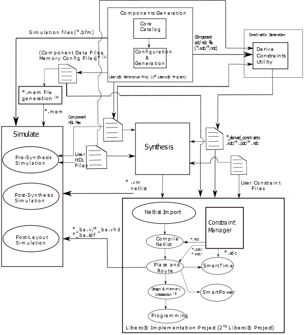

# Custom Flow

The following figure shows:

-   Libero SoC can be integrated as a part of the larger FPGA design flow with the third-party synthesis and simulation tools outside the Libero SoC environment.
-   Various steps involved in the flow, starting from design creation and stitching all the way to programming the device.
-   The data exchange \(inputs and outputs\) that must occur at each design flow step.

**Tip:**

1.  `SNVM.cfg`, `UPROM.cfg`
2.  `*.mem` file generation for Simulation: `pa4rtupromgen.exe` takes `UPROM.cfg` as input and generates `UPROM.mem`.

The following are the steps in the custom flow:

1.  Component configuration and generation:
    1.  Create a first Libero project \(to serve as a Reference Project\).
    2.  Select the Core from the Catalog. Double click the core to give it a component name and configure the component.

        This automatically exports component data and files. A  [Component Manifests](GUID-E82E32F4-E622-477E-A4C9-37BB5DE032DC.md) is also generated. See [Component Manifests](GUID-E82E32F4-E622-477E-A4C9-37BB5DE032DC.md)  for details. For more details, see [Component Configuration](GUID-FE19AAE3-578B-4B77-857E-C2796C8240F2.md).

2.  Complete your RTL design outside of Libero:
    1.  Instantiate the component HDL files.
    2.  The location of the HDL files is listed in the [Component Manifests](GUID-E82E32F4-E622-477E-A4C9-37BB5DE032DC.md) files.
3.  Generate SDC constraints for the components. Use Derive Constraints utility to generate the timing constraint file\(SDC\) based on:

    1.  Component HDL files
    2.  Component SDC files
    3.  User HDL files
    For more details, see [Appendix C—Derive Constraints](GUID-05E323D6-53B9-484F-8989-7AB23AB58F56.md).

4.  Synthesis tool/simulation tool:
    1.  Get HDL files, stimulus files, and component data from the specific locations as noted in the [Component Manifests](GUID-E82E32F4-E622-477E-A4C9-37BB5DE032DC.md).
    2.  Synthesize and simulate the design with third-party tools outside Libero SoC.
5.  Create your second \(Implementation\) Libero Project.
6.  Remove synthesis from the design flow tool chain \(**Project** &gt; **Project Settings** &gt; **Design Flow** &gt; clear the **Enable Synthesis** check box\).
7.  Import the design source files \(post-synthesis `*.vm netlist` from synthesis tool\):
    -   Import post-synthesis `*.vm` netlist \(**File**&gt;**Import**&gt; **Synthesized Verilog Netlist \(VM\)**\).
    -   Component metadata `*.cfg` files for uPROM and/or sNVM.
8.  Import any Libero SoC block component files. The block files must be in the `*.cxz` file format. For more information on how to create a block, see [PolarFire Block Flow User Guide](https://coredocs.s3.amazonaws.com/Libero/2021_3/Tool/pf_block_flow_ug.pdf).
9.  Import the design constraints:
    -   Import I/O constraint files \(**Constraints Manager** &gt; **I/OAttributes** &gt; **Import**\).
    -   Import floorplanning `*.pdc` files \(**Constraints Manager** &gt; **Floor Planner** &gt; **Import**\).
    -   Import `*.sdc` timing constraint files \(**Constraints Manager** &gt; **Timing**&gt;**Import**\). Import the SDC file generated through Derive Constraint tool.
    -   Import `*.ndc` constraint files \(**Constraints Manager** &gt; **NetlistAttributes** &gt; **Import**\), if any.
10. Constraint file and tool association
    -   In the Constraint Manager, associate the `*.pdc` files to place and route, the `*.sdc` files to place and route and timing verifications, and the `*.ndc` files to Compile Netlist.
11. Complete design implementation
    -   Place and route, verify timing and power, configure design initialization data and memories, and programming file generation.
12. Validate the design
    -   Validate the design on FPGA and debug as necessary using the design tools provided with the Libero SoC design suite.

**Parent topic:**[Overview](GUID-1BA4CB4D-FE1F-4BF9-9865-B061E5938FCA.md)

