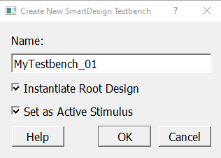
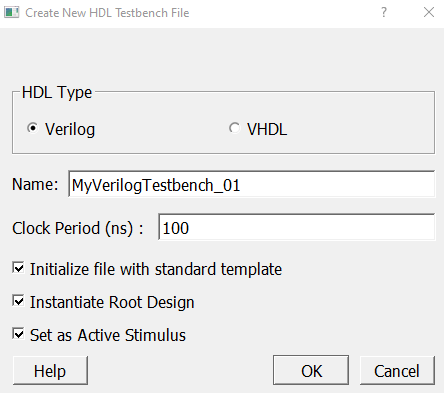

# Creating a SmartDesign Testbench

After importing or creating and generating your design, create testbenches to simulate your  design. You can create testbenches for your design in either of the following ways.

## Creating a SmartDesign Testbench

To create a SmartDesign testbench using the SmartDesign canvas, perform the following steps:

1.  Launch the **Create New SmartDesign Testbench** dialog box in either of the following ways:

    -   On the menu, click **File** &gt; **New** &gt; **SmartDesign Testbench**.
    -   On the **Design Flow** tab, double-click **Create SmartDesign Testbench**.
    **Result:** The **Create New SmartDesign Testbench** dialog box appears.

    

2.  Enter an appropriate and unique name for your design file in the **Name** box.
3.  By default, the root design is instantiated in the testbench and is set as the active stimulus for the design.
    1.  If you do not want to instantiate the root design in the testbench, deselect the **Instantiate Root Design** option. When you deselect the **Instantiate Root Design** option the **Set As Active Stimulus** option is automatically deselected and disabled.
    2.  If you do not want the testbench to serve as the active stimulus, deselect the **Set As Active Stimulus** option.
4.  Click **OK** to create the testbench. The newly created testbench appears in the **Stimulus Hierarchy** tab along with other testbenches and is displayed in the central tab of the IDE main window.

    **Result:** The testbench file is saved in a folder with the  same name as that of the testbench itself and is placed in your  `<project>\component\work\` folder.

## Creating a SmartDesign HDL Testbench Using the IDE

To create a HDL testbench using the IDE, perform the following steps:

1.  Launch the **Create New HDL Testbench file** dialog box in either of the following ways:

    -   On the menu, click **File** &gt; **New** &gt; **HDL Testbench**.
    -   On the **Design Flow** tab, double-click **Create HDL Testbench**.
    **Result:** The **Create New HDL Testbench File** dialog box appears

    

2.  By default, the preferred language to write the testbench file is set to **Verilog**. If you choose to use VHDL, select the **VHDL** option.
3.  Enter an appropriate and unique name for your testbench file in the **Name** box.
4.  Enter the clock speed you want to set for the testbench in nanoseconds \(ns\) in the **Clock Period \(ns\)** box. By default, the value is set to *100ns*.
5.  By default, the testbench is initialized with the built-in standard testbench file template, the root design is instantiated in the testbench, and the testbench is set as the active stimulus for the design.
    1.  If you choose to not use the default standard template, deselect the **Initialize file with standard template** option.
    2.  If you choose to not use the testbench to serve as the active stimulus for your design, deselect the **Set As Active Stimulus option**.
    3.  If you choose to not instantiate the root design in the testbench, deselect the **Instantiate Root Design** option. When you deselect the **Instantiate Root Design** option the **Set As Active Stimulus** option is automatically deselected and disabled.
6.  Click **OK** to create the testbench. The newly created SmartDesign HDL testbench appears in the **Stimulus Hierarchy** tab along with other testbenches and is displayed in the central tab of the IDE main window.

**Result:** The newly created SmartDesign HDL testbench is copied to your  `<project>\hdl\` folder.

