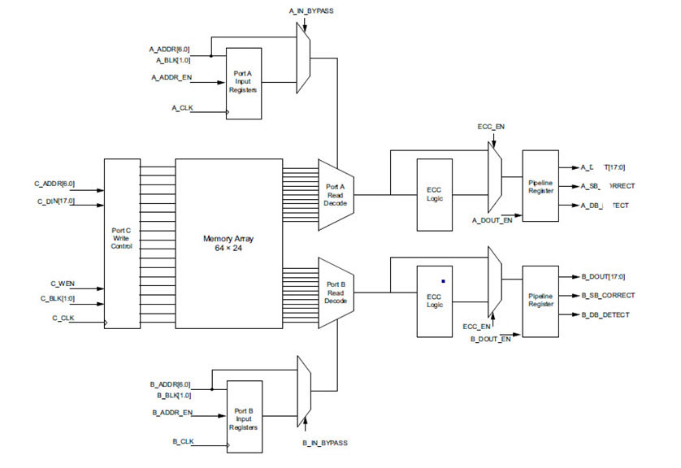

# SRAM

## RAM1K18\_RT

The RAM1K18\_RT block contains 24,576 \(18,432 with ECC\) memory bits and is a true  dual-port memory with two independent data ports A and B. The RAM1K18\_RT memory can also be  configured in two-port mode. All read/write operations to the RAM1K18\_RT memory are  synchronous. To improve the read-data delay, an optional pipeline register at the output is  available. RAM1K18\_RT also adds a Read-enable control to both dual-port and two-port modes.  The RAM1K18\_RT memory has two data ports which can be independently configured in any  combination as follows.

-   ECC Dual-Port RAM with the following configuration:
    -   1Kx18 on both ports
-   Non-ECC Dual-Port RAM with the following configurations:
    -   1Kx18 on both ports
    -   2Kx12 or 2Kx9 on both ports, but port B is read-only
    -   2Kx9 on port A, 1Kx18 on port B
-   ECC Two-Port RAM with the following configurations:
    -   Any of 512x36 or 1Kx18 on each port
-   Non-ECC Two-Port RAM with port A write, port B read:
    -   Any of 1Kx18 or 2Kx9 on each port
    -   2Kx12 on both ports
-   Non-ECC Two-Port RAM with port A read, port B write:
    -   Any of 512x36, 1Kx18, or 2Kx9 on each port

        FUNCTIONALITY

The main features of the RAM1K18\_RT memory block are as follows:

-   The address, data, block-port select, write enable and read-enable inputs are registered.
-   An optional pipeline register with a separate enable and synchronous-reset is available at the read-data port to improve the clock-to-out delay.
-   The registers in RAM1K18\_RT block have an option to mitigate Single-event transients.
-   There is an independent clock for each port. The memory will be triggered at the rising edge of the clock.
-   Read from both ports at the same location is allowed.
-   Read and write on the same location at the same time results in unknown data to be read. There is no collision prevention or detection. However, correct data are expected to be written into the memory.
-   When ECC is enabled, each port of the RAM1K18\_RT memory can raise flags to indicate single-bit-correct and double-bit-detect.

The following figure shows a simplified block diagram of the RAM1K18\_RT memory block and the following table gives the port descriptions. The simplified block illustrates the two independent data ports and the read-data pipeline registers.

|Pin Name|Pin Direction|Type|Description|Polarity|
|--------|-------------|----|-----------|--------|
|A\_ADDR\[10:0\]|Input|Dynamic|Port A address|—|
|A\_BLK\[2:0\]|Input|Dynamic|Port A block selects|High|
|A\_CLK|Input|Dynamic|Port A clock|Rising|
|A\_DIN\[17:0\]|Input|Dynamic|Port A write-data|—|
|A\_DOUT\[17:0\]|Output|Dynamic|Port A read-data|—|
|A\_WEN\[1:0\]|Input|Dynamic|Port A write-enables \(per byte\)|High|
|A\_REN|Input|Dynamic|Port A read-enable|High|
|A\_WIDTH\[1:0\]|Input|Static|Port A width/depth mode select|—|
|A\_DOUT\_BYPASS|Input|Static|Port A pipeline register select|Low|
|A\_WMODE\[1:0\]|Input|Static|Port A write mode|High|
|A\_DOUT\_EN|Input|Dynamic|Port A pipeline register enable|High|
|A\_DOUT\_SRST\_N|Input|Dynamic|Port A pipeline register synchronous-reset|Low|
|B\_ADDR\[10:0\]|Input|Dynamic|Port B address|—|
|B\_BLK\[2:0\]|Input|Dynamic|Port B block selects|High|
|B\_CLK|Input|Dynamic|Port B clock|Rising|
|B\_DIN\[17:0\]|Input|Dynamic|Port B write-data|—|
|B\_DOUT\[17:0\]|Output|Dynamic|Port B read-data|—|
|B\_WEN\[1:0\]|Input|Dynamic|Port B write-enables \(per byte\)|High|
|B\_REN|Input|Dynamic|Port B read-enable|High|
|B\_WIDTH\[1:0\]|Input|Static|Port B width/depth mode select|—|
|B\_WMODE\[1:0\]|Input|Static|Port B write mode|High|
|B\_DOUT\_BYPASS|Input|Static|Port B pipeline register select|Low|
|B\_DOUT\_EN|Input|Dynamic|Port B pipeline register enable|High|
|B\_DOUT\_SRST\_N|Input|Dynamic|Port B pipeline register synchronous-reset|Low|
|ARST\_N|Input|Global|Pipeline registers asynchronous-reset|Low|
|ECC|Input|Static|Enable ECC|High|
|ECC\_DOUT\_BYPASS|Input|Static|ECC pipeline register select|Low|
|A\_SB\_CORRECT|Output|Dynamic|Port A single-bit correct flag|High|
|A\_DB\_DETECT|Output|Dynamic|Port A double-bit detect flag|High|
|B\_SB\_CORRECT|Output|Dynamic|Port B single-bit correct flag|High|
|B\_DB\_DETECT|Output|Dynamic|Port B double-bit detect flag|High|
|DELEN|Input|Static|Enable SET mitigation|High|
|SECURITY|Input|Static|Lock access to SII|High|
|BUSY|Output|Dynamic|Busy signal from SII|High|

**Note:** Static inputs are defined at design time and need to be tied to 0 or 1.

**Port Description**

A\_WIDTH AND B\_WIDTH

The following table lists the width/depth mode selections for each port. Two-port mode is in effect when the width of at least one port is 36, and A\_WIDTH indicates the read width while B\_WIDTH indicates the write width.

|Depth x Width|A\_WIDTH/B\_WIDTH|
|-------------|-----------------|
|2Kx9, 2Kx12|00|
|1Kx18|01|
|512x36 \(Two-port\)|10|

A\_WEN AND B\_WEN

The following table lists the write/read control signals for each port. Two-port mode is in effect when the width of at least one port is 36, and read operation is always enabled.

|Depth x Width|A\_WEN/B\_WEN|Result|
|-------------|-------------|------|
|2Kx9, 2Kx12,1Kx18|00|Perform a read operation|
|2Kx9, 2Kx12|11|Perform a write operation|
|1Kx18|01|Write \[8:0\]|
|10|Write \[17:9\]|
|11|Write \[17:0\]|
|512x36\(Two-port write\)|B\_WEN\[0\] = 1|Write B\_DIN\[8:0\]|
|B\_WEN\[1\] = 1|Write B\_DIN\[17:9\]|
|A\_WEN\[0\] = 1|Write A\_DIN\[8:0\]|
|A\_WEN\[1\] = 1|Write A\_DIN\[17:9\]|

A\_ADDR AND B\_ADDR

The following table lists the address buses for the two ports. 11 bits are needed to address the 2K independent locations in x9 mode. In wider modes, fewer address bits are used. The required bits are MSB justified and unused LSB bits must be tied to 0. A\_ADDR is synchronized by A\_CLK while B\_ADDR is synchronized to B\_CLK. Two-port mode is in effect when the width of at least one port is 36, and A\_ADDR provides the read-address while B\_ADDR provides the write-address.

|Depth x Width|A\_ADDR/B\_ADDR|
|Used Bits|Unused Bits \(must be tied to 0\)|
|-------------|---------------|
|---------|---------------------------------|
|2Kx9, 2Kx12|\[10:0\]|None|
|1Kx18|\[10:1\]|\[0\]|
|512x36 \(Two-port\)|\[10:2\]|\[1:0\]|

A\_DIN AND B\_DIN

The following table lists the data input buses for the two ports. The required bits are LSB justified and unused MSB bits must be tied to 0. Two-port mode is in effect when the width of at least one port is 36, and A\_DIN provides the MSB of the write-data while B\_DIN provides the LSB of the write-data.

|Depth x Width|A\_DIN/B\_DIN|
|Used Bits|Unused Bits \(must be tied to 0\)| |
|-------------|-------------|
|---------|---------------------------------|---|
|2Kx9|\[8:0\]|\[17:9\]|
|2Kx12|\[11:0\]|\[17:12\]|
|1Kx18|\[17:0\]|None|
|512x36\(Two-port write\)|A\_DIN\[17:0\] is \[35:18\] B\_DIN\[17:0\] is \[17:0 \]|None|

A\_DOUT AND B\_DOUT

The following table lists the data output buses for the two ports. The required bits are LSB justified. Two-port mode is in effect when the width of at least one port is 36, and A\_DOUT provides the MSB of the read-data while B\_DOUT provides the LSB of the read-data.

|Depth x Width|A\_DOUT/B\_DOUT|
|Used Bits|Unused Bits|
|-------------|---------------|
|---------|-----------|
|2Kx9|\[8:0\]|\[17:9\]|
|2Kx12|\[11:0\]|\[17:12\]|
|1Kx18|\[17:0\]|None|
|512x36\(Two-port read\)|A\_DOUT\[17:0\] is \[35:18\] B\_DOUT\[17:0\] is \[17:0 \]|None|

A\_BLK AND B\_BLK

The following table lists the block-port select control signals for the two ports. A\_BLK is synchronized by A\_CLK while B\_BLK is synchronized to B\_CLK. Two-port mode is in effect when the width of at least one port is 36, and A\_BLK controls the read operation while B\_BLK controls the write operation.

|Block-port Select Signal|Value|Result|
|------------------------|-----|------|
|A\_BLK\[2:0\]|111|Perform read or write operation on Port A. In 36 width mode, perform a read operation from both ports A and B.|
|A\_BLK\[2:0\]|Any one bit is 0|No operation in memory from Port A. Port A read-data will be forced to 0. In 36 width mode, the read-data from both ports A and B will be forced to 0.|
|B\_BLK\[2:0\]|111|Perform read or write operation on Port B. In 36 width mode, perform a write operation to both ports A and B.|
|B\_BLK\[2:0\]|Any one bit is 0|No operation in memory from Port B. Port B read-data will be forced to 0, unless it is a 36 width mode and write operation to both ports A and B is gated.|

A\_WMODE AND B\_WMODE

Specifies the write mode for each port:

-   Logic 00 = Read-data port holds the previous value.
-   Logic X1 = This setting is invalid.
-   Logic 10 = This setting is invalid.

    A\_CLK AND B\_CLK

All signals in ports A and B are synchronous to the corresponding port clock. All addresses, data, block-port select, write enable, and read-enable inputs must be setup before the rising edge of the clock. The read or write operation begins with the rising edge. Two-port mode is in effect when the width of at least one port is 36, and A\_CLK provides the read clock while B\_CLK provides the write clock.

A\_REN AND B\_REN

Enables read operation from the memory on the corresponding port.

Read-data Pipeline Register Control signals

-   A\_DOUT\_BYPASS and B\_DOUT\_BYPASS
-   A\_DOUT\_EN and B\_DOUT\_EN
-   A\_DOUT\_SRST\_N and B\_DOUT\_SRST\_N

Two-port mode is in effect when the width of at least one port is 36, and the A\_DOUT register signals control the MSB of the read-data while the B\_DOUT register signals control the LSB of the read-data.

The following table describes the functionality of the control signals on the A\_DOUT and B\_DOUT pipeline registers.

|ARST\_N|\_BYPASS|\_CLK|\_EN|\_SRST\_N|D|Qn+1|
|-------|--------|-----|----|---------|---|----|
|0|X|X|X|X|X|0|
|1|0|Not rising|X|X|X|Qn|
|1|0|↑|0|X|X|Qn|
|1|0|↑|1|0|X|0|
|1|0|↑|1|1|D|D|
|1|1|X|X|X|D|D|

ARST\_N

Connects the Read-data pipeline registers to the global Asynchronous-reset signal.

ECC AND ECC\_DOUT\_BYPASS

Controls ECC operation.

-   ECC = 0: Disable ECC.
-   ECC = 1, ECC\_DOUT\_BYPASS = 0: Enable ECC Pipelined.
-   ECC Pipelined mode inserts an additional clock cycle to Read-data.
    -   ECC = 1, ECC\_DOUT\_BYPASS = 1: Enable ECC Non-pipelined.

        A\_SB\_CORRECT AND B\_SB\_CORRECT

Output flag indicates single-bit correction was performed on the corresponding port.

A\_DB\_DETECT AND B\_DB\_DETECT

Output flag indicates double-bit detection was performed on the corresponding port.

DELEN

Enable Single-event Transient mitigation.

SECURITY

Controls signal, when 1 locks the entire RAM1K18\_RT memory from being accessed by the SII.

BUSY

This output indicates that the RAM1K18\_RT memory is being accessed by the SII.

## RAM64x18\_RT

The RAM64x18\_RT block contains 1,536 \(1,152 with ECC\) memory bits and is a  three-port memory providing one write port and two read ports. Write operations to the  RAM64x18\_RT memory are synchronous. Read operations can be asynchronous or synchronous for  setting up the address and reading out the data. Enabling synchronous operation at the  read-address port improves setup timing for the read-address and its enable signals. Enabling  synchronous operation at the read-data port improves clock-to-out delay. Each data port on the  RAM64x18\_RT memory can be independently configured in any combination as follows.

-   ECC Three-Port RAM with the following configuration:
    -   64x18 on all three ports
-   Non-ECC Three-Port RAM with the following configurations:
    -   Any of 64x18 or 128x9 on each port
    -   128x12 on all three ports

        FUNCTIONALITY

The main features of the RAM64x18\_RT memory block are as follows.

-   There are two independent read-data ports A and B, and one write-data port C.
-   The write operation is always synchronous. The write-address, write-data, C block-port select and write enable inputs are registered.
-   For both read-data ports, setting up the address can be synchronous or asynchronous.
-   The two read-data ports have address registers with a separate enable and synchronous-reset for synchronous mode operation, which can also be bypassed for asynchronous mode operation.
-   The two read-data ports have output registers with a separate enable and synchronous-reset for pipeline mode operation, which can also be bypassed for asynchronous mode operation.
-   Therefore, there are four read operation modes for ports A and B:
    -   Synchronous read-address without read-data pipeline registers \(sync-async\)
    -   Synchronous read-address with read-data pipeline registers \(sync-sync\)
    -   Asynchronous read-address without read-data pipeline registers \(async-async\)
    -   Asynchronous read-address with read-data pipeline registers \(async-sync\)
-   In ECC mode, all ports have word widths equal to 18 bits.
-   In non-ECC mode, each port can be independently configured to any of the following depth/width: 64x18 or 128x9. In addition, all the ports can be configured to 128x12.
-   The registers in RAM64x18\_RT block have an option to mitigate Single-event transients.
-   There is an independent clock for each port. The memory will be triggered at the rising edge of the clock.
-   Read from both ports A and B at the same location is allowed.
-   Read and write on the same location at the same time results in unknown data to be read.
-   There is no collision prevention or detection. However, correct data are expected to be written into the memory.
-   When ECC is enabled, each port of the RAM64x18\_RT memory can raise flags to indicate single-bit-correct and double-bit-detect.

The following figure shows a simplified block diagram of the RAM64x18\_RT memory block and  the following table gives the port descriptions. The simplified block illustrates the three  independent read/write ports and the pipeline registers on the read port.

|Pin Name|Pin Direction|Type|Description|Polarity|
|--------|-------------|----|-----------|--------|
|A\_ADDR\[6:0\]|Input|Dynamic|Port A read-address|—|
|A\_BLK\[1:0\]|Input|Dynamic|Port A block selects|High|
|A\_WIDTH|Input|Static|Port A width/depth mode selection|—|
|A\_DOUT\[17:0\]|Output|Dynamic|Port A read-data|—|
|A\_DOUT\_EN|Input|Dynamic|Port A read-data pipeline register enable|High|
|A\_DOUT\_BYPASS|Input|Static|Port A read-data pipeline register select|Low|
|A\_DOUT\_SRST\_N|Input|Dynamic|Port A read-data pipeline register synchronous-reset|Low|
|A\_CLK|Input|Dynamic|Port A registers clock|Rising|
|A\_ADDR\_EN|Input|Dynamic|Port A read-address register enable|High|
|A\_ADDR\_BYPASS|Input|Static|Port A read-address register select|Low|
|A\_ADDR\_SRST\_N|Input|Dynamic|Port A read-address register synchronous-reset|Low|
|B\_ADDR\[6:0\]|Input|Dynamic|Port B read-address|—|
|B\_BLK\[1:0\]|Input|Dynamic|Port B block selects|High|
|B\_WIDTH|Input|Static|Port B width/depth mode selection|—|
|B\_DOUT\[17:0\]|Output|Dynamic|Port B read-data|—|
|B\_DOUT\_EN|Input|Dynamic|Port B read-data pipeline register enable|High|
|B\_DOUT\_BYPASS|Input|Static|Port B read-data pipeline register select|Low|
|B\_DOUT\_SRST\_N|Input|Dynamic|Port B read-data pipeline register synchronous-reset|Low|
|B\_CLK|Input|Dynamic|Port B registers clock|Rising|
|B\_ADDR\_EN|Input|Dynamic|Port B read-address register enable|High|
|B\_ADDR\_BYPASS|Input|Static|Port B read-address register select|Low|
|B\_ADDR\_SRST\_N|Input|Dynamic|Port B read-address register synchronous-reset|Low|
|C\_ADDR\[6:0\]|Input|Dynamic|Port C address|—|
|C\_CLK|Input|Dynamic|Port C clock|Rising|
|C\_DIN\[17:0\]|Input|Dynamic|Port C write-data|—|
|C\_WEN|Input|Dynamic|Port C write enable|High|
|C\_BLK\[1:0\]|Input|Dynamic|Port C block selects|High|
|C\_WIDTH|Input|Static|Port C width/depth mode selection|—|
|ARST\_N|Input|Global|Read-address and Read-data pipeline registers asynchronous-reset|Low|
|ECC|Input|Static|Enable ECC|High|
|ECC\_DOUT\_BYPASS|Input|Static|ECC pipeline register select|Low|
|A\_SB\_CORRECT|Output|Dynamic|Port A single-bit correct flag|High|
|A\_DB\_DETECT|Output|Dynamic|Port A double-bit detect flag|High|
|B\_SB\_CORRECT|Output|Dynamic|Port B single-bit correct flag|High|
|B\_DB\_DETECT|Output|Dynamic|Port B double-bit detect flag|High|
|DELEN|Input|Static|Enable SET mitigation|High|
|SECURITY|Input|Static|Lock access to SII|High|
|BUSY|Output|Dynamic|Busy signal from SII|High|

**Tip:** Static inputs are defined at design time and need to be tied to 0 or 1.

**PORT DESCRIPTION**

A\_WIDTH, B\_WIDTH AND C\_WIDTH

The following table lists the width/depth mode selections for each port.

|Depth x Width|A\_WIDTH/B\_WIDTH/C\_WIDTH|
|-------------|--------------------------|
|128x9, 128x12|0|
|64x16, 64x18|1|

C\_WEN

This is the write enable signal for port C.

A\_ADDR, B\_ADDR AND C\_ADDR

The following table lists the address buses for each port. 7 bits are required to address 128 independent locations in x9 mode. In wider modes, fewer address bits are used. The required bits are MSB justified and unused LSB bits must be tied to 0.

|Depth x Width|A\_ADDR/B\_ADDR/C\_ADDR|
|Used Bits|Unused Bits \(must be tied to zero\)|
|-------------|-----------------------|
|---------|------------------------------------|
|128x9, 128x12|\[6:0\]|None|
|64x18|\[6:1\]|\[0\]|

C\_DIN

The following table lists the write-data input for port C. The required bits are LSB justified and unused MSB bits must be tied to 0.

|Depth x Width|**C\_DIN**|
|Used Bits|Unused Bits \(must be tied to 0\)|
|-------------|----------|
|---------|---------------------------------|
|128x9|\[8:0\]|\[17:9\]|
|128x12|\[11:0\]|\[17:12\]|
|64x18|\[17:0\]|None|

A\_DOUT AND B\_DOUT

The following table lists the read-data output buses for ports A and B. The required bits are LSB justified.

|Depth x Width|A\_DOUT/B\_DOUT|
|Used Bits|Unused Bits|
|-------------|---------------|
|---------|-----------|
|128x9|\[8:0\]|\[17:9\]|
|128x12|\[11:0\]|\[17:12\]|
|64x18|\[17:0\]|None|

A\_BLK, B\_BLK AND C\_BLK

The following table lists the block-port select control signals for the ports.

|Block-port Select Signal|Value|Result|
|------------------------|-----|------|
|A\_BLK\[1:0\]|Any one bit is 0|Port A is not selected and its read-data will be forced to zero.|
|11|Perform read operation from port A.|
|B\_BLK\[1:0\]|Any one bit is 0|Port B is not selected and its read-data will be forced to zero.|
|11|Perform read operation from port B.|
|C\_BLK\[1:0\]|Any one bit is 0|Port C is not selected.|
|11|Perform write operation to port C.|

C\_CLK

All signals on port C are synchronous to this clock signal. All write-address, write-data, C block-port select and write-enable inputs must be set up before the rising edge of the clock. The write operation begins with the rising edge.

Read-address and Read-data Pipeline Register Control signals

-   A\_DOUT\_BYPASS, A\_ADDR\_BYPASS, B\_DOUT\_BYPASS, and B\_ADDR\_BYPASS
-   A\_DOUT\_EN, A\_ADDR\_EN, B\_DOUT\_EN, and B\_ADDR\_EN
-   A\_DOUT\_SRST\_N, A\_ADDR\_SRST\_N, B\_DOUT\_SRST\_N, and B\_ADDR\_SRST\_N

The following table describes the functionality of the control signals on the  A\_ADDR, B\_ADDR, A\_DOUT, and B\_DOUT registers.

|ARST\_N|\_BYPASS|\_CLK|\_EN|\_SRST\_N|D|Qn+1|
|-------|--------|-----|----|---------|---|----|
|0|X|X|X|X|X|0|
|1|0|Not rising|X|X|X|Qn|
|1|0|↑|0|X|X|Qn|
|1|0|↑|1|0|X|0|
|1|0|↑|1|1|D|D|
|1|1|X|X|X|D|D|

ARST\_N

Connects the read-address and read-data pipeline registers to the global Asynchronous-reset signal.

ECC and ECC\_DOUT\_BYPASS

Controls ECC operation.

-   ECC = 0: Disable ECC.
-   ECC = 1, ECC\_DOUT\_BYPASS = 0: Enable ECC Pipelined.
    -   ECC Pipelined mode inserts an additional clock cycle to Read-data.
-   ECC = 1, ECC\_DOUT\_BYPASS = 1: Enable ECC Non-pipelined.

    A\_SB\_CORRECT AND B\_SB\_CORRECT

Output flag indicates single-bit correction was performed on the corresponding port.

A\_DB\_DETECT and B\_DB\_DETECT

Output flag indicates double-bit detection was performed on the corresponding port.

DELEN

Enable Single-event Transient mitigation.

SECURITY

Control signal, when 1 locks the entire RAM64x18\_RT memory from being accessed by the SII.

BUSY

This output indicates that the RAM64x18\_RT memory is being accessed by the SII.

