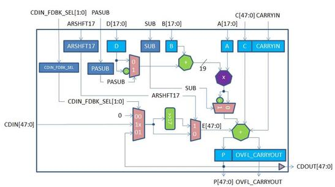

# MACC\_PA

The MACC\_PA macro implements multiplication, multiply-add, and multiply-accumulate functions. The MACC\_PA block can accumulate the current multiplication product with a previous result, a constant, a dynamic value, or a result from another MACC\_PA block. Each MACC\_PA block can also be configured to perform a Dot-product operation. All the signals of the MACC\_PA block have optional registers.

## Features

The main features of the MACC\_PA block are as follows:

-   Native 18 x 18 signed multiplication and supports 17 x 17 unsigned multiplication.
-   Independent third input C of data width 48 bits along with a CARRYIN, optionally registered.
-   Pre-adder of B with an independent fourth input D of data width 18 bits, optionally registered.
-   Internal cascade signals \(48-bit CDIN and CDOUT\) enable cascading of the Math blocks to support larger accumulator, adder, and subtracter without extra logic.
-   Normal addition/subtraction: CARRYIN + C\[47:0\] + E\[47:0\] ± \{ \( B\[17:0\] ± D\[17:0\]\) x A\[17:0\] \}.
-   Dot product mode: \(B\[8:0\] ± D\[8:0\]\) x A\[17:9\] ± \(B\[17:9\] ± D\[17:9\]\) x A\[8:0\].
-   SIMD mode for dual independent multiplication of two pairs of 9-bit operands.
-   Supports both registered and unregistered inputs and outputs.
-   Arithmetic right-shift by 17 bits of the loopback of CDIN.

The following figure shows a simplified block diagram of the MACC\_PA  block.

<table id="ID-00000A0C"><thead><tr id="ID-00000A19"><th id="ID-00000A1A">

Port Name

</th><th id="ID-00000A1C">

Direction

</th><th id="ID-00000A1E">

Type

</th><th id="ID-00000A20">

Polarity

</th><th id="ID-00000A22">

Description

</th></tr></thead><tbody><tr id="ID-00000A24"><td id="ID-00000A25">

DOTP

</td><td id="ID-00000A27">

Input

</td><td id="ID-00000A29">

Static

</td><td id="ID-00000A2B">

High

</td><td id="ID-00000A2D">

Dot-product mode.When DOTP = 1, MACC\_PA block performs Dot- product of two pairs of 9-bit operands.-   SIMD must not be 1.
-   C\[8:0\] must be connected to CARRYIN.

</td></tr><tr id="ID-00000A34"><td id="ID-00000A35">

SIMD

</td><td id="ID-00000A37">

Input

</td><td id="ID-00000A39">

Static

</td><td id="ID-00000A3B">

High

</td><td id="ID-00000A3D">

SIMD mode.When SIMD = 1, MACC\_PA block performs dual independent multiplication of two pairs of 9-bit operands.-   DOTP must not be 1.
-   ARSHFT17 must be 0.
-   D\[8:0\] must be 0.
-   C\[17:0\] must be 0.
-   E\[17:0\] must be 0.

Refer to [Table   2](GUID-6AC383CF-C29B-427B-A3B2-FD280645F8CC.md#ID-00000D3E) to see how operand E is obtained from P, CDIN or  0.

</td></tr><tr id="ID-00000A4C"><td id="ID-00000A4D">

OVFL\_CARRYOUT\_SEL

</td><td id="ID-00000A4F">

Input

</td><td id="ID-00000A51">

Static

</td><td id="ID-00000A53">

High

</td><td id="ID-00000A55">

Generate OVERFLOW or CARRYOUT with result P.-   OVERFLOW when OVFL\_CARRYOUT\_SEL = 0
-   CARRYOUT when OVFL\_CARRYOUT\_SEL = 1

</td></tr><tr id="ID-00000A5E"><td id="ID-00000A5F">

CLK

</td><td id="ID-00000A61">

Input

</td><td id="ID-00000A63">

Dynamic

</td><td id="ID-00000A65">

Rising edge

</td><td id="ID-00000A67">

Clock for A, B, C, CARRYIN, D, P, OVFL\_CARRYOUT, ARSHFT17, CDIN\_FDBK\_SEL, PASUB and SUB registers.

</td></tr><tr id="ID-00000A69"><td id="ID-00000A6A">

AL\_N

</td><td id="ID-00000A6C">

Input

</td><td id="ID-00000A6E">

Dynamic

</td><td id="ID-00000A70">

Low

</td><td id="ID-00000A72">

Asynchronous load for A, B, P, OVFL\_CARRYOUT, ARSHFT17, CDIN\_FDBK\_SEL, PASUB and SUB registers. Connect to 1, if none are registered.When asserted, A, B, P and OVFL\_CARRYOUT registers are loaded with zero, while the ARSHFT17, CDIN\_FDBK\_SEL, PASUB and SUB registers are loaded with the complementary. value of the respective \_AD\_N.

</td></tr><tr id="ID-00000A78"><td id="ID-00000A79">

A\[17:0\]

</td><td id="ID-00000A7C">

Input

</td><td id="ID-00000A7E">

Dynamic

</td><td id="ID-00000A80">

High

</td><td id="ID-00000A82">

Input data A.

</td></tr><tr id="ID-00000A84"><td id="ID-00000A85">

A\_BYPASS

</td><td id="ID-00000A87">

Input

</td><td id="ID-00000A89">

Static

</td><td id="ID-00000A8B">

High

</td><td id="ID-00000A8D">

Bypass data A registers. Connect to 1, if not  registered. See [Table   6](GUID-6AC383CF-C29B-427B-A3B2-FD280645F8CC.md#ID-00000F03).

</td></tr><tr id="ID-00000A91"><td id="ID-00000A92">

A\_SRST\_N

</td><td id="ID-00000A94">

Input

</td><td id="ID-00000A96">

Dynamic

</td><td id="ID-00000A98">

Low

</td><td id="ID-00000A9A">

Synchronous reset for data A registers.  Connect to1, if not registered. See Table   6.

</td></tr><tr id="ID-00000A9F"><td id="ID-00000AA0">

A\_EN

</td><td id="ID-00000AA2">

Input

</td><td id="ID-00000AA4">

Dynamic

</td><td id="ID-00000AA6">

High

</td><td id="ID-00000AA8">

Enable for data A registers. Connect to 1, if  not registered. See [Table   6](GUID-6AC383CF-C29B-427B-A3B2-FD280645F8CC.md#ID-00000F03).

</td></tr><tr id="ID-00000AB7"><td id="ID-00000AB8">

B\[17:0\]

</td><td id="ID-00000ABB">

Input

</td><td id="ID-00000ABD">

Dynamic

</td><td id="ID-00000ABF">

High

</td><td id="ID-00000AC1">

Input data B to Pre-adder with data D.

</td></tr><tr id="ID-00000AC3"><td id="ID-00000AC4">

B\_BYPASS

</td><td id="ID-00000AC6">

Input

</td><td id="ID-00000AC8">

Static

</td><td id="ID-00000ACA">

High

</td><td id="ID-00000ACC">

Bypass data B registers. Connect to 1, if not  registered. See [Table   6](GUID-6AC383CF-C29B-427B-A3B2-FD280645F8CC.md#ID-00000F03).

</td></tr><tr id="ID-00000ACF"><td id="ID-00000AD0">

B\_SRST\_N

</td><td id="ID-00000AD2">

Input

</td><td id="ID-00000AD4">

Dynamic

</td><td id="ID-00000AD6">

Low

</td><td id="ID-00000AD8">

Synchronous reset for data B registers.  Connect to 1, if not registered. See [Table   6](GUID-6AC383CF-C29B-427B-A3B2-FD280645F8CC.md#ID-00000F03).

</td></tr><tr id="ID-00000ADB"><td id="ID-00000ADC">

B\_EN

</td><td id="ID-00000ADE">

Input

</td><td id="ID-00000AE0">

Dynamic

</td><td id="ID-00000AE2">

High

</td><td id="ID-00000AE4">

Enable for data B registers. Connect to 1, if  not registered. See [Table   6](GUID-6AC383CF-C29B-427B-A3B2-FD280645F8CC.md#ID-00000F03).

</td></tr><tr id="ID-00000AF2"><td id="ID-00000AF3">

D\[17:0\]

</td><td id="ID-00000AF6">

Input

</td><td id="ID-00000AF8">

Dynamic

</td><td id="ID-00000AFA">

High

</td><td id="ID-00000AFC">

Input data D to Pre-adder with data B. When SIMD = 1, connect D\[8:0\] to 0.

</td></tr><tr id="ID-00000AFE"><td id="ID-00000AFF">

D\_BYPASS

</td><td id="ID-00000B01">

Input

</td><td id="ID-00000B03">

Static

</td><td id="ID-00000B05">

High

</td><td id="ID-00000B07">

Bypass data D registers. Connect to 1, if not  registered. See [Table   7](GUID-6AC383CF-C29B-427B-A3B2-FD280645F8CC.md#ID-00000F98).

</td></tr><tr id="ID-00000B0A"><td id="ID-00000B0B">

D\_ARST\_N

</td><td id="ID-00000B0D">

Input

</td><td id="ID-00000B0F">

Dynamic

</td><td id="ID-00000B11">

Low

</td><td id="ID-00000B13">

Asynchronous reset for data D registers.  Connect to 1, if not registered. See [Table   7](GUID-6AC383CF-C29B-427B-A3B2-FD280645F8CC.md#ID-00000F98).

</td></tr><tr id="ID-00000B16"><td id="ID-00000B17">

D\_SRST\_N

</td><td id="ID-00000B19">

Input

</td><td id="ID-00000B1B">

Dynamic

</td><td id="ID-00000B1D">

Low

</td><td id="ID-00000B1F">

Synchronous reset for data D registers.  Connect to 1, if not registered. See [Table   7](GUID-6AC383CF-C29B-427B-A3B2-FD280645F8CC.md#ID-00000F98).

</td></tr><tr id="ID-00000B22"><td id="ID-00000B23">

D\_EN

</td><td id="ID-00000B25">

Input

</td><td id="ID-00000B27">

Dynamic

</td><td id="ID-00000B29">

High

</td><td id="ID-00000B2B">

Enable for data D registers. Connect to 1, if  not registered. See [Table   7](GUID-6AC383CF-C29B-427B-A3B2-FD280645F8CC.md#ID-00000F98).

</td></tr><tr id="ID-00000B3A"><td id="ID-00000B3B">

CARRYIN

</td><td id="ID-00000B3D">

Input

</td><td id="ID-00000B3F">

Dynamic

</td><td id="ID-00000B41">

High

</td><td id="ID-00000B43">

CARRYIN for input data C.

</td></tr><tr id="ID-00000B45"><td id="ID-00000B46">

C\[47:0\]

</td><td id="ID-00000B49">

Input

</td><td id="ID-00000B4B">

Dynamic

</td><td id="ID-00000B4D">

High

</td><td id="ID-00000B4F">

Input data C.When DOTP = 1, connect C\[8:0\] to CARRYIN. When SIMD = 1, connect C\[8:0\] to 0.

</td></tr><tr id="ID-00000B52"><td id="ID-00000B53">

C\_BYPASS

</td><td id="ID-00000B55">

Input

</td><td id="ID-00000B57">

Static

</td><td id="ID-00000B59">

High

</td><td id="ID-00000B5B">

Bypass CARRYIN and C registers. Connect to 1,  if not registered. See [Table   7](GUID-6AC383CF-C29B-427B-A3B2-FD280645F8CC.md#ID-00000F98).

</td></tr><tr id="ID-00000B5E"><td id="ID-00000B5F">

C\_ARST\_N

</td><td id="ID-00000B61">

Input

</td><td id="ID-00000B63">

Dynamic

</td><td id="ID-00000B65">

Low

</td><td id="ID-00000B67">

Asynchronous reset for CARRYIN and C  registers. Connect to 1, if not registered. See [Table   7](GUID-6AC383CF-C29B-427B-A3B2-FD280645F8CC.md#ID-00000F98).

</td></tr><tr id="ID-00000B6B"><td id="ID-00000B6C">

C\_SRST\_N

</td><td id="ID-00000B6E">

Input

</td><td id="ID-00000B70">

Dynamic

</td><td id="ID-00000B72">

Low

</td><td id="ID-00000B74">

Synchronous reset for CARRYIN and C  registers. Connect to 1, if not registered. See [Table   7](GUID-6AC383CF-C29B-427B-A3B2-FD280645F8CC.md#ID-00000F98).

</td></tr><tr id="ID-00000B78"><td id="ID-00000B79">

C\_EN

</td><td id="ID-00000B7B">

Input

</td><td id="ID-00000B7D">

Dynamic

</td><td id="ID-00000B7F">

High

</td><td id="ID-00000B81">

Enable for CARRYIN and C registers. Connect  to 1, if not registered. See [Table   7](GUID-6AC383CF-C29B-427B-A3B2-FD280645F8CC.md#ID-00000F98).

</td></tr><tr id="ID-00000B8F"><td id="ID-00000B90">

CDIN\[47:0\]

</td><td id="ID-00000B93">

Input

</td><td id="ID-00000B95">

Cascade

</td><td id="ID-00000B97">

High

</td><td id="ID-00000B99">

Cascaded input for operand E.The entire bus must be driven by an entire CDOUT of another  MACC\_PA or MACC\_PA\_BC\_ROM block. In Dot-product mode, the driving CDOUT must  also be generated by a MACC\_PA or MACC\_PA\_BC\_ROM block in Dot-product mode.  Refer to Table   2 to see how CDIN is propagated to operand E.

</td></tr><tr id="ID-00000BAD"><td id="ID-00000BAE">

P\[47:0\]

</td><td id="ID-00000BB1">

Output

</td><td id="ID-00000BB3">

—

</td><td id="ID-00000BB5">

High

</td><td id="ID-00000BB7">

Result data. See [Table   3](GUID-6AC383CF-C29B-427B-A3B2-FD280645F8CC.md#ID-00000D7F).

</td></tr><tr id="ID-00000BBB"><td id="ID-00000BBC">

OVFL\_CARRYOUT

</td><td id="ID-00000BBE">

Output

</td><td id="ID-00000BC0">

—

</td><td id="ID-00000BC2">

High

</td><td id="ID-00000BC4">

OVERFLOW or CARRYOUT. See [Table   4](GUID-6AC383CF-C29B-427B-A3B2-FD280645F8CC.md#ID-00000E25).

</td></tr><tr id="ID-00000BC7"><td id="ID-00000BC8">

P\_BYPASS

</td><td id="ID-00000BCA">

Input

</td><td id="ID-00000BCC">

Static

</td><td id="ID-00000BCE">

High

</td><td id="ID-00000BD0">

Bypass P and OVFL\_CARRYOUT registers. Connect  to 1, if not registered. See [Table   6](GUID-6AC383CF-C29B-427B-A3B2-FD280645F8CC.md#ID-00000F03). P\_BYPASS must be 0 when  CDIN\_FDBK\_SEL\[0\] = 1. See Table   2.

</td></tr><tr id="ID-00000BD6"><td id="ID-00000BD7">

P\_SRST\_N

</td><td id="ID-00000BD9">

Input

</td><td id="ID-00000BDB">

Dynamic

</td><td id="ID-00000BDD">

Low

</td><td id="ID-00000BDF">

Synchronous reset for P and OVFL\_CARRYOUT  registers. Connect to 1, if not registered. See [Table   6](GUID-6AC383CF-C29B-427B-A3B2-FD280645F8CC.md#ID-00000F03).

</td></tr><tr id="ID-00000BE2"><td id="ID-00000BE3">

P\_EN

</td><td id="ID-00000BE5">

Input

</td><td id="ID-00000BE7">

Dynamic

</td><td id="ID-00000BE9">

High

</td><td id="ID-00000BEB">

Enable for P and OVFL\_CARRYOUT registers.  Connect to 1, if not registered. See [Table   6](GUID-6AC383CF-C29B-427B-A3B2-FD280645F8CC.md#ID-00000F03).

</td></tr><tr id="ID-00000BF1"><td id="ID-00000BF2">

CDOUT\[47:0\]

</td><td id="ID-00000BF4">

Output

</td><td id="ID-00000BF6">

Cascade

</td><td id="ID-00000BF8">

High

</td><td id="ID-00000BFA">

Cascade output of result P. See [Table   3](GUID-6AC383CF-C29B-427B-A3B2-FD280645F8CC.md#ID-00000D7F).Value of CDOUT is the same as P. The  entire bus must either be dangling or drive an entire CDIN of another  MACC\_PA or MACC\_PA\_BC\_ROM block in cascaded mode.

</td></tr><tr id="ID-00000C06"><td id="ID-00000C07">

PASUB

</td><td id="ID-00000C09">

Input

</td><td id="ID-00000C0B">

Dynamic

</td><td id="ID-00000C0D">

High

</td><td id="ID-00000C0F">

Subtract operation for Pre-adder of B and D.

</td></tr><tr id="ID-00000C11"><td id="ID-00000C12">

PASUB\_BYPASS

</td><td id="ID-00000C14">

Input

</td><td id="ID-00000C16">

Static

</td><td id="ID-00000C18">

High

</td><td id="ID-00000C1A">

Bypass PASUB register. Connect to 1, if not  registered. See [Table   5](GUID-6AC383CF-C29B-427B-A3B2-FD280645F8CC.md#ID-00000E48).

</td></tr><tr id="ID-00000C1D"><td id="ID-00000C1E">

PASUB\_AD\_N

</td><td id="ID-00000C20">

Input

</td><td id="ID-00000C22">

Static

</td><td id="ID-00000C24">

Low

</td><td id="ID-00000C26">

Asynchronous load data for PASUB register.  See [Table   5](GUID-6AC383CF-C29B-427B-A3B2-FD280645F8CC.md#ID-00000E48).

</td></tr><tr id="ID-00000C29"><td id="ID-00000C2A">

PASUB\_SL\_N

</td><td id="ID-00000C2C">

Input

</td><td id="ID-00000C2E">

Dynamic

</td><td id="ID-00000C30">

Low

</td><td id="ID-00000C32">

Synchronous load for PASUB register. Connect  to1, if not registered. See Table   5.

</td></tr><tr id="ID-00000C36"><td id="ID-00000C37">

PASUB\_SD\_N

</td><td id="ID-00000C39">

Input

</td><td id="ID-00000C3B">

Static

</td><td id="ID-00000C3D">

Low

</td><td id="ID-00000C3F">

Synchronous load data for PASUB register.  SeeTable   5.

</td></tr><tr id="ID-00000C43"><td id="ID-00000C44">

PASUB\_EN

</td><td id="ID-00000C46">

Input

</td><td id="ID-00000C48">

Dynamic

</td><td id="ID-00000C4A">

High

</td><td id="ID-00000C4C">

Enable for PASUB register. Connect to 1, if  not registered. See [Table   5](GUID-6AC383CF-C29B-427B-A3B2-FD280645F8CC.md#ID-00000E48).

</td></tr><tr id="ID-00000C52"><td id="ID-00000C53">

CDIN\_FDBK\_SEL\[1:0\]

</td><td id="ID-00000C55">

Input

</td><td id="ID-00000C57">

Dynamic

</td><td id="ID-00000C59">

High

</td><td id="ID-00000C5B">

Select CDIN, P or 0 for operand E. See [Table   2](GUID-6AC383CF-C29B-427B-A3B2-FD280645F8CC.md#ID-00000D3E).

</td></tr><tr id="ID-00000C5E"><td id="ID-00000C5F">

CDIN\_FDBK\_SEL\_BYPASS

</td><td id="ID-00000C61">

Input

</td><td id="ID-00000C63">

Static

</td><td id="ID-00000C65">

High

</td><td id="ID-00000C67">

Bypass CDIN\_FDBK\_SEL register. Connect to 1,  if not registered. See [Table   5](GUID-6AC383CF-C29B-427B-A3B2-FD280645F8CC.md#ID-00000E48).

</td></tr><tr id="ID-00000C6A"><td id="ID-00000C6B">

CDIN\_FDBK\_SEL\_AD\_N\[1:0\]\[1:0\]

</td><td id="ID-00000C6F">

Input

</td><td id="ID-00000C71">

Static

</td><td id="ID-00000C73">

Low

</td><td id="ID-00000C75">

Asynchronous load data for CDIN\_FDBK\_SELregister. See Table   5.

</td></tr><tr id="ID-00000C79"><td id="ID-00000C7A">

CDIN\_FDBK\_SEL\_SL\_N

</td><td id="ID-00000C7C">

Input

</td><td id="ID-00000C7E">

Dynamic

</td><td id="ID-00000C80">

Low

</td><td id="ID-00000C82">

Synchronous load for CDIN\_FDBK\_SEL register.  Connect to 1, if not registered. See [Table   5](GUID-6AC383CF-C29B-427B-A3B2-FD280645F8CC.md#ID-00000E48).

</td></tr><tr id="ID-00000C85"><td id="ID-00000C86">

CDIN\_FDBK\_SEL\_SD\_N\[1:0\]\[1:0\]CDIN\_FDBK\_SEL\_SD\_N\[1:0\]

</td><td id="ID-00000C8C">

Input

</td><td id="ID-00000C8E">

Static

</td><td id="ID-00000C90">

Low

</td><td id="ID-00000C92">

Synchronous load data for CDIN\_FDBK\_SELregister. See Table   5.

</td></tr><tr id="ID-00000C97"><td id="ID-00000C98">

CDIN\_FDBK\_SEL\_EN

</td><td id="ID-00000C9A">

Input

</td><td id="ID-00000C9C">

Dynamic

</td><td id="ID-00000C9E">

High

</td><td id="ID-00000CA0">

Enable for CDIN\_FDBK\_SEL register. Connect to  1, if not registered. See [Table   5](GUID-6AC383CF-C29B-427B-A3B2-FD280645F8CC.md#ID-00000E48).

</td></tr><tr id="ID-00000CA6"><td id="ID-00000CA7">

ARSHFT17

</td><td id="ID-00000CA9">

Input

</td><td id="ID-00000CAB">

Dynamic

</td><td id="ID-00000CAD">

High

</td><td id="ID-00000CAF">

Arithmetic right-shift for operand E.When asserted, a 17-bit arithmetic right-shift is performed  on operand E. Refer to Table   2 to see how operand E is obtained from P, CDIN or 0. When  SIMD = 1, ARSHFT17 must be 0.

</td></tr><tr id="ID-00000CB3"><td id="ID-00000CB4">

ARSHFT17\_BYPASS

</td><td id="ID-00000CB6">

Input

</td><td id="ID-00000CB8">

Static

</td><td id="ID-00000CBA">

High

</td><td id="ID-00000CBC">

Bypass ARSHFT17 register. Connect to 1, if  not registered. See [Table   5](GUID-6AC383CF-C29B-427B-A3B2-FD280645F8CC.md#ID-00000E48).

</td></tr><tr id="ID-00000CBF"><td id="ID-00000CC0">

ARSHFT17\_AD\_N

</td><td id="ID-00000CC2">

Input

</td><td id="ID-00000CC4">

Static

</td><td id="ID-00000CC6">

Low

</td><td id="ID-00000CC8">

Asynchronous load data for ARSHFT17 register.  See [Table   5](GUID-6AC383CF-C29B-427B-A3B2-FD280645F8CC.md#ID-00000E48).

</td></tr><tr id="ID-00000CCB"><td id="ID-00000CCC">

ARSHFT17\_SL\_N

</td><td id="ID-00000CCE">

Input

</td><td id="ID-00000CD0">

Dynamic

</td><td id="ID-00000CD2">

Low

</td><td id="ID-00000CD4">

Synchronous load for ARSHFT17 register.  Connect to 1, if not registered. See [Table   5](GUID-6AC383CF-C29B-427B-A3B2-FD280645F8CC.md#ID-00000E48).

</td></tr><tr id="ID-00000CD7"><td id="ID-00000CD8">

ARSHFT17\_SD\_N

</td><td id="ID-00000CDA">

Input

</td><td id="ID-00000CDC">

Static

</td><td id="ID-00000CDE">

Low

</td><td id="ID-00000CE0">

Synchronous load data for ARSHFT17 register.  See [Table   5](GUID-6AC383CF-C29B-427B-A3B2-FD280645F8CC.md#ID-00000E48).

</td></tr><tr id="ID-00000CE3"><td id="ID-00000CE4">

ARSHFT17\_EN

</td><td id="ID-00000CE6">

Input

</td><td id="ID-00000CE8">

Dynamic

</td><td id="ID-00000CEA">

High

</td><td id="ID-00000CEC">

Enable for ARSHFT17 register. Connect to 1,  if not registered. See [Table   5](GUID-6AC383CF-C29B-427B-A3B2-FD280645F8CC.md#ID-00000E48).

</td></tr><tr id="ID-00000CF2"><td id="ID-00000CF3">

SUB

</td><td id="ID-00000CF5">

Input

</td><td id="ID-00000CF7">

Dynamic

</td><td id="ID-00000CF9">

High

</td><td id="ID-00000CFB">

Subtract operation.

</td></tr><tr id="ID-00000CFD"><td id="ID-00000CFE">

SUB\_BYPASS

</td><td id="ID-00000D00">

Input

</td><td id="ID-00000D02">

Static

</td><td id="ID-00000D04">

High

</td><td id="ID-00000D06">

Bypass SUB register. Connect to 1, if not  registered. See [Table   5](GUID-6AC383CF-C29B-427B-A3B2-FD280645F8CC.md#ID-00000E48).

</td></tr><tr id="ID-00000D09"><td id="ID-00000D0A">

SUB\_AD\_N

</td><td id="ID-00000D0C">

Input

</td><td id="ID-00000D0E">

Static

</td><td id="ID-00000D10">

Low

</td><td id="ID-00000D12">

Asynchronous load data for SUB register. See  [Table   5](GUID-6AC383CF-C29B-427B-A3B2-FD280645F8CC.md#ID-00000E48)

</td></tr><tr id="ID-00000D16"><td id="ID-00000D17">

SUB\_SL\_N

</td><td id="ID-00000D19">

Input

</td><td id="ID-00000D1B">

Dynamic

</td><td id="ID-00000D1D">

Low

</td><td id="ID-00000D1F">

Synchronous load for SUB register. Connect to  1, if not registered. See [Table   5](GUID-6AC383CF-C29B-427B-A3B2-FD280645F8CC.md#ID-00000E48).

</td></tr><tr id="ID-00000D22"><td id="ID-00000D23">

SUB\_SD\_N

</td><td id="ID-00000D25">

Input

</td><td id="ID-00000D27">

Static

</td><td id="ID-00000D29">

Low

</td><td id="ID-00000D2B">

Synchronous load data for SUB register. See  [Table   5](GUID-6AC383CF-C29B-427B-A3B2-FD280645F8CC.md#ID-00000E48).

</td></tr><tr id="ID-00000D30"><td id="ID-00000D31">

SUB\_EN

</td><td id="ID-00000D33">

Input

</td><td id="ID-00000D35">

Dynamic

</td><td id="ID-00000D37">

High

</td><td id="ID-00000D39">

Enable for SUB register. Connect to 1, if not  registered. See [Table   5](GUID-6AC383CF-C29B-427B-A3B2-FD280645F8CC.md#ID-00000E48).

</td></tr></tbody>
</table>**Tip:** Static inputs are defined at design time and need to be tied to 0 or 1.

|CDIN\_FDBK\_SEL\[1\]|CDIN\_FDBK\_SEL\[0\]|ARSHFT17|Operand E|
|--------------------|--------------------|--------|---------|
|0|0|X|48'b0|
|0|1|0|P\[47:0\]|
|0|1|1|\{\{17\{P\[47\]\}\},P\[47:17\]\}|
|1|X|0|CDIN\[47:0\]|
|1|X|1|\{\{17\{CDIN\[47\]\}\},CDIN\[47:17\]\}|

|SIMD|DOTP|SUB|PASUB|Result P and CDOUT|
|----|----|---|-----|------------------|
|0|0|0|0|CARRYIN + C\[47:0\] + E\[47:0\] + \{ \(B\[17:0\] + D\[17:0\]\) x A\[17:0\] \}|
|0|0|0|1|CARRYIN + C\[47:0\] + E\[47:0\] + \{ \(B\[17:0\] - D\[17:0\]\) x A\[17:0\] \}|
|0|0|1|0|CARRYIN + C\[47:0\] + E\[47:0\] - \{ \(B\[17:0\] + D\[17:0\]\) x A\[17:0\] \}|
|0|0|1|1|CARRYIN + C\[47:0\] + E\[47:0\] - \{ \(B\[17:0\] - D\[17:0\]\) x A\[17:0\] \}|
|0|1|0|0|CARRYIN + C\[47:0\] + E\[47:0\] +\{ \(B\[8:0\] + D\[8:0\]\) x A\[17:9\] + \(B\[17:9\] + D\[17:9\]\) x A\[8:0\] \} x 29|
|0|1|0|1|CARRYIN + C\[47:0\] + E\[47:0\] +\{ \(B\[8:0\] - D\[8:0\]\) x A\[17:9\] + \(B\[17:9\] - D\[17:9\]\) x A\[8:0\] \} x 29|
|0|1|1|0|CARRYIN + C\[47:0\] + E\[47:0\] +\{ \(B\[8:0\] + D\[8:0\]\) x A\[17:9\] - \(B\[17:9\] + D\[17:9\]\) x A\[8:0\] \} x 29|
|0|1|1|1|CARRYIN + C\[47:0\] + E\[47:0\] +\{ \(B\[8:0\] - D\[8:0\]\) x A\[17:9\] - \(B\[17:9\] - D\[17:9\]\) x A\[8:0\] \} x 29|
|1|0|0|0|P\[17:0\] = CARRYIN + \{ B\[8:0\] x A\[8:0\] \}P\[47:18\] = C\[47:18\] + E\[47:18\] + \{ \(B\[17:9\] + D\[17:9\]\) x A\[17:9\] \}|
|1|0|0|1|P\[17:0\] = CARRYIN + \{ B\[8:0\] x A\[8:0\] \}P\[47:18\] = C\[47:18\] + E\[47:18\] + \{ \(B\[17:9\] - D\[17:9\]\) x A\[17:9\] \}|
|1|0|1|0|P\[17:0\] = CARRYIN + \{ B\[8:0\] x A\[8:0\] \}P\[47:18\] = C\[47:18\] + E\[47:18\] - \{ \(B\[17:9\] + D\[17:9\]\) x A\[17:9\] \}|
|1|0|1|1|P\[17:0\] = CARRYIN + \{ B\[8:0\] x A\[8:0\] \}P\[47:18\] = C\[47:18\] + E\[47:18\] - \{ \(B\[17:9\] - D\[17:9\]\) x A\[17:9\] \}|

|OVFL\_CARRYOUT\_SEL|OVFL\_CARRYOUT|Description|
|-------------------|--------------|-----------|
|0|\(SUM\[49\] ^ SUM\[48\]\) \| \(SUM\[48\] ^ SUM\[47\]\)|True if overflow or underflow occurred.|
|1|C\[47\] ^ E\[47\] ^ SUM\[48\]|A signal that can be used to extend the final adder in the fabric.|

SUM\[49:0\] is defined similarly to P\[47:0\] as shown in [Table   3](GUID-6AC383CF-C29B-427B-A3B2-FD280645F8CC.md#ID-00000D7F), except  that SUM is a 50-bit quantity so that no overflow can occur. SUM\[48\] is the carry out bit  of a 48-bit final adder producing P\[47:0\].

|AL\_N|\_AD\_N|\_BYPASS|CLK|\_EN|\_SL\_N|\_SD\_N|D|Qn+1|
|-----|-------|--------|---|----|-------|-------|---|----|
|0|AD\_N|0|X|X|X|X|X|!AD\_N|
|1|X|0|Not rising|X|X|X|X|Qn|
|1|X|0|?|0|X|X|X|Qn|
|1|X|0|?|1|0|SD\_N|X|!SD\_N|
|1|X|0|?|1|1|X|D|D|
|X|X|1|X|0|X|X|X|Qn|
|X|X|1|X|1|0|SD\_N|X|!SD\_N|
|X|X|1|X|1|1|X|D|D|

|AL\_N|\_BYPASS|CLK|\_EN|\_SRST\_N|D|Qn+1|
|-----|--------|---|----|---------|---|----|
|0|0|X|X|X|X|0|
|1|0|Not rising|X|X|X|Qn|
|1|0|?|0|X|X|Qn|
|1|0|?|1|0|X|0|
|1|0|?|1|1|D|D|
|X|1|X|0|X|X|Qn|
|X|1|X|1|0|X|0|
|X|1|X|1|1|D|D|

|\_ARST\_N|\_BYPASS|CLK|\_EN|\_SRST\_N|D|Qn+1|
|---------|--------|---|----|---------|---|----|
|0|0|X|X|X|X|0|
|1|0|Not rising|X|X|X|Qn|
|1|0|?|0|X|X|Qn|
|1|0|?|1|0|X|0|
|1|0|?|1|1|D|D|
|X|1|X|0|X|X|Qn|
|X|1|X|1|0|X|0|
|X|1|X|1|1|D|D|

