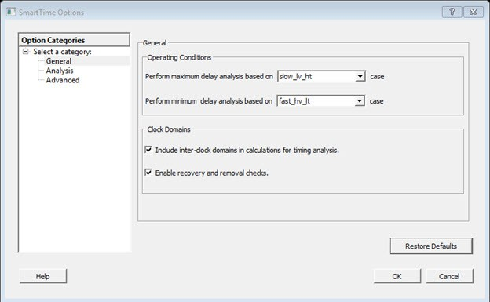
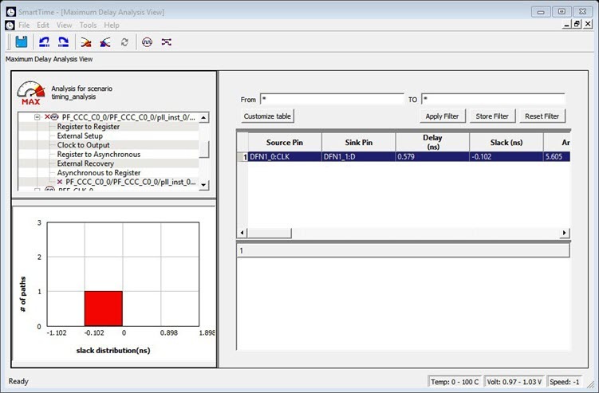
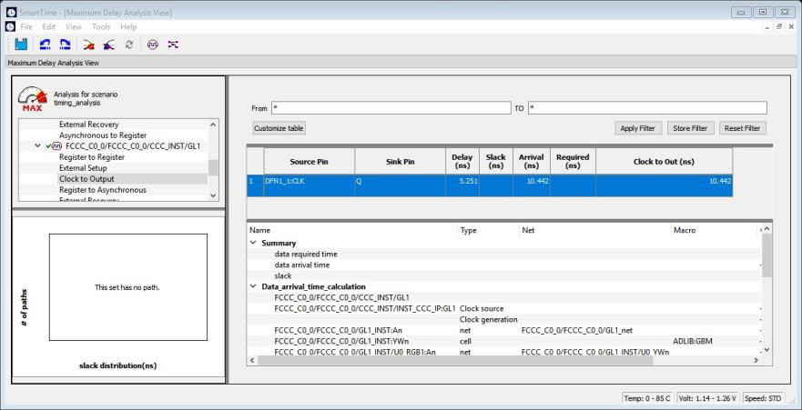

# Advanced Timing Analysis

The following sections describe advanced timing analysis.

## Understanding Inter-Clock Domain Analysis

When functional paths exist across two clock domains \(the register launching the data and the one capturing it are clocked by two different clock sources\), you must provide accurate specification of both clocks to allow a valid inter-clock domain timing check. This is important especially when the clocks are specified with different waveforms and frequencies.

When inter-clock domain paths exist in your design, consider whether setup and hold analysis needs to be performed. Inter-clock domain analysis is controlled from the SmartTime options, as shown in [Activating Inter-Clock Domain Analysis](GUID-6CBA2A60-1CCC-452E-94B5-1BEC4DB0B723.md#GUID-AB62393E-E00A-486C-B1A3-903DBF3B6B2E) section, and is enabled by default. When enabled, SmartTime performs setup and hold checks between the clock domains unless a false path or asynchronous clock group constraint has been applied. When disabled, the tool does not perform the setup and hold checks.

If you have several clock domains that are subset of a single clock \(for example, if you want to measure clock tree delay from an input clock to a generated clock\), you must configure Generated Clock Constraints for each of the clock domains in order for SmartTime to execute the calculation, and show timing for each of the inter-clock domain paths.

Once you include the inter-clock domains for timing analysis, SmartTime analyzes, for each inter-clock domain, the relationship between all the active clock edges over a common period equal to the least common multiple of the two clock periods. The new common period represents a full repeating cycle \(or pattern\) of the two clock waveforms, as shown in the following figure.

For setup check, SmartTime considers the tightest relation launch-capture to ensure that the data arrives before the capture edge. The hold check verifies that a setup relationship is not overwritten by a following data launch.

## Activating Inter-Clock Domain Analysis

To activate the inter-clock domain checking:

1.  From the SmartTime **Tools** menu, choose **Options**.

    The [SmartTime Options dialog box](GUID-0E342BFD-075D-492F-9087-E125B356879B.md#) appears, as shown in the following figure.

2.  In the **General** category, check **Include inter-clock domains in calculations for timing analysis**.

    

    

3.  Click **OK** to save the dialog box settings.

## Displaying Inter-Clock Domain Paths

After you activate the inter-clock domain checking for a given clock domain CK1, SmartTime detects automatically all other domains CKn with paths ending at CK1.

SmartTime creates inter-clock domain sets CKn to CK1 under the domain CK1. Each set allows you to display the inter-clock domain paths between a given clock domain and CK1.

To display an inter-clock domain  set:

1.  Expand the receiving clock domain of the inter-clock domain in the Domain Browser to display its related sets. For the inter-clock domain CK1 to CK2, expand clock domain CK2.

2.  

3.  Select the inter-clock domain you want to expand from these sets.

    All paths between the related two domains are displayed in Paths List in the same way as any register to register set.

## Deactivating a Specific Inter-Clock Domain

To deactivate the inter-clock domain checking for the specific clock domains clk2-&gt;clk1, without disabling this option for the other clock domains:

1.  From the **Tools** menu, choose **Constraints Editor &gt; Primary Scenario** to open the Constraints Editor View.

2.  In the Constraints Browser, double-click **False Path** under **Exceptions**.

    The Set False Path Constraint dialog box appears.

3.  Click the **Browse** button to the right of the **From** text box.

    The Select Source Pins for False Path Constraint dialog box appears.

4.  For **Specify pins**, select **by keyword and wildcard**.

5.  For **Pin Type**, select **Registers by clock names** from the **Pin Type** drop-down list.

6.  In the filter box, type the inter-clock domain name \(for example, Clk2\), and then click **Filter**.

7.  Click **OK** to begin filtering the pins by your criteria.

    In this example, \[get\_clocks \{Clk2\}\] appears in the **From** text box in the Set False Path Constraint dialog box.

8.  Repeat steps 3 to 7 for the **TO** option in the Set False Path Constraint dialog box and type `Clk1` in the filter box.

9.  Click **OK** to validate the new false path and display it in the Paths List of the Constraints Editor.

10. Click the Recalculate All icon  in the toolbar.

11. Select the inter-clock domain set clk2 -&gt; clk1 in the Domain Browser.

12. Verify that the set does not contain any paths.

## Changing Output Port Capacitance

Output propagation delay is affected by both the capacitive loading on the board and the I/O standard.

The I/O Attribute Editor in Chip Planner provides a way to set the expected capacitance to improve the propagation delay model. SmartTime uses the modified delay model automatically for delay calculations.

To  change the output port capacitance and view the effect of this change in SmartTime  Timing Analyzer, see the following example. The following figure shows a delay of  6.603 ns from DFN1 to output port Q based on the default loading of 5 pF.

If your board has an output capacitance of 15 pf on Q, perform the following  steps to update the timing number.

1.  Open the I/O Attribute Editor and change the output load to 15 pf.

2.  

3.  Select **File &gt; Save**.

4.  Select **File &gt; Close**.

5.  Open the SmartTime Timing Analyzer and confirm that the **Clock to Output** delay changed to 5.952 ns.

