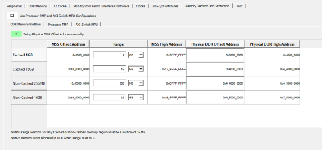
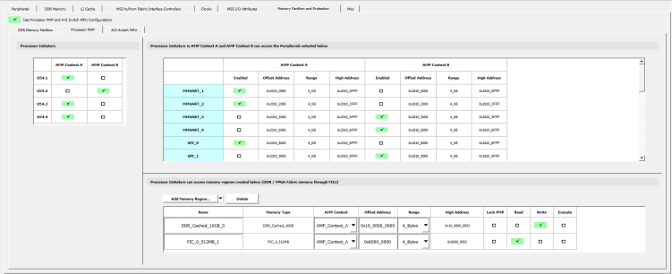
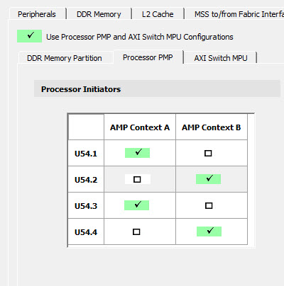
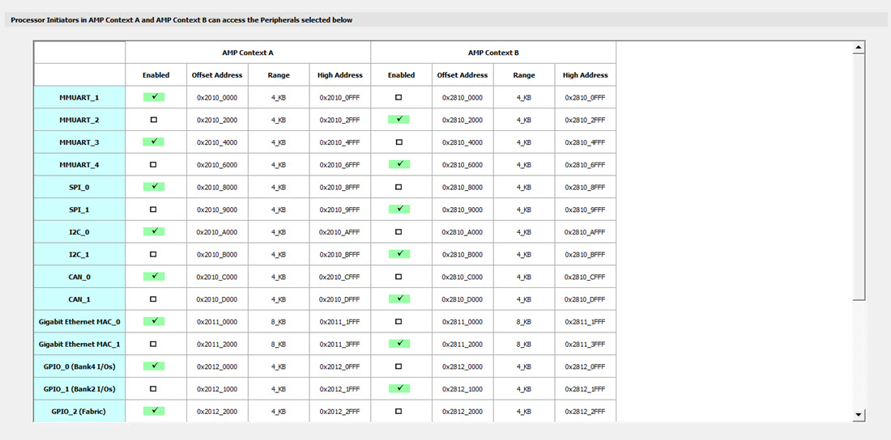
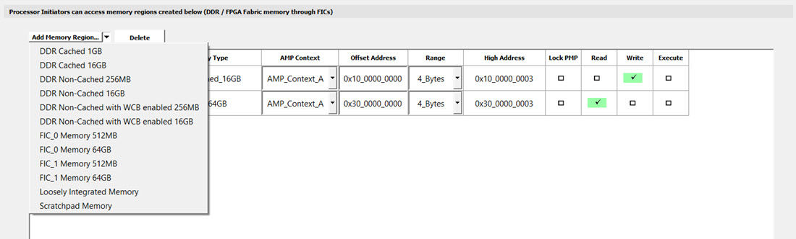
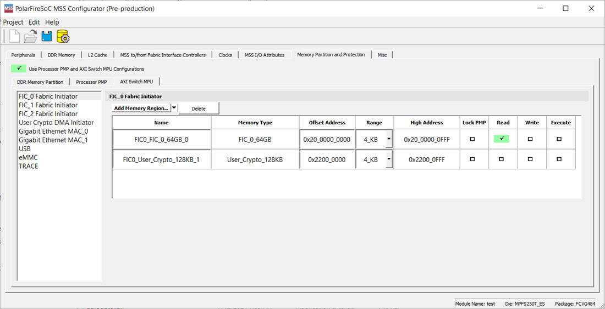

# Memory Partition and Protection

The Physical Memory Protection \(PMP\) prevents a process \(running on a RISC-V Processor\) or an  initiator \(FPGA Fabric\) from accessing memory that has not been allocated to it. RISC-V  system has PMP unit, which provides control registers for each processor to allow  physical memory access privileges \(read, write, execute\) to be specified for each  physical memory region. Similarly, the AXI Switch has Memory Protection Unit \(MPU\) block  which provides register control to setup memory access regions for FPGA initiators.

## DDR Memory Partition

The  DDR Memory Partition tab allows the DDR memory to be allocated to cached and  non-cached regions depending on the amount of DDR memory physically  connected.

In the DDR Memory Partition:

-   The Offset Address \(Base Address\) for both cached and non-cached regions is fixed.
-   High Address is the End Address based on the size.
-   Users are expected to enter the Range. Based on the Range selection, High Address and Physical DDR Offset is updated.
    -   When Range is set to zero, memory is not allocated in DDR.
    -   When Range is set to a nonzero value, it must be a multiple of 16 MB.
-   Physical DDR Offset is allocation of DDR memory \(connected to the FPGA system\) based on the nonzero Range value.

    **Important:** When **Setup Physical DDR Address manually** option is enabled, the default Physical DDR Offset Address is set as 0x0000\_0000 for all the regions and it is up to the user to change this address \(when the size of the allocated memory region is greater than 0 bytes\). When the size of allocated memory region is zero bytes, the offset and high address are reported as **N/A** and remains as a read-only field.

-   Range is allocated sequentially starting with 0x0000\_0000 in the following order:

    -   Cached 32-bit
    -   Cached 64-bit
    -   Non-Cached 32-bit
    -   Non-Cached 64-bit
    The following figure shows the graphical representation of how the  Physical DDR Offset allocation is done based on the preceding  ranges:

    

## Processor PMP

The following figure shows the Processor PMP tab.

**Processor Initiators**

Four CPU initiators can be enabled in one of the two Asymmetric Multi Processing \(AMP\) contexts. CPU initiators can access both CPU and Peripherals.

**Processor Initiators in Context A and Context B can access the following selected Peripherals**

The AMP Context A is assigned to AHB0 bus interface and AMP  Context B is assigned to AHB1 bus interface. Peripherals can be enabled in  either Context A or in Context B. The range and base address for the peripherals  are populated in Graphical User Interface and are not editable. The base address  will be different for peripherals that are on dual AHB bus interfaces for  Context A and Context B.

**Processor Initiators can access memory regions created below \(DDR/FPGA Fabric memory through FICs\)**

DDR memory appears at several address ranges depending on  whether it is cached, non-cached, or access through a Write Combine Buffer  \(WCB\). WCB improves performance \(by combining multiple writes to the same  address into a single write\) for sequential accesses. Each AMP context needs to  specify how much DDR memory of each type it needs. Some DDR memories may be  shared between AMP Context to pass data. User can create protection for memory  region accessed by processors by clicking on the **Add Memory Region...** button. User can delete any memory region by selecting  the memory region and clicking **Delete** button. The  following figure shows the memory regions available to Processor Initiators.

The following table lists different types of memory regions that  user can create.

|Memory  Type|Memory  Size|Address  Size|Address Range|
|-------------------------------|-------------------------------|--------------------------------|-------------|
|**DDR Cached**|512 MB|32-bit|0x80000000 - 0xBFFFFFFF|
|16 GB|64-bit|0x10\_00000000 - 0x13\_FFFFFFFF|
|**DDR Non-Cached**|256 MB|  32-bit |0xC0000000 - 0xCFFFFFFF|
|16 GB|64-bit|0x14\_00000000 - 0x17\_FFFFFFFF|
|**DDR Non-Cached with WCB enabled**|256 MB|32-bit|0xC0000000 - 0xCFFFFFFF|
|16 GB|64-bit|0x14\_00000000 - 0x17\_FFFFFFFF|
|**FIC\_0 Memory**|512 MB|32-bit|0x60000000 - 0x7FFFFFFF|
|64 GB|64-bit|0x20\_00000000 - 0x2F\_FFFFFFFF|
|**FIC\_1 Memory**|512 MB|32-bit|0xE0000000 - 0xFFFFFFFF|
|64 GB|64-bit|0x30\_00000000 - 0x3F\_FFFFFFFF|
|**Loosely Integrated Memory**|—|—|Start Address is 0x0800\_0000|
|**Scratch**|—|—|Start Address is 0x0A00\_0000|

## AXI Switch MPU

AXI switch Memory Protection Unit \(MPU\) provides FPGA \(Non-CPU\) Initiators read/write/execute access to the Memory subsystem and Fabric Memory. Users can create protection for memory regions accessed by FPGA Initiators by clicking any one of the FPGA Initiators and clicking the **Add Memory Region...** button. User can delete any memory region by selecting the memory region and clicking **Delete** button.

The following table lists the different types of memory regions that user can create.

|Memory Type|Memory Size|Address Size|Address Range|
|-----------|-----------|------------|-------------|
|**DDR Non-Cached**|256 MB|32-bit|0xC0000000 - 0xCFFFFFFF|
|16 GB|64-bit|0x14\_00000000 - 0x17\_FFFFFFFF|
|FIC\_0 Memory|512 MB|32-bit|0x60000000 - 0x7FFFFFFF|
|64 GB|64-bit|0x20\_00000000 - 0x2F\_FFFFFFFF|
|**FIC\_1 Memory**|512 MB|32-bit|0xE0000000 - 0xFFFFFFFF|
|64 GB|64-bit|0x30\_00000000 - 0x3F\_FFFFFFFF|
|FIC\_3 Memory|512 MB|32-bit|0x40000000 - 0x5FFFFFFF|
|User Crypto Memory|128 KB|32-bit|0x22000000 - 0x2201FFFF|

**Parent topic:**[Using the PolarFire SoC MSS Configurator GUI](GUID-E11D45E3-7975-4122-BA81-72D6BDD0CD1A.md)

**Previous topic:**[Crypto](GUID-2BCF0FE7-8951-47C2-A2E6-D143E8C923AD.md)

**Next topic:**[Creating a Project and Configuring MSS](GUID-8B621B26-CB3E-42CC-A36B-7FE7DCC01087.md)

