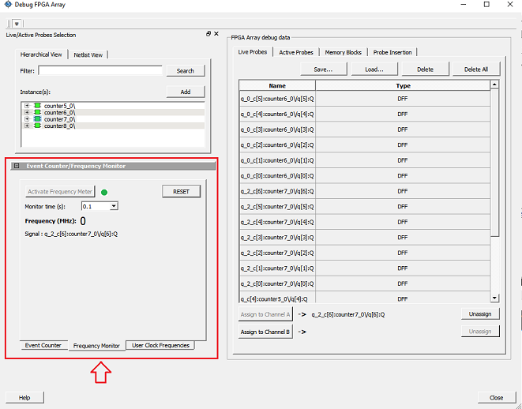
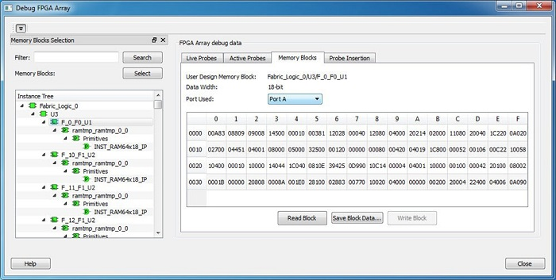
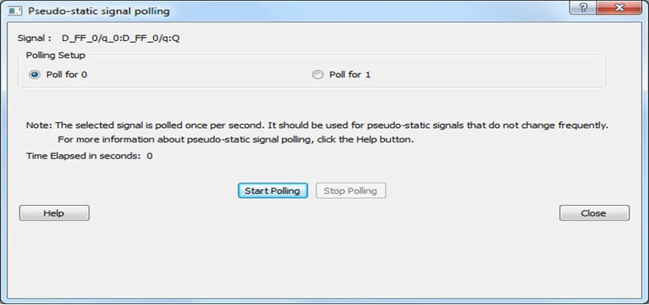
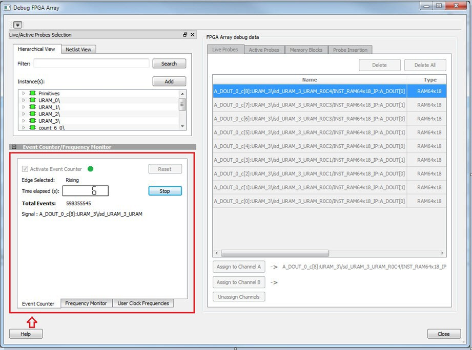

# Frequently Asked Questions

The following topics describe frequently asked questions about SmartDebug.

## SmartDebug FAQs for PolarFire

The following topics contains frequently asked questions related to using SmartDebug with PolarFire.

### How Do I Monitor a Static or Pseudo-static Signal?

To monitor a static or pseudo-static signal:

1.  Add the signal to the **Active Probes** tab.

2.  Select the signal in the **Active Probes** tab, right click, and choose **Poll**.

    

3.  In the Pseudo-static Signal Polling dialog box, choose a value in Polling Setup and click **Start Polling**.

    


### How Do I Force a Signal to a New Value?

To force a signal to a new value:

1.  In the SmartDebug window, click **Debug FPGA Array**.

2.  Click the **Active Probes** tab.

3.  Select the signal from the selection panel and add it to **Active Probes** tab.

    

4.  Click **Read Active Probe** to read the value.

5.  In the **Write Value** column, enter the value to write to the signal, and then click **Write Active Probes**.

    


### How Do I Count the Transitions on a Signal?

If FHB IP is auto-instantiated in the design, you can use the Event Counter in the<br /> **Live Probes** tab to count the transitions on a signal. For<br /> more information, see [Event Counter](GUID-AFCD4A75-089E-4BD6-AFD4-FC526F201B3D.md#).

To count the transitions on a signal:

1.  Assign the desired signal to Live Probe Channel A.

2.  Click the **Event Counter** tab and select the **Activate Event Counter** check-box.

    


### How Do I Monitor or Measure a Clock?

You can monitor a clock signal from the **Live Probe** tab when<br /> the design is synthesized and compiled with FHB Auto Instantiation turned on in the<br /> **Project Settings** dialog box.

In the **Live Probe** tab, SmartDebug allows you to:

1.  Measure all the FABCCC GL clocks by clicking the **User Clock Frequencies** tab, as shown in the following figure.

    

2.  You can monitor frequencies of any probe points by:

    1.  Assigning the desired signal to the Live Probe Channel A.
    2.  Selecting the **Frequency Monitor** tab as shown in the following figure.

        

    3.  Selecting the **Activate Frequency Meter** check box.

### How Do I Perform Simple SmartBERT Tests?

You can perform SmartBERT tests using the **Debug Transceiver** option<br /> in SmartDebug.

To perform a SmartBERT test, in the **SmartBERT** page of the<br /> **Debug Transceiver** dialog box, select to run a PRBS test<br /> on-die or off-die with EQ-NEAREND checked or unchecked. For more information, see [SmartBERT](GUID-AFCD4A75-089E-4BD6-AFD4-FC526F201B3D.md#).

To perform a SmartBERT test, in the Smart BERT page of the Debug Transceiver dialog box,<br /> select your options and click **Start** to run a Smart BERT test<br /> on-die or off-die with EQ-NEAREND checked or unchecked. For more information, see [SmartBERT](GUID-AFCD4A75-089E-4BD6-AFD4-FC526F201B3D.md#).

### How Do I Read LSRAM or USRAM Content?

To read RAM content:

1.  In the Debug FPGA Array dialog box, click the **Memory Blocks** tab.

2.  Select the memory block to be read from the selection panel on the left of the window.

    

    An **L** in the icon next to the block name indicates that<br /> it is a logical block, and a **P** in the icon indicates<br /> that it is a physical block. A logical block displays three fields in the<br /> **Memory Blocks** tab: User Design Memory Blocks,<br /> Data Width, and Port Used. A physical block displays two fields in the<br /> **Memory Blocks** tab: User Design Memory Block and<br /> Data Width.

3.  Add the block in one of the following ways:

    -   Click **Select**.
    -   Right click and choose **Add**.
    -   Drag the block to the **Memory Blocks** tab.
4.  Click **Read Block** to read the content of the block.

    

    For more information, see [Memory Blocks](GUID-AFCD4A75-089E-4BD6-AFD4-FC526F201B3D.md#).


### How Do I Change the Content of LSRAM or USRAM?

To change the content of LSRAM or USRAM:

1.  In the SmartDebug window, click **Debug FPGA Array**.

2.  Click the **Memory Blocks** tab.

3.  Select the memory block from the selection panel.

    

    An **L** in the icon next to the block name indicates that<br /> it is a logical block, and a **P** in the icon indicates<br /> that it is a physical block. A logical block displays three fields in the<br /> **Memory Blocks** tab: **User Design Memory Blocks**, **Data Width**, and<br /> **Port Used**. A physical block displays two fields<br /> in the **Memory Blocks** tab: **User Design Memory Block** and **Data Width**.

4.  Add the memory block in one of the following ways:

    -   Click **Select**.
    -   Right click and choose **Add**.
    -   Drag the block to the **Memory Blocks** tab.
5.  Click **Read Block**. The memory content matrix appears.

6.  Select the memory cell value that you want to change and update the value.

7.  Click **Write Block** to write to the device.

    

    For more information, see [Memory Blocks](GUID-AFCD4A75-089E-4BD6-AFD4-FC526F201B3D.md#).


### How Do I Read the Health Check of the Transceiver?

You can read the transceiver health check using the following Debug Transceiver<br /> options:

1.  Review the **Configuration Report**, which returns Tx PMA Ready, Rx PMA Ready, TxPLL status, and RxPLL status. For the transceiver to function correctly, all four should be green. The Configuration Report can be found in the Debug TRANSCEIVER dialog box under Configuration Report. For more information, see [Debug Transceiver](GUID-AFCD4A75-089E-4BD6-AFD4-FC526F201B3D.md#).

    

2.  Run the SmartBERT Test, with EQ-NEAR END checked or with external loopback connection from Tx to Rx on selected lanes. This should result in 0 errors in the Cumulative Error Count column. For more information, see [SmartBERT](GUID-AFCD4A75-089E-4BD6-AFD4-FC526F201B3D.md#).


## SmartDebug FAQs for SmartFusion 2, IGLOO 2, and RTG4

The following topics contains frequently asked questions related to using SmartDebug with SmartFusion 2, IGLOO 2, and RTG4.

### Embedded Flash Memory \(NVM\) - Failure when Programming/Verifying

If the Embedded Flash Memory failed verification when executing the PROGRAM\_NVM, VERIFY\_NVM or<br /> PROGRAM\_NVM\_ACTIVE\_ARRAY action, the failing page may be corrupted. To confirm and<br /> address this issue:

1.  In the **Inspect Device**window click **View Flash Memory Content**.
2.  Select the Flash Memory block and client \(or page range\) to retrieve from the device:
    1.  Click **Read from Device**; the retrieved data appears in the lower part of the window.
    2.  Click **View Detailed Status**.

        **Note:** You can use the `check_flash_memory` and `read_flash_memory` Tcl commands to perform diagnostics similar to the preceding commands.

    3.  To reset the corrupted NVM pages, either re-program the pages with your original data or ‘zero-out’ the pages by using the Tcl command `recover_flash_memory`.

If the Embedded Flash Memory failed verification when executing a VERIFY\_NVM or<br /> VERIFY\_NVM\_ACTIVE\_ARRAY action, the failure may be due to the change of content in your<br /> design. To confirm this, repeat te preceding steps.

**Note:** NVM corruption is still possible when writing from user design. Check NVM status for confirmation.

### Analog System Not Working as Expected

If the Analog System is not working correctly, it may be due the following:

-   System supply issue. To troubleshoot:
    1.  Physically verify that all the supplies are properly connected to the device and they are at the proper level. Then confirm by running the Device Status.
    2.  Physically verify that the relevant channels are correctly connected to the device.
-   Analog system is not properly configured. You can confirm this by examining the Analog System.

### ADC Not Sampling the Correct Value

If the ADC is sampling all zero values then the wrong analog pin may be connected to the system, or the analog pin is disconnected. If that is not the case and the ADC is not sampling the correct value, it may be due to the following:

-   System supply issues: Run the device status to confirm.
-   Analog system is not configured at all: To confirm, read out the ACM configuration and verify if the ACM content is all zero.
-   Analog system is not configured correctly: To confirm:
    1.  Read out the ACM configuration and verify that the configuration is as expected.
    2.  Once analog block configuration has been confirmed, you can use the `sample_analog_channel` Tcl command for debug sampling of the analog channel with user-supplied sampling parameters.
    3.  If you have access to your Analog System Builder settings project \(&lt;`Libero IDE project>/Smartgen/AnalogBlock`\), you may use the compare function provided by the tool.

### How Do I Unlock the Device Security So That I Can Debug?

You must provide the PDB file with a **User Pass Key** to unlock the device<br /> and continue debugging.

If you do not have a PDB with User Pass Key but you know the **Pass Key**<br /> value, you can create a PDB file in FlashPro.

### How Do I Export a Report?

You can export three reports from the SmartDebug GUI: Device Status, Client Detailed Status from the NVM, or the Compare Client Content report from the NVM. Each of those reports can be saved<br /> and printed.

For more information about Tcl commands supported by SmartDebug, see the [Tcl Commands Reference Guide](http://coredocs.s3.amazonaws.com/Libero/2025_1/Tool/libero_soc_tcl_cmd_ref_ug.pdf).

### How Do I Generate Diagnostic Reports for My Target Device?

A set of diagnostic reports can be generated for your target device depending on which silicon<br /> feature you are debugging. A set of Tcl commands are available to export those reports.<br />

**Note:** Select **File** &gt; **Run Script** to execute a Tcl command.

The following is a summary of the Tcl<br /> commands based on the silicon features.

#### For the Overall Device:

-   `read_device_status`
-   `read_id_code`

#### For FlashROM:

-   `compare_flashrom_client`
-   `read_flashrom`

#### For Embedded Flash Memory \(NVM\):

-   `compare_memory_client`
-   `check_flash_memory`
-   `read_flash_memory`

#### For Analog Block:

-   `read_analog_block_config`
-   `compare_analog_config`
-   `sample_analog_channel`

**Note:** When using the `–file` parameter, ensure that you use a different file name for each command so you do not overwrite the report content. If you do not specify the`–file` option in the Tcl, the output results will be directed to the FlashPro log window.

### How Do I Monitor a Static or Pseudo-static Signal?

To monitor a static or pseudo-static signal:

1.  Add the signal to the **Active Probes**tab.
2.  Select the signal in the **Active Probes**tab, right click, and choose **Poll...**.

    

3.  In the Pseudo-static Signal Polling dialog box, choose a value in Polling Setup and click **Start Polling**.

    


### How Do I Force a Signal to a New Value?

To force a signal to a new value:

1.  In the SmartDebug window, click **Debug FPGA Array**.
2.  Click the **Active Probes**tab.
3.  Select the signal from the selection panel and add it to **Active Probes** tab.

    

4.  Click **Read Active Probe**to read the value.
5.  In the Write Value column, enter the value to write to the signal and then click **Write Active Probes**.

    


### How Do I Count the Transitions on a Signal?

If FHB IP is auto-instantiated in the design, you can use the Event Counter in the<br /> **Live Probes**tab to count the transitions on a signal.

To count the transitions on a signal:

1.  Assign the desired signal to Live Probe Channel A.
2.  Click the **Event Counter**tab and check the **Activate Event Counter** check box.

    


### How Do I Monitor or Measure a Clock?

You can monitor a clock signal from the **Live Probe**tab when the design is<br /> synthesized and compiled with FHB Auto Instantiation turned on in Project Settings<br /> dialog box.

In the **Live Probe**tab, SmartDebug allows you to:

1.  Measure all the FABCCC GL clocks by clicking the **User Clock Frequencies**tab, as shown in the following figure.

    

2.  Monitor frequencies of any probe points by:

    1.  Assigning the desired signal to Live Probe Channel A.
    2.  Selecting the **Frequency Monitor**tab as shown in the following figure and checking the **Activate Frequency Meter** check box.
    


### How Do I Perform Simple PRBS and Loopback Tests?

You can perform PRBS and loopback tests using the Debug SerDes option in SmartDebug.

To perform a PRBS test, in the Debug SerDes dialog box, select **PRBS Test**to run a PRBS test on-die or off- die For more information, see [Debug SerDes – PRBS Test](GUID-AFCD4A75-089E-4BD6-AFD4-FC526F201B3D.md#).

To perform a PRBS test, in the Debug SerDes dialog box, select PRBS Test to run a PRBS test on-die or off- die. For more information, see [Debug SerDes – PRBS Test](GUID-AFCD4A75-089E-4BD6-AFD4-FC526F201B3D.md#).

To perform a loopback test, in the Debug SerDes dialog box, select **Loopback Test**to run a near end serial loopback /far end PMA Rx to Tx loopback test. For more information, see [Debug SerDes – Loopback Test](GUID-AFCD4A75-089E-4BD6-AFD4-FC526F201B3D.md#).

### How Do I Read LSRAM or USRAM Content?

To read RAM content:

1.  In the Debug FPGA Array dialog box, click the **Memory Blocks**tab.
2.  Select the memory block to be read from the selection panel on the left of the window.

    

    An **L** in the icon next to the block name indicates<br /> that it is a logical block, and a **P** in the icon indicates<br /> that it is a physical block. A logical block displays three fields in the<br /> **Memory Blocks**tab: User Design Memory Blocks, Data<br /> Width, and Port Used. A physical block displays two fields in the<br /> **Memory Blocks** tab: User Design Memory Block and Data<br /> Width.

3.  Add the block in one of the following ways:
    -   Click **Select**.
    -   Right click and choose **Add**.
    -   Drag the block to the **Memory Blocks**tab.
4.  Click **Read Block**to read the content of the block.

    


### How Do I Change the Content of LSRAM or USRAM?

To change the content of LSRAM or USRAM:

1.  In the SmartDebug window, click **Debug FPGA Array**.
2.  Click the **Memory Blocks**tab.
3.  Select the memory block from the selection panel on the left of the window.

    

    An **L** in the icon next to the block name indicates<br /> that it is a logical block, and a **P** in the icon indicates<br /> that it is a physical block. A logical block displays three fields in the<br /> **Memory Blocks** tab: User Design Memory Blocks, Data<br /> Width, and Port Used. A physical block displays two fields in the<br /> **Memory Blocks** tab: User Design Memory Block and Data<br /> Width.

4.  Add the memory block in one of the following ways:
    -   Click **Select**.
    -   Right click and choose **Add**.
    -   Drag the block to the **Memory Blocks**tab.
5.  Click **Read Block**. The memory content matrix is displayed.
6.  Select the memory cell value that you want to change and update the value.
7.  Click **Write Block**to write to the device.

    


### How Do I Read the Health Check of the SerDes?

You can read the SerDes health check using the following Debug SerDes options:

1.  Review the **Configuration Report**, which returns PMA Ready, TxPLL status, and RxPLL status. For SerDes to function correctly, PMA ready should be true, and TxPLL and RxPLL status should be locked. The Configuration Report can be found in the Debug SerDes dialog box under Configuration. See [Debug SerDes \(SmartFusion 2, IGLOO 2, and RTG4\).](GUID-AFCD4A75-089E-4BD6-AFD4-FC526F201B3D.md#)

    

2.  Run the **PRBS Test**, which is a Near End Serial Loopback tests on selected lanes. This should result in 0 errors in the Cumulative Error Count column. See [Debug SerDes – PRBS Test](GUID-AFCD4A75-089E-4BD6-AFD4-FC526F201B3D.md#).

### Where Can I Find Files to Compare My Contents/Settings?

#### FlashROM

You can compare the FlashROM content in the device with the data in the PDB file. You<br /> can find the PDB in the `<Libero IDE project>/Designer/Impl` directory.

#### Embedded Flash Memory \(NVM\)

You can compare the Embedded Flash Memory content in the device with the data in the<br /> PDB file. You can find the PDB in the `<Libero IDE project>/Designer/Impl` directory.

### What is a UFC File? What is an EFC File?

UFC is the User FlashROM Configuration file, generated by the FlashROM configurator; it contains the partition information set by the user. It also contains the user-selected data for region types with static data.

However, for AUTO\_INC and READ\_FROM\_FILE, regions the UFC file contains only:

-   Start value, end value, and step size for AUTO\_INC regions
-   File directory for READ\_FROM\_FILE regions

EFC is the Embedded Flash Configuration file, generated by the Flash Memory Builder in the<br /> Project Manager Catalog; it contains the partition information and data set by the<br /> user.

Both UFC and EFC information is embedded in the PDB when you generate the PDB file.

### Is My FPGA Fabric Enabled?

When your FPGA fabric is programmed, you will see the following statement under Device State in the Device Status report:

```
FPGA Array Status: Programmed and Enabled
```

If the FPGA fabric is not programmed, the Device State shows:

```
FPGA Array Status: Not Enabled
```

### Is My Embedded Flash Memory \(NVM\) Programmed?

To know if your NVM is programmed, read out and view the NVM content or perform verification with<br /> the PDB file.

To examine the NVM content, see the **FlashROM Memory Content** dialog<br /> box.

### How Do I Display Embedded Flash Memory \(NVM\) Content in the Client Partition?

You must load your PDB into your FlashPro project to view the Embedded Flash Memory content in<br /> the Client partition. To view NVM content in the client partition:

1.  Load your PDB into your FlashPro project.
2.  Click **Inspect Device**.
3.  Click **View Flash Memory Content**.
4.  Choose a block from the drop-down menu.
5.  Select a client.
6.  Click **Read from Device**. The Embedded Flash Memory content from the device appears in the Flash Memory dialog box.

### How Do I Know Whether I Have Embedded Flash Memory \(NVM\) Corruption?

When Embedded Flash Memory is corrupted, checking Embedded Flash Memory may return with any or<br /> all of the following page status:

-   ECC1/ECC2 failure
-   Page write count exceeds the 10-year retention threshold
-   Page write count is invalid
-   Page protection is set illegally \(set when it should not be\)

See the [How do I interpret data in the Flash Memory \(NVM\) Status Report?](GUID-6D8FE55D-13C7-4B25-806D-6C80802E000D.md#) topic for<br /> details.

If your Embedded Flash Memory is corrupted, you can recover by reprogramming with original design<br /> data. Alternatively, you can ‘zero-out’ the pages by using the Tcl command<br /> `recover_flash_memory`.

### Why Does Embedded Flash Memory \(NVM\) Corruption Happen?

Embedded Flash Memory corruption occurs when Embedded Flash Memory programming is interrupted due to:

-   Supply brownout; monitor power supplies for brownout conditions. For SmartFusion, monitor the VCC\_ENVM/VCC\_ROSC voltage levels; for Fusion, monitor VCC\_NVM/VCC\_OSC.
-   Reset signal is not properly tied off in your design. Check the Embedded Memory reset signal.

### How do I Recover from Embedded Flash Memory Corruption?

Reprogram with original design data or ‘zero-out’ the pages by using the Tcl command<br /> `recover_flash_memory`.

### What is a JTAG IR-Capture Value?

JTAG IR-Capture value contains private and public device status values. The public status value in the value read is ISC\_DONE, which indicates if the FPGA Array is programmed and enabled.

The ISC\_DONE signal is implemented as part of IEEE 1532 specification.

### What Does the ECC1/ECC2 Error Mean?

ECC is the Error Correction Code embedded in each Flash Memory page. ECC1 – One bit error and correctable.

ECC2 – Two or more errors found, and not correctable.

### What Happens if Invalid Firmware is Loaded into eNVM in SmartFusion 2 Devices?

When invalid firmware is loaded into eNVM in SmartFusion 2 devices, Arm® Cortex®-M3 will not be<br /> able to boot and issues reset to MSS continuously. eNVM content using View Flash Memory<br /> content will read zeroes in SmartDebug.

To verify that your FlashROM is programmed, read out and view the FlashROM content or perform verification with the PDB file by selecting the **VERIFY** or **VERIFY\_FROM** action in FlashPro.

### Can I Compare Serialization Data?

To compare the serialization data, you can read out the FlashROM content and visually check data in the serialization region. Note that a serialization region can be an AUTO\_INC or READ\_FROM\_FILE region.

For serialization data in the AUTO\_INC region, check to make sure that the data is within the specified range for that region.

For READ\_FROM\_FILE region, you can search for a match in the source data file.

### Can I Tell What Security Options are Programmed in My Device?

To determine the programmed security settings, run the Device Status option from the Inspect Device dialog and examine the Security Section in the report.

This section lists the security status of the FlashROM, FPGA Array, and Flash Memory blocks.

### How Do I Interpret Data in the Device Status Report?

The Device Status Report generated from the FlashPro SmartDebug Feature contains the following sections:

-   IDCode
-   User Information
-   Device State
-   Factory Data
-   Security Settings

### How Do I Interpret Data in the Flash Memory \(NVM\) Status Report?

The Embedded Flash Memory \(NVM\) Status Report generated from the FlashPro SmartDebug feature consists of the page status of each NVM page. For example:

```
Flash Memory Content [ Page 34 to 34 ] 
FlashMemory Page #34:
Status Register(HEX): 00090000
Status ECC2 check: Pass
```

#### Data ECC2 Check: Pass

```
Write Count: Pass (2304 writes)
Total number of pages with status ECC2 errors: 0
Total number of pages with data ECC2 errors: 0
Total number of pages with write count out of range: 0
FlashMemory Check PASSED for [ Page 34 to 34 ]
The 'check_flash_memory' command succeeded.
The Execute Script command succeeded.
```

<table id="GUID-C12C19C8-9997-4238-B9EF-6128234D7D3A"><thead><tr><th align="center">

Flash Memory Status Info

</th><th align="center">

Description

</th></tr></thead><tbody><tr><td>

Status Register \(HEX\)

</td><td>

Raw page status register captured from device.

</td></tr><tr><td>

Status ECC2 Check

</td><td>

Check for ECC2 issue in the page status.

</td></tr><tr><td>

Data ECC2 Check

</td><td>

Check for ECC2 issue in the page data.

</td></tr><tr><td>

Write Count

</td><td>

<br /> Check if the page-write count is within the expected range. The<br /> expected write count is greater than or equal to:<br /> 6,384 - SmartFusion devices <br /> 2,288 - Fusion devices<br /> **Note:** Write count, if corrupted, cannot be reset to a valid value within the customer flow. An invalid write count will not prevent the device from being programmed with the FlashPro tool.

<br /> The write count on all good eNVM pages is set to be 2288 instead of 0<br /> in the manufacturing flow. The starting count of the eNVM is 2288.<br /> Each time the page is programmed or erased the count increments by<br /> one. There is a Threshold that is set to 12288, which equals to 3 \*<br /> 4096.<br /> Since the threshold can only be set in multiples of 4096 \(2^12\), to<br /> set a 10,000 limit, the Threshold is set to 12288 and the start<br /> count is set to 2288; and thus the eNVM has a 10k write cycle limit.<br /> After the write count exceeds the threshold, the STATUS bit goes to<br /> 11 when attempting to erase/program the page.<br />

</td></tr></tbody>
</table>