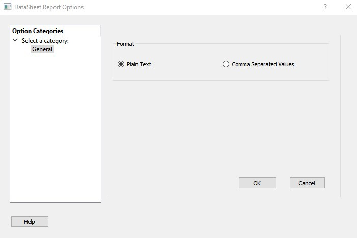

# Timing Datasheet Report Options Dialog Box

Use the Timing Datasheet Report Options dialog box to select the output format for the Timing  Datasheet Report.

To open the Timing Datasheet Report Options dialog box from the SmartTime Max/Min Delay Analysis  view, choose **Tools &gt; Reports &gt; Datasheet**.

You can generate your report in one of two formats:

-   **Plain Text**: Saves your report to disk in plain ASCII text format.
-   **Comma Separated Values**: Saves your report to disk in comma-separated value format \(.CSV\) format, which you can import into a spreadsheet

**Note:** This Datasheet Report feature is not supported for PolarFire.

**Parent topic:**[SmartTime Dialog Boxes](GUID-F96D2B4E-7DDD-4507-8621-C49A84F55C81.md)

