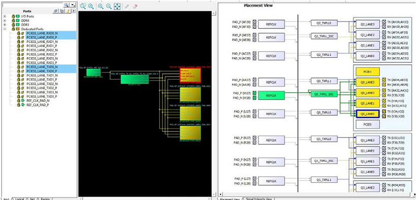

# Interface—Specific I/O Views

In addition to the Pin view, Port view and Package view, the I/O Editor  provides three views specific to PolarFire-supported interfaces I/Os:

-   Memory View—for I/O pin assignments of Memory interfaces such as DDR3/4, LPDDR3, and QDR.
-   XCVR View—Presents a physical view of the Transceiver connectivity, including Transceiver lanes, Reference Clock \(REFCLK\), and Transmit PLL lines.
-   IOD Lane Controller View—Presents the I/O Digital block view, used for non-memory interfaces using the FPGA I/Os.

**Parent topic:**[Interface—Specific I/Os and Views](GUID-535B44C3-032E-4658-9968-5753B7474A2B.md)

