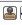

# Display Options Window

The **Display Options** window allows you to customize  the layout and the color settings for design elements on the **Floorplanner View** to meet your personal preferences.

There are three default layers and colors settings group that are provided  with Chip Planner:

-   System
-   Pin\_Planner
-   Grey\_Scale

By default, Chip Planner launches with “System” layers and colors settings  group for the **Device** \(Silicon feature\) and the  **Design** elements. These are the System Default Settings.

The following figure shows the color setting for MPF300TS die \(PolarFire\).

")

The device color setting is a hierarchical view. You may expand each  group to see the lower level items and see the default color setting for each. The  device cell types, I/O banks are die-dependent and reflects the available hardware  components for the selected die.

Similarly, the color settings for the **Design**  elements are displayed in a hierarchical view. Expand the group to see the default color  setting for each lower level **Design** element.

## Changing Color Settings

To change the color setting for a device or design element from the default setting:

1.  Right click the color for the element.

2.  In the Set Color dialog box, move the Cross across the color spectrum to the color you prefer.

3.  Click **OK**.

    

## Displaying an Instance in the Floorplanner View Using the Display Options Window

You can use the check box provided against each menu item to select the  elements you want to see in the Floorplanner View.

Some of the options in Display Options window cannot be unchecked, as  these options are fixed for any design. Such options have check boxes grayed-out and are  always enabled. However, you can still change the colors settings of these options.

Design Option in Display Options windows can be grouped according to Macro  Type and State of Macro. The display of design elements in the Floorplanner View depends on  both conditions met: the Macro Type and the State of macro. For example, if you want to see  4LUT elements of your design, you need to select both Movable and Placed Macro and 4LUT  options.

The following table lists the icons specific to the Display Options  window.

<table id="ID-00000905"><thead><tr id="ID-0000090B"><th id="ID-0000090C">

**Icon**

</th><th id="ID-0000090F">

**Name**

</th><th id="ID-00000912">

**Function**

</th></tr></thead><tbody><tr id="ID-00000915"><td id="ID-00000916">

</td><td id="ID-0000091B">

Rename Settings

</td><td id="ID-0000091E" align="justify">

Renames user created layers  and colors settings from the default name to a name you specify.

</td></tr><tr id="ID-00000921"><td id="ID-00000922">

</td><td id="ID-00000927">

Remove Settings

</td><td id="ID-0000092A">

Removes the user defined Layers and colors  settings.

</td></tr><tr id="ID-0000092D"><td id="ID-0000092E">

</td><td id="ID-00000933">

Clone Settings

</td><td id="ID-00000936">

Creates a clone of current Layers and Colors  Settings.

</td></tr></tbody>
</table>## Creating Personal Settings

You can create your display settings according to your preferences.

1.  Create a clone from one of the selected settings \(Grey Scale, Pin Planner, System\) using **Clone Setting**icon in the Display Options window.

    

2.  Accept the default name “Group \#” for the settings name or rename it from the Display Options window.

3.  Change color settings and/or select items to be displayed from the Display Options window.

The customized settings can be created and preserved on your system and will always be available in the drop-down group list in the Display Options window. The customized settings are available to you across different projects on the same machine.

## Selection

Clicking an item selects that one object in the model. However, you can select multiple  items:

-   To select contiguous items, click the first item you want to select, and then hold down the Shift key and click the last item you want to select. All items between the two are selected automatically.
-   To select items that are not contiguous. click the first item. Then hold down the Ctrl key and click each additional item you want to select.

If you selected multiple items and then change your mind about a selected item, you can  deselect the item by holding down the Ctrl key and clicking the item.

Selections follow a symmetrical behavior: If you select a port, all macros attached to it  are selected as well. Similarly, if you select a pin object, all corresponding macro  objects are also selected.

For example, if you select a port, the macro is also shown as selected. However, the  property page still points to the port. Pin selection follows the same behavior.

**Parent topic:**[Display Modes](GUID-FD21638F-3EBD-426A-A1E8-53B67BEDA222.md)

## Highlighting

The Highlighting option allows you to set persistent colors on designated macros, nets, or both across the system.

 

To set a highlight, go to the **Logical Object Browser** or the **Net Object Browser**, select one or more macros and/or components, and click the pencil icon as shown in the following toolbar.

When you set a highlight, all selected macros, ports, and/or nets in the  design are marked with the selected color. The selected color appears in the  left object browser tree. The following figure shows the left Main Object  Browser with the logical tree displayed. To select both components, click one  component, hold down the Ctrl key and click the other component.

 

 

The color remains until you select one of the two middle eraser icons:

-   The left eraser icon removes all highlights.
-   The right eraser icon removes highlights only from selected items.

To set the highlights, use the **Current Highlight** check box from the **Design Settings** docking  window. Below this check box are an **Auto Rotate** check  box, along with eight **Highlight** check boxes and radio  buttons.

-   Use the **Highlight** check boxes to enable or disable a highlight. Separate check boxes are provided for macros and nets.
-   Use the **Highlight** radio buttons to designate which highlight is active.

**Note:** You cannot disable the active highlight.

 

 

Clicking the colored box next to each check box allows you to select a color  for that macro or net.

The following figure shows an example of the  results when all options under **Nets** are exposed.

If **Net Settings** is not checked, all nets in  the system, except cross-probe nets, are disabled. All options subordinate to  that option are marked with a gray box to show that the option is not used. If  **Show Nets for Highlighted Macros** is not checked, all  net options inside the currently highlighted net selections are disabled. To  restore the color of these options, check the individual options. If you check  **Show Nets for Highlighted Macros**, the individual  settings in the highlight settings area determine whether nets will be  drawn.

**Note:** If you enable **Auto Rotate** and **Net** under **Auto Rotate**, and then uncheck the check box in the **Net** color selection, the net color in the Net view is not consistent with that of the Planner.

The **Consolidate Globals** option converts the raw clock display with globals connected to locals as if the sum of the local nets and the global nets are the same net. This is for display purposes only.

The bottom three options in  the Design Settings docking window work with groups of macros and ports for  which you consider net lines as a single entity:

-   **Show Interior Nets for Selected/Highlighted Macros** shows lines that connect two different macros in the group.
-   **Show Input Nets for Selected/Highlighted Macros** shows lines that connect an output port of an exterior macro to one or more input pins in the group.
-   **Show Driver Nets for Selected/Highlighted Macros** shows drivers in the group that connect with an exterior macro.

 

**Parent topic:**[Display Modes](GUID-FD21638F-3EBD-426A-A1E8-53B67BEDA222.md)

### Changing an Option Color

To change the color associated with an option:

1.  Right click the option under **Device Settings**.

    A right click menu similar to the following appears.

    

2.  Select an option from the right click menu. The following table describes the options.

    **Note:** The **Darker** and **Lighter** work well with fully saturated colors, but not for extremes; however, you can use the **Set Color** dialog box to achieve the desired result. If you apply the **Contrast** option twice, you will get approximately the same color fully saturated.

    **Tip:** You can also change option colors from one active element to another by selecting an active element under **Device Settings**, and then dragging the colored rectangle to the destination element.

<table id="TABLE_PJZ_NML_P4B"><thead><tr><th>

Option

</th><th>

Description

</th></tr></thead><tbody><tr><td>

Edit Color

</td><td>

Displays the Set Color dialog box as shown in the following figure. Use this dialog box to  choose a color from a set of basic or custom color palettes.  Alternatively, you can generate a color value by modifying  the hue, saturation, luminosity \(HSL\) or red, green blue  \(RGB\) color values. **Note:** Selecting fully or mostly transparent option colors can lead to unexpected results. For example, if you make a color fully transparent, you can have the option selected while rendering the color invisible.

</td></tr><tr><td>

Copy

</td><td>

Saves the color of the current option.

</td></tr><tr><td>

Paste

</td><td>

Makes the color of the option the same as the saved color.

</td></tr><tr><td>

Reset to Default

</td><td>

Resets the values for the selected option.

</td></tr><tr><td>

Darken

</td><td>

Creates a darker version of the color.

</td></tr><tr><td>

Lighten

</td><td>

Creates a lighter version of the color.

</td></tr><tr><td>

Roll

</td><td>

Moves the hue 60 degrees around the hue, saturation, value \(HSV\) color wheel.

</td></tr><tr><td>

Contrast

</td><td>

Creates a fully saturated color, with the hue rotated 180 degrees.

</td></tr></tbody>
</table>    

## Displaying Routing Views

Chip Planner provides the **Show Detailed Routing for Selected Nets** option to PolarFire and PolarFire SoC users.

Checking this option displays detailed routing for selected nets. This is a global  option, which means it applies to all Libero projects associated with the user when  selected. By default, this option is not selected, which displays the net as  rasnets.

## Cross Probing

When an external application performs a cross probe, the elements colored for cross probing and  cross probe nets are always displayed. There are no options that allow cross probing to  be disabled or turned off; however, you can change the cross probing color to  transparent.

Any additional cross probes get added to the current ones. To clear a cross probe state,  use the rightmost eraser icon in the following toolbar.

**Parent topic:**[Display Modes](GUID-FD21638F-3EBD-426A-A1E8-53B67BEDA222.md)

## Removing Custom Setting Group

To delete the custom setting group, select the custom setting group and click **Remove Setting icon**in Display Options window.

**Note:** The System setting is the default group and it cannot be removed. Only user-set custom settings can be removed.

## Reset to System Default

Click **Reset &lt;group\_name&gt; to Default**to reset the group’s settings to the system default settings.

## Consolidate Globals

When this box is checked, the Row Globals \(RGB\) are hidden from the  Floorplanner View. RGBs do not exist in the user netlist. They are buffers inserted by  Libero SoC after layout. When this option is turned on, the RGBs are removed from the  display and the Chip Globals are shown as directly driving the macros and cells. This view  makes it easy to determine the load of the Chip Globals, without having to track the load  from the Chip Globals to the RGBs and then to the macros and cells.

## Design Elements in Display Options Window

The design elements displayed in the Display Options window are family and die-dependent.

