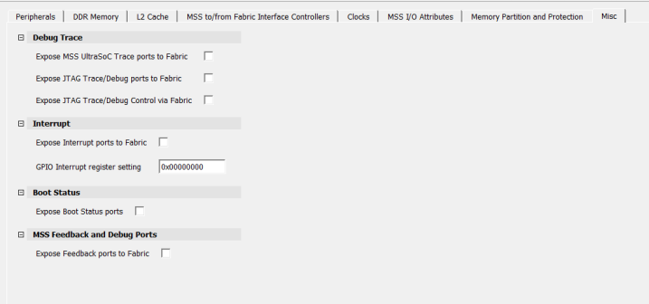
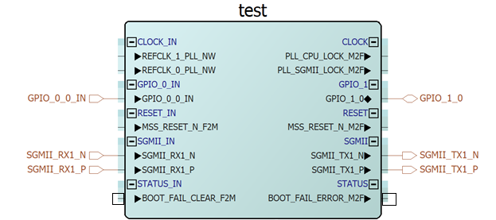
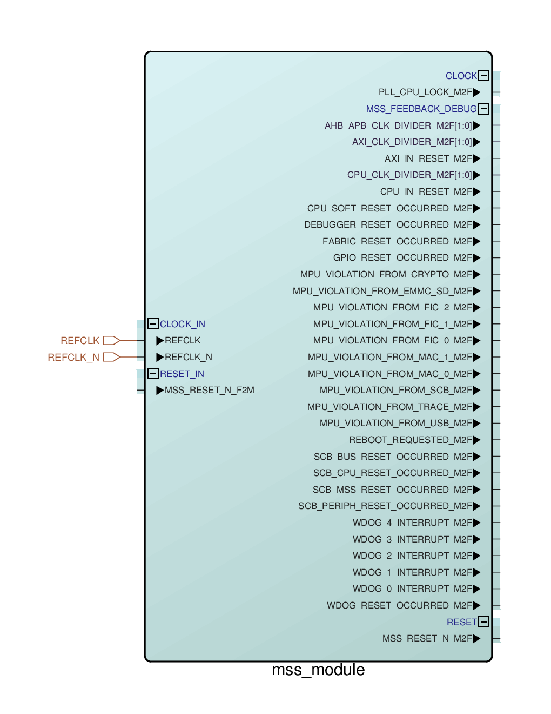

# Misc

Use the **Misc** tab to enable the following options:

-   Trace functionality
-   JTAG \(Debug\) functionality
-   Interrupts to/from MSS
-   Configuring GPIO Interrupt Register
-   Exposing Boot Status ports
-   Exposing feedback ports to fabric

For more information, see [PolarFire SoC FPGA MSS Technical Reference Manual](https://ww1.microchip.com/downloads/aemDocuments/documents/FPGA/ProductDocuments/ReferenceManuals/PolarFire_SoC_FPGA_MSS_Technical_Reference_Manual_VC.pdf).

By default, these options are marked as **Unused**. When any of the  options are enabled, the corresponding ports are exposed on the MSS block \(see the  following figure\).

**Boot Status**: When **Expose Boot Status ports**  option is selected, the ports `BOOT_FAIL_CLEAR_F2M` and  `BOOT_FAIL_ERROR_M2F` are exposed as shown in the following figure.  Both the signals typically represent binary states through voltage levels and are  generally synchronous with the MSS clock.

`Boot_fail_error_M2F` is a signal from the MSS to the FPGA fabric that  indicates a boot failure has occurred. When the MSS detects the failure, it sets this  signal high and informs the fabric to take action or log the issue.

`Boot_Fail_Clear_F2M` is a signal from the FPGA fabric to inform the MSS  that the boot failure has been addressed. When the FPGA fabric handles the issue, it  sets the signal high telling the MSS to clear the boot failure status.

**MSS Feedback and Debug Ports**: This option is only available for  production devices. If selected, a group of `MSS_FEEDBACK_DEBUG` ports  are exposed as shown in the following figure.

**Important:** In a Libero project, when System Controller Suspend Mode is enabled \(**Project** &gt; **Project Settings** &gt; **Device settings**\), the `PFSOC_SCSM` macro must be instantiated in the user design and the `REBOOT_REQUESTED_M2F` pin of MSS must be connected to the `SC_WAKE` pin of `PFSOC_SCSM` macro to wake up the system controller temporarily so it can reboot the MSS during normal operation.

**Parent topic:**[Using the PolarFire SoC MSS Configurator GUI](GUID-E11D45E3-7975-4122-BA81-72D6BDD0CD1A.md)

**Previous topic:**[DDR Memory](GUID-A29420D1-4E36-4920-B9BB-DD0B63F5E787.md)

**Next topic:**[L2 Cache](GUID-A82E6D32-6043-4BDA-AD1C-FC004A2867D0.md)

