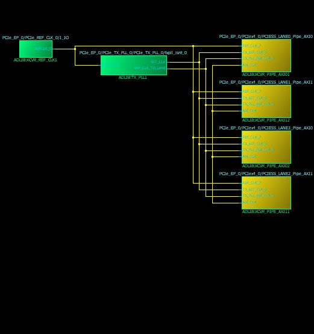
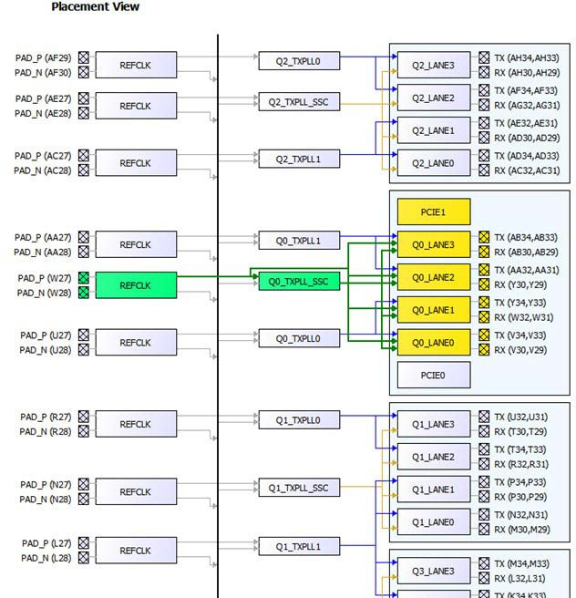
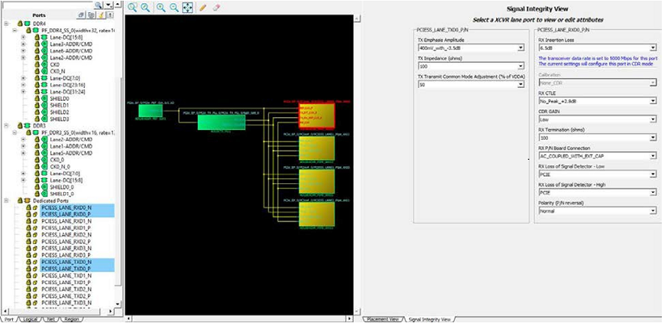

# XCVR View

The XCVR View allows the user to make assignments for Transceiver Lanes, Reference Clocks and Transmit PLLs. It presents the following views:

-   A schematic view of the Reference Clock \(REFCLK\), the TransmitPLL, and the Transceiver Lanes they drive. See [Figure   1](GUID-7C12202D-E802-4F24-9D43-D82DA41A819B.md#GUID-B8C2DA43-AA49-4DEB-976B-A000AD4F64BF).
-   A graphical placement view of the REFCLK, its connection from the PADS, to the TransmitPLL, to the Transceiver Lanes. See [Figure   2](GUID-7C12202D-E802-4F24-9D43-D82DA41A819B.md#GUID-2E4DD603-02E4-4DC5-99B2-088C63247641).
-   A Signal Integrity View for a Transceiver Lane, showing TX Emphasis Amplitude, TX Impedance, TX Transmit Common Mode Adjustment, RX and TX Polarity, RX Insertion Loss, RX CTLE, RX Termination, RX P/N Board Connection, and RX Loss of Signal Detector \(Low and High\). See [Figure   3](GUID-7C12202D-E802-4F24-9D43-D82DA41A819B.md#GUID-08639D67-B7DA-451A-BE57-D1C344AA9300).

    

     

    

     

     

    

     

The Signal Integrity View for a Transceiver Lane shows the following:

-   TX Emphasis Amplitude
-   TX Impedance
-   TX Transmit Common Mode Adjustment
-   RX and TX Polarity, RX Insertion Loss, RX CTLE
-   RX Termination
-   RX P/N Board Connection
-   RX Loss of Signal Detector \(Low, High, Calibration, and CDR Gain\)

-   **[XCVR Interface I/O Assignment](GUID-12E518DB-C374-49B7-B54A-4E2EA496BDEC.md)**  

-   **[Direct Versus Cascaded Connection](GUID-3881D9F6-C666-4392-9D23-52FD28D5924D.md)**  

-   **[Reference Clock \(REFCLK\) I/O Assignments](GUID-8321D8F3-580C-4E6A-88B0-B35C08D5DB50.md)**  

-   **[Transmit PLL Assignment](GUID-76A8FD1D-28CA-437B-AA7B-C99A34C35737.md)**  

-   **[Placement DRC Rules](GUID-C4347DC8-BDDA-465C-9278-A81C8993B2D3.md)**  

