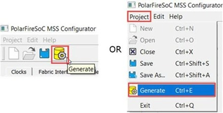
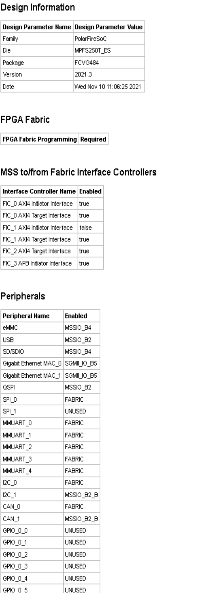
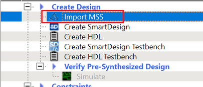

# Generating, Importing, and Exporting the MSS Component

The following sections describe the steps for generating, importing, and exporting the MSS<br /> component.

## Generating the MSS Component and Report

To generate the MSS component, use the **Generate** option \(see the following figure\).



The configuration file \(`module_name.xml`\) required for the firmware project and the configuration report file \(`module_name.html`\) are also generated at this time.

The Log window shows the following messages indicating the generated files:

```
INFO: Successfully generated MSS configuration report to 'C:/Microsemi/PFSOC_MSS_Configuration\PFSOC_MSS_C0_Report.html'
```

```
INFO: Successfully generated MSS component file to 'C:/Microsemi/PFSOC_MSS_Configuration/PFSOC_MSS_C0.cxz'
```

The report file \(`module_name.html`\) consists of following sections:

-   Design Information – This section consists of design parameters like device family name, die, package, configurator version, and the date the report was generated.
-   FPGA Fabric – This section mentions whether FPGA Fabric programming is required or not.
-   Fabric Interface Controllers – Consists information about status of the interface controllers.
-   Peripherals – Contains information about which peripherals are being used or unused.
-   DDR Memory – Shows the memory type.
-   List of Ports – Depicts information about all the ports with direction.
-   I/O REFCLK Port Settings – Shows all the information about Reference clock ports.
-   MSSIO Port Settings – Shows all the information about MSSIO ports.
-   DDRIO Port Settings – Shows all the information about DDRIO ports.
-   SGMII I/O Port Settings – Shows all the information about SGMII ports.



## Importing the MSS CXZ File to Libero SoC

To import the `PFSOC_MSS_C0.cxz` file:

1.  Use the **Import MSS** option shown in the following figure.

    

2.  From Design Hierarchy, drag the MSS component to SmartDesign canvas.
3.  Build the hierarchy.

**Note:** Any changes required in the MSS configuration must be performed in the PolarFire SoC MSS Configurator, and the updated `MSS CXZ` file must be re-imported and used in Libero SmartDesign.

## Importing the MSS XML File to SoftConsole

Copy the XML file from:<br />

```
<$Directory>:/Microsemi/PFSOC_MSS_Configuration/PFSOC_MSS_C0_mss_cfg.xml
```

<br /> to:

<br />

```
<$Installation Directory>:\Microchip\<$SoftConsole_Workspace>\Project_Name\src\platform\config\xml
```

<br />

<br /> **Note**: This step can also be performed using the **Import** option<br /> from SoftConsole.

## Exporting the FPGA Design Hardware Platform Information

When using PolarFire SoC, the overall application runs an embedded software<br /> application on the RISC-V cores that may use the FPGA fabric to expand the number of I/O<br /> peripherals, accelerate software functions using FPGA logic, or control FPGA fabric<br /> functions. In these cases, the processor communicates with the FPGA fabric via the MSS<br /> Fabric Interface Controllers \(FIC\) and interrupt ports. The embedded software application<br /> must contain the following information to establish this communication properly:

-   Fabric blocks like LSRAM, DMA Controller, and PCIe are connected to the AXI interconnect IP on the Fabric side. MSS communicates with these fabric blocks via Fabric Interface Controllers, which connects to the AXI Interconnect IP. The memory addresses of these fabric blocks are specified in the AXI Interconnect IP Configurator. These memory addresses must be specified in the software application.
-   In the Libero SoC design, the user must drive the required MSS interrupt ports and other interrupts can be grounded. The corresponding Interrupt Request \(IRQ\) handler routines must be invoked in the software application for interrupt handling.

Libero SoC tool does not export the FPGA fabric peripheral memory map, interrupt mapping,<br /> or peripheral clock frequencies. Therefore, add this information manually in your embedded<br /> software projects. For example, if fabric blocks such as LSRAM and DMA Controller are used<br /> in the design and interfaced with the MSS through a FIC, then the memory addresses of these<br /> fabric blocks must be specified in the user application code for accessing them from<br /> MSS.

