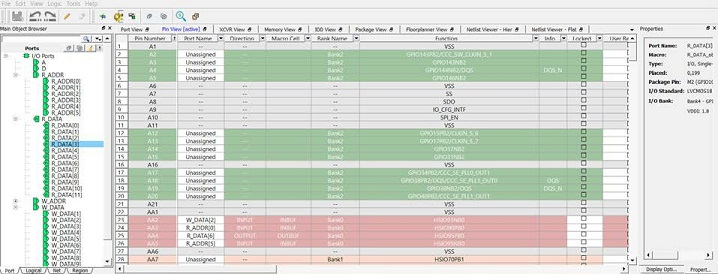

# Pin View

The Pin View displays the I/O attributes of I/O attributes in a  spreadsheet-like format. Each row corresponds to an I/O macro \(port\) in the design, sorted  by pin number. The column headings specify the names of the I/O attributes in your design.  The first few column headings are standard and common for all families. The remaining  columns display family-specific attributes. Only attributes applicable to a specific device  appear in the I/O Editor attributes. For some I/O attributes, you will choose from a  drop-down menu; for others, you may enter a value and for the rest, the field is read-only  and not editable.

The display in the columns can be sorted alphabetically, numerically or  filtered. See the following figure.

**Note:** ****See the following documents for more information about the I/O standards supported by each attribute:

-   [PDC Commands User Guide for SmartFusion2, IGLOO2, and RTG4](http://coredocs.s3.amazonaws.com/Libero/2025_1/Tool/pdc_ug.pdf)
-   [PDC Commands User Guide for PolarFire FPGA](http://coredocs.s3.amazonaws.com/Libero/2025_1/Tool/pf_pdc_ug.pdf)

-   **[Pin Number](GUID-B93E52A8-89BD-404B-A32E-8FF8463B24A0.md)**  

-   **[Port Name](GUID-A2DD9759-1259-46CF-9009-5B3D31A175D6.md)**  

-   **[Direction](GUID-A2C3E3FF-AE2E-4860-8960-656CB1ACC36F.md)**  

-   **[Macro Cell](GUID-9BDFC3D2-2D0A-45DD-9B61-896B6DB6461F.md)**  

-   **[Bank Name](GUID-D959B7F6-DB8A-4657-A081-C7B3C42E821B.md)**  

-   **[Function](GUID-1B086606-1A16-43A1-80B2-4A1C43457064.md)**  

-   **[Locked](GUID-ACF9E722-D342-45D0-86AC-C8C00A9F66E9.md)**  

-   **[User Reserved](GUID-EA259291-92C9-4E56-83C6-5E4D4518003B.md)**  

-   **[Dedicated](GUID-CF6AB730-CAF5-450F-8A0B-E4A8026088B7.md)**  

-   **[Vref](GUID-3779F60A-C061-4795-B2A2-2CA01657B3C0.md)**  

-   **[User I/O Lock Down](GUID-6B1395E7-84BD-40F2-A204-827363990615.md)**  

-   **[I/O State in Flash\*Freeze Mode](GUID-E4823E75-00A0-491D-9EB4-5447DFB0B48B.md)**  

-   **[Clamp Diode](GUID-9A6C6C89-0215-4830-80C4-DF083111981B.md)**  

-   **[Resistor Pull](GUID-8A4C1597-6FA1-4FC2-9706-1C275C503142.md)**  

-   **[I/O Available in Flash\*Freeze Mode](GUID-CDC11AE5-E91E-4A71-8EB1-2D4058666CE6.md)**  

-   **[Schmitt Trigger](GUID-13E0C636-93F5-4F4C-AAE7-6A4CAC7DA5F0.md)**  

-   **[Vcm Input Range](GUID-623839D6-0CDB-4618-B759-FCE07B146202.md)**  

-   **[On-Die Termination](GUID-51F1ACF2-D8DD-45E7-B448-6F6ED9E3315A.md)**  

-   **[ODT Static](GUID-865F2894-41FA-452F-AB25-00699E5CA7D3.md)**  

-   **[ODT Dynamic](GUID-0C2A41AB-D0FD-468E-8FCD-DAE3F27A5C0C.md)**  

-   **[ODT Value](GUID-2DE3A87E-69A9-4B13-8591-DEA67EA64A04.md)**  

-   **[ODT Imp \(Ohm\)](GUID-CC10A5C3-D043-4478-A3C4-87328996C934.md)**  

-   **[Low Power Exit](GUID-D0A886C7-34BB-49A7-9890-8C4CCB131011.md)**  

-   **[Input Delay](GUID-57AB72C8-7941-4037-B3C8-7D622A6A6DBB.md)**  

-   **[Slew](GUID-7C5B18FD-A59B-4B6F-9883-643C39445383.md)**  

-   **[Pre-Emphasis](GUID-1012F0B8-26AE-41CE-99EC-81B39D8BF292.md)**  

-   **[Output Drive](GUID-3BD39DDF-DA60-4474-96AA-041B0CFF8819.md)**  

-   **[Impedance](GUID-D816DBFE-A0B0-44AB-A3EF-7CFDA0507A78.md)**  

-   **[Output Load](GUID-E081FD25-A9F2-4586-98C7-0020079B348B.md)**  

-   **[Source Termination](GUID-7680DBC2-8182-4302-B465-8F0DDE25EC94.md)**  

-   **[Output Delay](GUID-FB5845B8-BC33-4E2A-BDD5-877ED41889C2.md)**  

