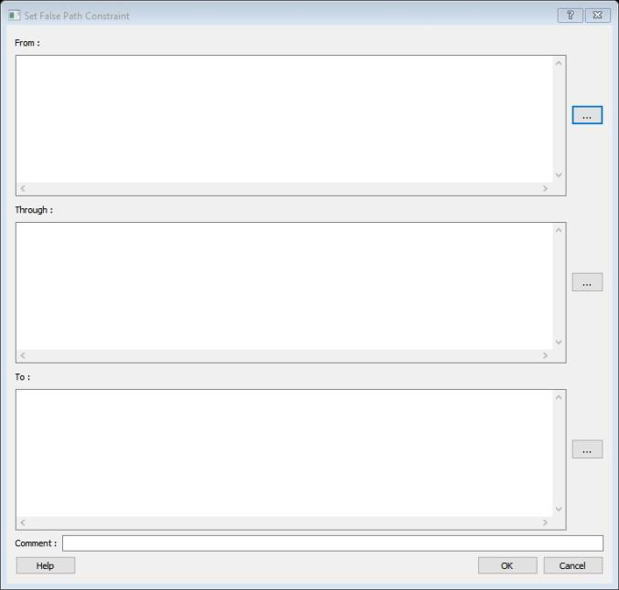

# Set False Path Constraint Dialog Box

Use the Set False Path Constraint dialog box to define specific timing paths as being false.

This constraint removes timing requirements on these false paths so that they are not considered during the timing analysis. The path starting points are the input ports or register clock pins and path ending points are the register data pins or output ports. This constraint disables setup and hold checking for the specified paths.

**Note:** The false path information always takes precedence over multiple cycle path information and overrides maximum delay constraints.

To open the Set False Path Constraint dialog box from the SmartTime Constraints Editor, choose  **Constraints &gt; Exceptions False Path &gt; Add False Path Constraint**.

-   **[From](GUID-FF043461-7122-4CE8-A1B0-E45A1B37F722.md)**  

-   **[Through](GUID-E7324483-54EC-46F6-8BF0-903ECCDA45A8.md)**  

-   **[To](GUID-214A90D6-EFE4-492D-B5BD-163E78A47F14.md)**  

-   **[Comment](GUID-EEF0D44A-1C7A-446B-8289-B94EA13913C9.md)**  

**Parent topic:**[SmartTime Dialog Boxes](GUID-F96D2B4E-7DDD-4507-8621-C49A84F55C81.md)

