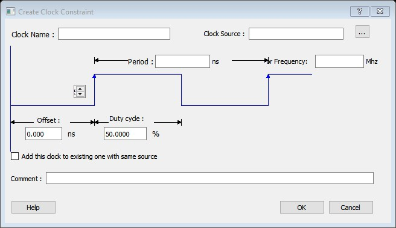
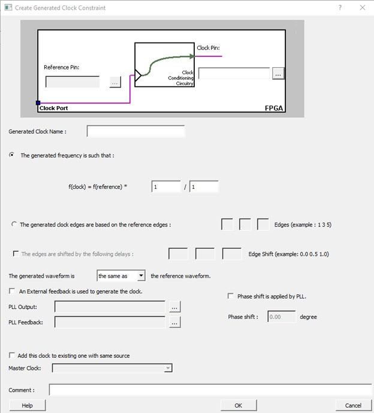
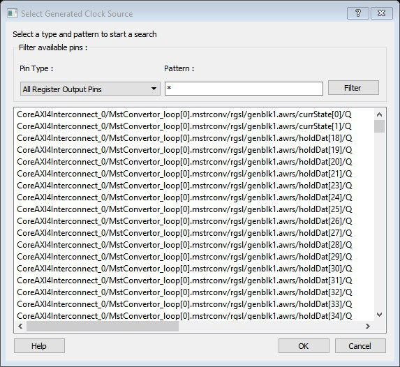
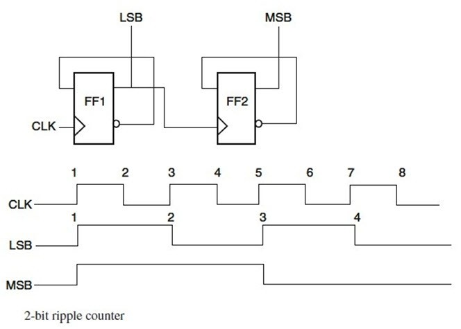
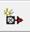
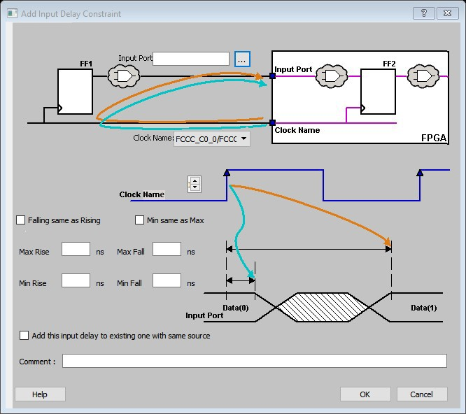
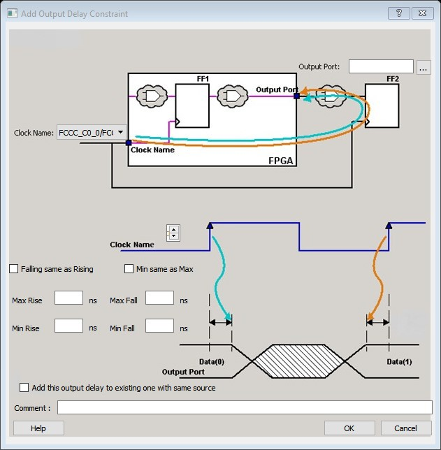
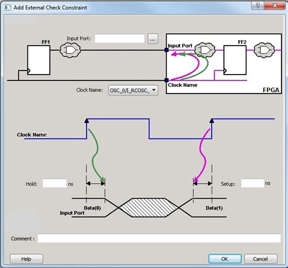
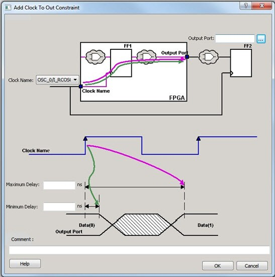

# Required Constraints

This chapter describes how to add constraints. It also lists the supported constraints.

## Set a Clock Constraint

Adding a clock constraint is the most effective way to constrain and verify that the timing  behavior of a sequential design meets your performance goals.

To set a clock constraint, use one of the following ways to open the **Create Clock Constraint** dialog box:

-   In the **Constraints Browser**, double-click **Clock**.
-   Click the **Add Clock Constraint**  icon.
-   In the **Constraints** list, click **Clock**.
-   In the **Clock Constraints Table**, right-click the first row or any other row \(if they exist\) and click **Add Clock Constraint**.

The following table lists all the **Create Clock Constraint** dialog  box options.

|Option|Description|
|------|-----------|
|Clock Name|Specifies the name of the clock constraint.|
|Clock Source|Select the pin to use as clock source. To display the  **Select Source Pins for the Clock Constraint**  dialog box, click **Browse**.The following options  are available on the Select Source Pins for the Clock  Constraint dialog box:Type: Displays the type of the  available pins in the design. The type options for source  pins are:Input  PortsAll  PinsAll  NetsPattern: The default is \*,  which is a wild-card match for all. You can specify any  string value. Click Search to  filter the available pins based on the specified pin  type and pattern.Available Pins:The list  displays the available Clock Pins. If you change the  pattern value, the list box shows the available pins  based on the filter.To add the pins from the  Available Pins list to the  Assigned Pins list, click  Add or Add  All. To remove the pins from the  Assigned Pins list, click  Remove or Remove  All.Assigned Pins:Displays the  pins selected in the Available  Pins list. To add the source pins to the  constraint, click pins from this list and click  OK.|
|Period/Frequency|Specifies the period in nanoseconds \(ns\) or frequency in MegaHertz  \(MHz\). When you edit the period, the tool updates the frequency value  automatically. The frequency must be a positive real number. Accuracy is  up to three decimal places.|
|Starting Clock Edge Selector|Click the up or down arrow to use the rising or falling edge as the  starting edge for the created clock.|
|Offset|  Indicates the shift \(in nanoseconds\) of the first clock edge with  respect to instant zero common to all clocks in the design.  The offset value must be a positive real number. Accuracy is up to  two decimal places. Default value is 0. |
|Duty cycle|Specifies the percentage of the overall period that the clock pulse  is high. The duty cycle must be a positive real number. Accuracy is up  to four decimal places. Default value is 50%.|
|Add this clock to existing one with same source|Select this check box to add a new clock constraint on the same  source without overwriting the existing clock constraint. The new clock  constraint name must be different than the existing name. Otherwise, the  new constraint overwrites the existing one, even if you select this  check box.|
|Comment|Enter a single line of text that describes the purpose of the clock  constraints.|

### Specifying Clock Constraints

Specifying clock constraints is the most effective way to constrain and verify the timing  behavior of a sequential design. Use clock constraints to meet your performance  goals.

To specify a clock constraint:

1.  Add the constraint in the editable constraints grid or open the **Create Clock Constraint** dialog box using one of the following methods:
    -   In the **Constraints Editor**, click the  icon.
    -   In the Constraint Browser, right-click the **Clock** and select **Add Clock Constraint**.
    -   In the Constraint Browser, double-click **Clock**.
    -   In the Constraints list \(**Constraints &gt; Clock**\), select **Clock**. The **Create Clock Constraint** dialog box appears.

        

2.  Select the pin to use as the clock source. You can click **Browse**to display the **Source Pins for Clock Constraint** dialog box.

    **Note:** Do not select a source pin when you specify a virtual clock. Virtual clocks can be used to define a clock outside the FPGA that synchronize I/Os.

3.  Use the **Choose the Clock Source Pin** dialog box to display a list of source pins from which you can choose. By default, it displays the explicit clock sources of the design. To select other pins in the design as clock source pins, select **Filter available objects - Pin Type**as **Explicit clocks**, **Potential clocks**, **All Ports**, **All Pins**, **All Nets**, **Pins on clock network**, or **Nets in clock network**. To display a subset of the displayed clock source pins, you can create and apply a filter.

    **Note:** Multiple source pins can be specified for the same clock when a single clock is entering the FPGA using multiple inputs with different delays.

4.  To save these dialog box settings, click **OK**.
5.  Specify the **Period**in nanoseconds \(ns\) or **Frequency**in megahertz \(MHz\).
6.  Modify **Clock Name**. The name of the first clock source is provided as default.
7.  Modify **Duty cycle**, if needed.
8.  Modify **Offset**of the clock, if needed.
9.  Modify the first edge direction of the clock, if needed.
10. Select the **Add this clock to an existing one with the same source** option, if needed.
11. Click **OK**. The new constraint appears in the **Constraints List**.
12. Click **File** &gt; **Save**, the **Timing Constraints Editor**saves the newly created constraint in the database.

## Set a Generated Clock Constraint

Use the generated clock constraint to define an internally generated clock for your design and  verify its timing behavior to meet your performance goals.

To set a generated clock constraint, use one of the following ways to open the **Create Generated Clock Constraint** dialog box:

-   In the **Constraints Browser**, double-click **Generated Clock**.
-   Click the **Add Generated Clock Constraint**  icon.
-   In the **Constraints** list, click **Generated Clock**.
-   In the **Generated Clock Constraints Table**, right-click any row and click **Add Generated Clock Constraint**.

The following table lists all the **Create Generated Clock Constraint** dialog box options.

<table id="TABLE_M1D_RJH_5NB"><thead><tr><th>

Option

</th><th>

Description

</th></tr></thead><tbody><tr><td>

Clock Pin

</td><td>

Select a clock pin to use as the generated clock source. To  display a list of the available generated clock source pins, click  Browse. The Select Generated  Clock Source dialog box appears.The following  options are available on the Select Generated Clock  Source dialog box:Pin Type: Displays the available  pin types. The pin type options for the generated clock  reference are:Output PortsAll  Register Output PinsAll  PinsAll  NetsInput  PortsPattern: The default is \*, which  is a wild-card match for all. You can specify any string  value. Click Filter to filter the  available pins based on the specified pin type and  pattern.The list box displays the available pins  based on the filter. To save the dialog box settings,  click the pins from this list and click  OK. When prompted, modify the  clock name if necessary.

</td></tr><tr><td>

Reference Pin

</td><td>

Specifies a clock reference. To display the list of available  clock reference pins, click Browse. The  Select Generated Clock Reference dialog  box appears.The following options are available on the  Select Generated Clock Reference dialog  box:Pin Type: Displays the available  pin types. The pin type options for the generated clock  reference are:Input  PortsAll  PinsPattern: The default is \*,  which is a wild-card match for all. You can specify any  string value. To filter the available pins based on the  specified Pin Type and Pattern, click  Filter.The list box  displays the available pins based on the filter. To save  the dialog box settings, click the pins from this list  and click OK.

</td></tr><tr><td>

Generated Clock Name

</td><td>

Specifies the name of the generated clock constraint. **Note:** This field is required for virtual clocks when no clock source is provided.

</td></tr><tr><td>

Generated Frequency

</td><td>

Specifies the values to calculate the generated frequency. A  multiplication factor, division factor, or both is applied to the  reference clock to compute the generated clock. The multiplication or  division factor must be a positive integer.

</td></tr><tr><td>

Generated Clock Edges

</td><td>

Specifies the frequency of the generated clock. The specified integer  value represents the edges from the source clock that form the edges of  the generated clock.For more information, see Generating Clock Edges

</td></tr><tr><td>

Edge Shift

</td><td>

Specifies a list of three floating-point numbers that represents the  amount of shift, in library time units, that the specified edges are to  undergo to yield the final generated clock waveform. The floating-point  values can be positive or negative:-   A positive value indicates a shift later in time.
-   A negative indicates a shift earlier in time.

For example, an edge shift of \{1 1 1\} on the  LSB generated clock shifts each derived edge by 1 time unit. To  create a 200 MHz clock from a 100 MHz clock, use edge \{ 1 2  3\} and edge shift \{0 -2.5  -5.0\}.

</td></tr><tr><td>

Generated Waveform

</td><td>

Specify whether the generated waveform is the same as the reference  waveform or inverted with respect to the reference waveform. When you  finish, click **OK**.

</td></tr><tr><td>

Phase

</td><td>

This field is primarily used to report the information captured from  the CCC configuration process, and when constraint is auto-generated.  Meaningful phase values are: 0, 45, 90, 135, 180, 225, 270, and  315.

</td></tr><tr><td>

PLL Output

</td><td>

Refers to the CCC GL0/1/2/3 output that is fed back to the PLL \(in  the CCC\). It reports the information captured from the CCC configuration  process and when the constraint is auto-generated.

</td></tr><tr><td>

PLL Feedback

</td><td>

Refers to the way that the GL/0/1/2/3 output signal of the CCC is  connected to the PLL's FBCLK input. This field is primarily used to  report the information captured from the CCC configuration process and  when constraint is auto-generated.

</td></tr><tr><td>

Add Clock to Existing Clock

</td><td>

Specifies that the generated clock constraint is a new clock  constraint in addition to the existing one at the same source. The name  of the clock constraint should be different from the existing clock  constraint. When this option is selected, master clock must be  specified.

</td></tr><tr><td>

Master Clock

</td><td>

Specifies the master clock used for the generated clock when multiple  clocks fan into the master pin. It can be selected from the list. This  option is used with the add option of the generated clock.

</td></tr><tr><td>

Comment

</td><td>

Enter a single line of text that describes the purpose of the  generated clock constraints.

</td></tr></tbody>
</table>### Specifying Generated Clock Constraints

Specifying a generated clock constraint enables you to define an internally generated clock for  your design and verify its timing behavior. Use generated clock constraints and [clock constraints](GUID-82C12ACE-BFDB-4DE1-8DFA-01693C236E2B.md#)to meet your performance goals.

To specify a generated clock constraint:

1.  Open the **Create Generated Clock Constraint** dialog box using one of the following methods:

    -   Click the  icon.
    -   In the Constraint Browser, right-click the **Generated Clock** and click **Add Generated Clock**.
    -   Double-click the **Generated Clock Constraints** grid. The **Create Generated Clock Constraint** dialog box appears.
    

2.  Select a **Clock Pin**to use as the generated clock source. To display a list of available generated clock source pins, click **Browse**. The **Select Generated Clock Source** dialog box appears.

    

3.  Specify a **Reference Pin**. To display a list of available clock reference pins, click **Browse**. The **Select Generated Clock Reference** dialog box appears.
4.  Specify the **Generated Clock Name** \(optional\).
5.  Specify the values to calculate the generated frequency: a multiplication factor and/or a division factor \(both positive integers\).
6.  Specify the orientation of the generated clock edges based on the reference edges by entering values for the edges and the edge shifts. This is optional.
7.  Specify the first edge of the generated waveform either same as or inverted with respect to the reference waveform.
8.  Specify the PLL output and PLL feedback pins, if an external feedback generate the clock.
9.  Specify the Phase shift applied by the PLL in degrees.
10. Specify the Master Clock, if you want to add this to an existing one with the same source.
11. Click **OK**. The new constraint appears in the **Constraints List**.

    **Tip:** Select **File** &gt; **Save** to save the newly created constraint in the database.

### Generating Clock Edges

The frequency of the generated clock can also be specified by selecting the **Generated Clock Edges** option. Specify the integer values that represent the edges  from the source clock that form the edges of the generated clock.

Three values must be specified to generate the clock. If you specify less than three, a tool tip indicates an error. The following example shows how to specify the clock edges.

If LSB is the generated clock from CLK clock source, the edge values must be `[1 3 5]`. If MSB is the generated clock from CLK clock source, the edge values  must be `[1 5 9]`.

## Set an Input Delay Constraint

The input delay constraint defines the arrival time of an input relative to a clock. You  specify the input delay constraint in the **Input Delay** dialog box.  This dialog box allows you to enter an input delay constraint by specifying the timing  budget outside the FPGA. You can enter the maximum delay, minimum delay, or both.

To specify an input delay constraint, use one of the following ways to open the  **Add Input Delay Constraint** dialog box:

1.  In the **Constraints Browser**, double-click **Input Delay**.
2.  Click the **Add Input Delay Constraint**  icon.
3.  From the **Constraints** menu, click **Input Delay**.
4.  In the **Input Delay Constraints Table**, right-click any row and click **Add Input Delay Constraint**.

    

The following table describes the **Add Input Delay Constraint**  dialog box options.

|Option|Description|
|------|-----------|
|Input Port|Specify the input port or click **Browse** next to  **Input Port** to display the **Select Ports for Input Delay** dialog box. You can apply the  input delay constraint on multiple input ports.The following options  are available on the Select Ports for Input  Delay dialog box:Type: Displays the type of the  available pins in the design. The only valid selection is  Input Ports.Pattern: The default is \*,  which is a wild-card match for all. You can specify any  string value. Click Search to  filter the available pins based on the specified pin  type and pattern.Available Pins:The list box  displays the available input ports. If you change the  pattern value, the list box shows the available input  ports based on the filter.To add the pins from  the Available Pins list to the  Assigned Pins list, click  Add or Add  All. To remove the pins from the  Assigned Pins list, click  Remove or Remove  All.Assigned Pins:Displays the  pins selected from the Available  Pins list. To add the input port, click  the pins from this list and click  OK.|
|Clock Name|Specifies the clock reference to which the specified input delay is  based.|
|Clock edge|Selects rising or falling as the launching edge of the clock.|
|Falling same as Rising|Select this check box to use the same delay value for the falling  input value and the rising input value.|
|Min same as Max|Select this check box to use the same delay value for min and max  delay.|
|Max Rise and Max Fall|Specifies the delay in nanoseconds for the longest path arriving at  the specified input port.|
|Min Rise and Min Fall|Specifies the delay in nanoseconds for the shortest path arriving at  the specified input port.|
|Add this input delay to existing one with same source|Specifies that this input delay constraint should be added to an  existing constraint on the same port\(s\). Use this option to capture  information on multiple paths with different clocks or clock edges  leading to the same input port\(s\).|
|Comment|Enter a one-line comment for this constraint.|

## Set an Output Delay Constraint

The output delay constraints defines the output delay of an output relative to a clock. You  specify the output delay constraints in the **Output Delay** dialog box. This dialog  box allows you to enter an output delay constraint by specifying the timing budget  outside the FPGA. You can enter the maximum delay, the minimum delay, or both.

To specify an output delay constraint, use one of the following ways to open the Add Output Delay  Constraint dialog box:

-   In the **Constraints Browser**, double-click **Output Delay**.
-   Click the **Add Output Delay Constraint**  icon.
-   From the **Constraints** menu, click **Output Delay**.
-   In the **Output Delay Constraints Table**, right-click any row and click **Add Output Delay Constraint**.

The following table describes the **Add Output Delay Constraint**  dialog box options.

|Option|Description|
|------|-----------|
|Output Port|Specifies a list of output ports in the current design to which the  constraint is assigned. You can select multiple output ports to apply  the output delay constraints.Specify the name of the output port or  click Browse to display the Select  Ports for Output Delay dialog box.The  following options are available on the Select Ports for  Output Delay dialog box:Type: Displays the type of the  available pins in the design. The only valid selection is  Output Ports.Pattern: The default is \*, which  is a wild-card match for all. You can specify any string  value. Click Search to filter the  available pins based on the specified pin type and  pattern.Available Pins: The list box  displays the available  output  ports.  If you change the pattern value, the list box shows the  available  output  ports  based on the  filter.To  add the pins from the Available Pins  list to the Assigned Pins  list, click Add or  Add All. To remove the pins  from the Assigned Pins list,  click Remove or Remove  All.Assigned Pins: Displays pins  selected from the Available Pins list. To add the  Output Ports for the Output Delay Constraint, click pins  from this list and click OK.|
|Clock Name|Specifies the clock reference to which the specified output delay is  related.|
|Clock Edge Selector|Use the Up or the Down arrow to select the rising or falling edge as  the launching edge of the clock.|
|Falling same as Rising|Select this check box to use the same delay value for the  **Falling output** value as well as the  **Rising output** value.|
|Min same as Max|Select this check box to use the same delay value for Min and Max  delay.|
|Max Rise and Max Fall|Specifies the delay in nanoseconds for the longest path from the  specified output  port  to the captured edge. This represents a combinational  path delay to a register outside the current design plus the library  setup time.|
|Min Rise and Min Fall|Specifies the delay in nanoseconds for the shortest path from the  specified output  port  to the captured edge. This represents a combinational  path delay to a register outside the current design plus the library  hold time.|
|Add this output delay to existing one with same source|Specifies that this output delay constraint should be added to an  existing constraint on the same port\(s\). This    capture information on multiple paths with different clocks or clock  edges leading from the same output port\(s\).|
|Comment|Enter a one-line comment for the constraint.|

## Set an External Check Constraint

Use the Add External Check Constraint to specify the timing budget inside the FPGA.

To specify an External Check constraint, open the **Add External Check Constraint** dialog box in one of the following three ways:

-   In the **Constraints Browser**, double-click **External Check**.
-   From the **Constraints** menu, click **External Check**.
-   In the **External Check Constraints Table**, right-click any row and click **Add External Check Constraint**. The **Add External Check Constraint** dialog box appears.

The following table describes the **Add External Check Constraint**  dialog box options.

|Option|Description|
|------|-----------|
|Input Port|Specify the Input Port or click **Browse** next to  **Input Port** to display the **Select Ports for External Check** dialog box. You can apply the  External Check constraint on multiple input ports.|
|Clock Name|Specifies the clock reference to which the specified External Check  is related.|
|Hold|Specifies the external hold time requirement in nanoseconds for the  specified input ports.|
|Setup|Specifies the external setup time requirement in nanoseconds for the  specified input ports.|
|Comment|Enter a one-line comment for this constraint.|

## Set a Clock To Out Constraint

Enter a clock to output constraint by specifying the timing budget inside the FPGA.

To specify a Clock to Out constraint, open the **Add Clock to Out Constraint**  dialog box in one of the following three ways:

-   In the **Constraints Browser**, double-click **Clock to Out**.
-   From the **Constraints** menu, click **Clock to Out**.
-   Right-click any row of the **Clock To Out Constraints Table** and click **Add Clock to Out Constraint**. The **Add Clock To Out Constraint** dialog box appears.

The following table describes the **Add Clock to Out Constraint**  dialog box options.

|Option|Description|
|------|-----------|
|Output Port|Specify the name of the output port or click  **Browse** to display the **Select Ports for Clock to Output** dialog box.You can select  multiple output ports to apply the Clock to Out  constraint.|
|Clock Name|Specifies the clock reference to which the specified Clock to Out  delay is related.|
|Maximum Delay|Specifies the delay in nanoseconds for the longest path from the  specified output to the captured edge. This represents a combinational  path delay to a register inside the current design plus the library  setup time.|
|Minimum Delay|Specifies the delay in nanoseconds for the shortest path from the  specified output to the captured edge. This represents a combinational  path delay to a register inside the current design plus the library hold  time.|
|Comment|Enter a one-line comment for this constraint.|

