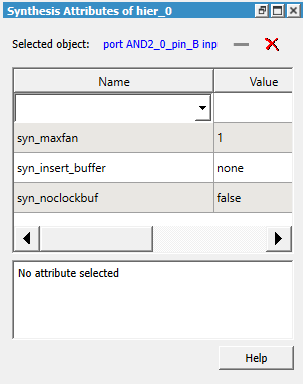

# Managing Synthesis Attributes

This feature allows you to add or modify the synthesis attributes of the SmartDesign objects \(nets, ports, and instances\) directly from the SmartDesign canvas.

**Important:** Synthesis attributes are not allowed to be set on BIF pins, BIF nets, pin groups, and slices. User-defined attributes are not supported.

Synthesis attributes that apply to the component can only be set on SmartDesign canvas. In the generated HDL file, those attributes are added to the SmartDesign module or architecture.

The following table lists the synthesis attributes available in the Synopsys® FPGA synthesis tool that are supported by SmartDesign.

|Attribute|Object|
|---------|------|
|`syn_insert_buffer`|Port, instance|
|`syn_keep`|Net|
|`syn_maxfan`|Port, net, instance|
|`syn_no_compile_point`|Module or architecture|
|`syn_noclockbuf`|Port, net, module or architecture|
|`syn_noprune`|Instance, module or architecture|
|`syn_preserve`|Port, module or architecture|
|`syn_hier`|Module or architecture|

**Important:** For more details for each attribute, see [Synplify Pro® ME](https://www.microchip.com/en-us/products/fpgas-and-plds/fpga-and-soc-design-tools/fpga/synthesis-and-simulation/synplify-pro-me#documents).

To add, modify, or remove synthesis attributes of  the SmartDesign objects, perform the following steps:

1.  Click **Manage Synthesis Attributes** icon in the SmartDesign toolbar. The **Synthesis Attributes** window appears.

    

2.  Select any object of interest such as a port, net, or instance in the SmartDesign canvas, the attributes of the selected object is displayed in the **Synthesis Attributes** window.
3.  You can perform the following actions:

    |Action|Steps|
    |------|-----|
    |Add attributes|From the **Name** dropdown list box, select the synthesis attribute of  your choice. The synthesis attribute is automatically added with a default value.  The selected synthesis attribute description is displayed at the bottom of the  window.|
    |Modify attributes|Double-click the `Value` field of the synthesis attribute and  change the default value as required.|
    |Remove attribute|  Click to select the synthesis attribute you want to remove and click  –. To remove all synthesis attributes, click  X. Alternatively, right-click on the port, net, or  instance that has synthesis attributes and select Clear Synthesis  Attributes. |

