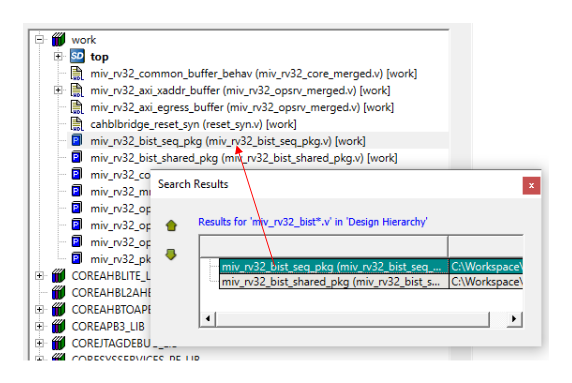

# Finding Objects in Your Project

You can quickly and easily find objects in your project using the **Find bar**  functionality.

To find for objects in your project, perform the following steps:

1.  On the menu, click **View** and select **Find Bar**. The **Find** dockable dialog box appears at the bottom the Libero main window.

    

    **Tip:** Ensure to retain the **Find Bar** option enabled to avoid performing step 1 and directly continue with step 2 whenever Libero is launched next.

2.  In the **Find** box, specify the object type you want to find.
3.  In the **Search in** box, select the location in which you want to search the object.

    

4.  Click **Find All**. If the objects you are trying to find are available in the specified search location, the search results are populated in the **Search Results** dockable dialog box. When you select a search result, it is highlighted and displayed in the library.

    

