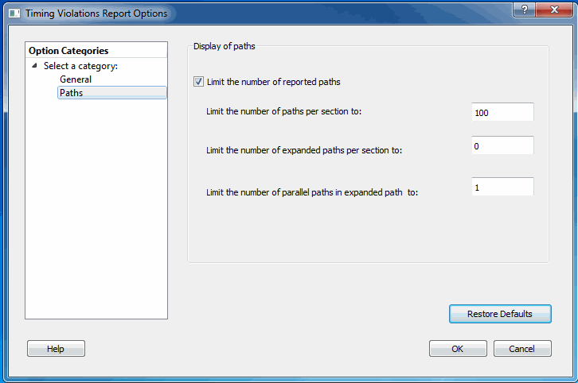

# Paths

The following figure shows the Timing Violations Report Options—Paths dialog box.

-   **[Display of Paths](GUID-75D4D691-4BDF-44B1-B317-DF26FFAE04C3.md)**  

-   **[Restore Defaults](GUID-D410C4A1-7D5C-4CC5-8F86-05A155D8572D.md)**  

**Parent topic:**[Timing Violations Report Options Dialog Box](GUID-892D2E3C-BC08-4D52-8468-95678F41CD25.md)

