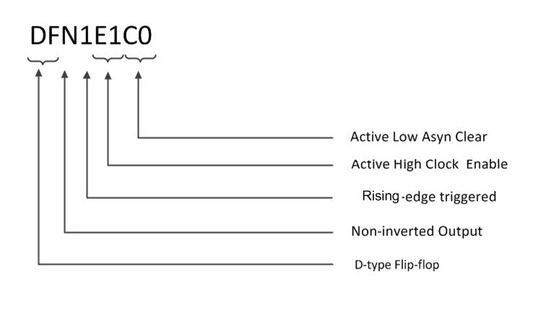

# Introduction

This macro library guide supports the RTG4™ FPGA  family. See the Microchip website for macro guides for other families. This guide follows a  naming convention for sequential macros that is unambiguous and extensible, making it  possible to understand the function of the macros by their name alone.

The first two mandatory characters of the macro name indicates the basic  macro function:

-   DF—D-type flip-flop

The following mandatory character indicates the output polarity:

-   I—output inverted \(QN with bubble\)
-   N—output non-inverted \(Q without bubble\)

The following mandatory number indicates the polarity of the clock or  gate:

-   1—rising edge-triggered flip-flop or transparent high latch \(non-bubbled\)
-   0—falling edge-triggered flip-flop or transparent low latch \(bubbled\)

The following two optional characters indicate the polarity of the Enable  pin, if present:

-   E0—active-low enable \(bubbled\)
-   E1—active-high enable \(non-bubbled\)

The following two optional characters indicate the polarity of the  asynchronous Preset pin, if present:

-   P0—active-low asynchronous preset \(bubbled\)
-   P1—active-high asynchronous preset \(non-bubbled\)

The following two optional characters indicate the polarity of the  asynchronous Clear pin, if present:

-   C0—active-low asynchronous clear \(bubbled\)
-   C1—active-high asynchronous clear \(non-bubbled\)

All sequential and combinatorial macros \(except MX4 and XOR8\) use one  logic element in the RTG4 family.

For example, the macro DFN1E1C0 indicates a D-type flip-flop \(DF\) with a  non-inverted \(N\) Q output, positive-edge-triggered \(1\), with Active-High Clock Enable \(E1\)  and Active-Low Asychronous Clear \(C0\). See the following figure.

## Truth Table Notation

The truth table states in this User Guide are defined as follows.

|State|Meaning|
|-----|-------|
|0|Logic “0”|
|1|Logic “1”|
|X|Don't Care \(for Inputs\), Unknown \(for  Outputs\)|
|Z|High Impedance|

## User Parameter/Generics

### WARNING\_MSGS\_ON

This feature enables you to disable the warning messages display. Default is ON  \('True' in VHDL and '1' in Verilog\).

