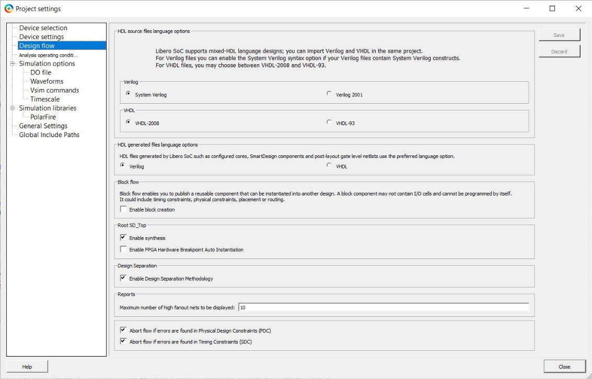

# Creating a Design

A complete design consists of sub-systems that are presented as block elements. Each block element is created in a top-level module, which is then floorplanned into separate regions for each sub-system block. There are also overlapping IRS regions that connect the blocks. It is important to physically isolate these IRS regions from one another. To enable the Design Separation Methodology, check the **Enable Design Separation Methodology** box in the Design flow settings on the Project settings page, as shown in the following figure. After this step, the design should be run through a layout, followed by timing closure.

For more information about creating your design, see the **Microchip Design Separation Methodology Guide**.

