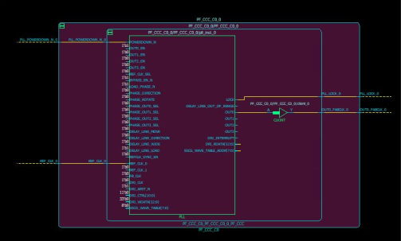
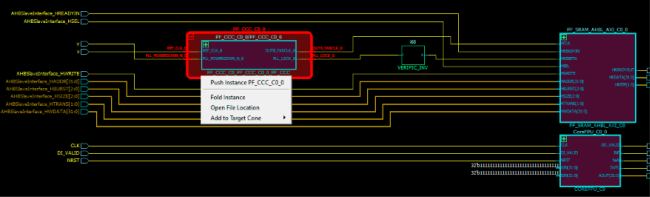

# Fold Instance

The expanded hierarchy of an instance can be folded or collapsed back into the parent instance.

Use one of the following three ways to fold/collapse the expanded instance back into the parent instance:

-   Click the **-** button at the top left of the instance.

    

-   Click to select the expanded instance, then right click and select **Fold Instance** in the menu.

    

-   Click the **Fold All Instance** icon.

**Parent topic:**[Dive In/Out of Design Hierarchy Without Creating New Views](GUID-AF5CEAAD-C50A-4627-BBEC-40CD98C66462.md)

