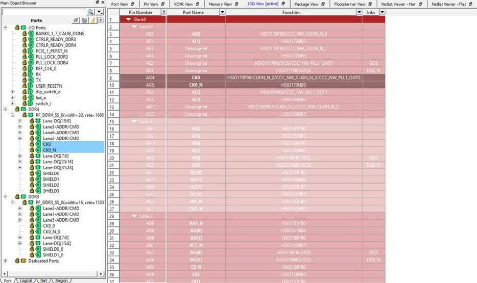

# IOD View

The IOD lane controller handles the complex operations necessary for the  high-speed interfaces, such as DDR memory interfaces and CDR interfaces. To bridge the lane  clock to the bank clock, the lane controller is used to control an I/O FIFO in each IOD.  This I/O FIFO interfaces with DDR memory by utilizing the DQS strobe on the lane clock. The  lane controller can also delay the lane clock using a PVT—calculated delay code from the  DLL to provide a 90° shift. Certain I/O interfaces require a lane controller to handle the  clock-domain that results with higher gear ratios.

The lane controller also provides the functionality for the IOD CDR. Using the four phases from the CCC PLL, the lane controller creates eight phases and selects the proper phase for the current input condition with the input data. A divided-down version of the recovered clock is provided to the fabric \(DIVCLK\).

In the I/O Editor, the IOD View allows I/O assignments for IOD \(I/O Digital\) Interface blocks. Libero SoC currently supports CDR and RX\_DDR\_L\_A/TX\_DDR\_G\_A generic IOD interface. Future releases will add in more interfaces. The IOD views presents a hierarchical view of the generic IOD based on Bank and Lanes. In PolarFire silicon, there may be up to eight banks per chip and six lanes per bank. Bigger dies may have even more lanes per bank.

**Note:** The actual number of banks and the number of lanes per bank vary with the die.

When the I/O Editor opens the IOD view, it detects the specific IOD Interface standards, groups the I/Os into specific banks/lanes and populates the spreadsheet-like table with the I/O names \(specific to the IOD Interface\) accordingly.

See the following figure for an example of the IOD View.

-   **[Generic I/O Assignments](GUID-9CF7AF08-AD69-47FC-BD4E-D35D220C5753.md)**  

-   **[DRC Rules](GUID-BFE40920-4C2E-405D-9DA9-2B28C2283062.md)**  

