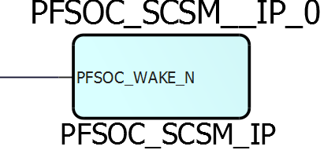

# Post-Layout Macros

## GB

It is a Post-layout macro that stands for Global Buffer. The global clock network is composed of global buffers \(GBs\) for clock distribution. GBs distribute clocks to the left/right half of the fabric through vertical clock stripes. Each GB drives an independent half-chip global clock \(GCLK\). Two GBs—one from each half, are instantiated by the Libero SoC PolarFire to distribute a clock to the entire FPGA fabric. There are a total of 24 full-chip global signals and 48 half-chip global signals that may be used in a design. The half-chip globals can be driven by up to 24 fabric routed signals. Clocks driven from regular I/Os, internally generated clocks, and high fan-out signals such as resets can be routed to GBs.

|An|ENn|q \(internal signal\)|YNn|YSn|
|---|---|---------------------|---|---|
|1|0|1|1|1|
|1|1|0|1|1|
|0|X|q|!q|!q|

## RGB

It is a Post-layout macro. Each GB drives row global buffers \(RGBs\) present on the vertical clock stripes to reach the logic sectors. Each RGB selects a global clock, a regional clock, or a fabric routed clock to drive the logic sectors located on the left or right side of the vertical clock stripe. RGBs are situated on the vertical stripes of the global network architecture inside the FPGA fabric. The global signals from the GBs are routed to the RGBs. Each RGB is independent and can be driven by fabric routing in addition to being driven by GBs. This facilitates the use of RGBs to drive regional clocks spanning a small fabric area, such as the the clock network for SERDES.

## CC\_CONFIG

The CC\_CONFIG macro is a Post-layout macro that is responsible for generating the Carry bit for each ARI1\_CC cell in the cluster. CI and CO are the carry-in and carry-out, respectively, to the cell. The intermediate carry-bits are given by CC\[11:0\]. The functionality of the CC\_CONFIG is evaluating CC using CC\[n\] = !Px!Y3+PxCC\[n-1\] where, CC\[-1\] is CI and CC\[12\] is CO.

## CFG0

Post-layout macro that is a zero input LUT with output tied to either 0 or 1 as per INIT.

## CRN\_INT

The CRN\_INT cell is a Post-layout macro that routes clocks from the fabric to corner cells \(PLL,  DLL\).

|A|Y|
|---|---|
|0|0|
|1|1|

## ICB\_INT

The ICB\_INT cell is a Post-layout macro that routes clocks from fabric to the Interface Clock Block \(ICB\).

## ICB\_CLKINT

The ICB\_CLKINT cell is a Post-layout macro that routes clocks from the Interface Clock Block \(ICB\) to global buffers.

## HS\_IO\_CLK

High-speed I/O bank clock networks are Post-layout macros that are integrated into I/O banks and distribute clocks along the entire I/O bank with low-skew. These are used to clock data in and out of the I/O logic while implementing the high-speed interfaces.

## CFG1A\_TEST

A Post-layout macro that the user can see in NLV. It is remapped to BUFF macros.

## CFG1B\_TEST

A Post-layout macro that the user can see in NLV. It is remapped to BUFF macros.

## CFG1C\_TEST

A Post-layout macro that the user can see in NLV. It is remapped to BUFF macros.

## CFG1D\_TEST

A Post-layout macro that the user can see in NLV. It is remapped to BUFF macros.

## CFG1A

A Post-layout macro used to implement a buffer. Output Y= f\(A\).

## CFG1B

A Post-layout macro used to implement a buffer. Output Y= f\(B\).

## CFG1C

A Post-layout macro used to implement a buffer. Output Y= f\(C\).

## CFG1D

A Post-layout macro used to implement a buffer. Output Y= f\(D\).

## CFG4A

Post-layout macro used to implement any 4-input combinational logic function. Output Y is  dependent on the INIT string parameter and the value of A. The INIT string parameter is 16  bits wide. Refer to [CFG4](GUID-CEB1BC36-BDC1-4986-B0B4-70AE88A7572D.md#)  macro for more details.

## CFG4\_ROM

Post-layout macro used to implement any 4-input combinational logic function. Output Y is  dependent on the INIT string parameter and the value of A. The INIT string parameter is 16  bits wide. Refer to [CFG4A](GUID-92622ACC-B044-4582-AE90-87F588869C4B.md#)  macro for more details.

## CFG4\_IP\_ABCD

Post-layout macro used to implement any 4-input combinational logic function. Output Y is  dependent on the INIT string parameter and the value of A, B, C, and D. The INIT  string parameter is 16 bits wide. It has 3 additional outputs IPB, IPC, and IPD and  those are inverter outputs for B, C, and D inputs, respectively. Refer to [CFG4](GUID-CEB1BC36-BDC1-4986-B0B4-70AE88A7572D.md#) macro for more  details.

## RAM64x12\_IP

Post-layout macro called within RAM64x12. Refer to [RAM64x12](GUID-6286C611-710E-40B7-B39A-D3A4A938917A.md) macro for more details. The RAM64x12 macro is designed by using pipeline register and RAM64x12\_IP macro.

## RAM1K20\_IP

Post-layout macro for RAM1K20. Refer to [RAM1K20](GUID-41402248-97A4-40DE-876D-4022F901B51C.md#) macro for more details. The RAM1K20 macro is designed by using pipeline  register and RAM1K20\_IP macro.

## MACC \_IP

It is the Post-layout macro for Multiply and Accumulate \(MACC\).

## IOIN\_IB

Buffer macro available in the post-layout netlist only.

|YIN|Y|
|---|---|
|Z|X|
|0|0|
|1|1|

## IOIN\_IB\_E

Buffer macro available in the post-layout netlist only. See [IOIN\_IB](GUID-92622ACC-B044-4582-AE90-87F588869C4B.md#) for more information.

## IOIN\_IB\_E\_ODT

Buffer macro available in the post-layout netlist with an additional ODT input.

## IOTRI\_OB\_EB

The I/O feed through macro is available in the post-layout netlist only.

|D/E|DOUT/EOUT|
|---|---------|
|0|0|
|1|1|

## IOBI\_IB\_OB\_EB

The I/O feed through macro is available in the post-layout netlist only.

|D/E/YIN|DOUT/EOUT/Y|
|-------|-----------|
|0|0|
|1|1|

## IO\_DIFF

The I/O differential macro is available in the post-layout netlist \(place holder to reserve the N location\).

## IOPAD\_IN

Input I/O macro is available in the post-layout netlist only.

|PAD|Y, Y\_HW|
|---|--------|
|Z|X|
|0|0|
|1|1|

## IOPAD\_TRI

Tri-state output buffer is available in the post-layout netlist only.

|D|E|PAD|
|---|---|---|
|X|0|Z|
|0|1|0|
|1|1|1|

## IOPAD\_BI

The I/O output bypass macro is available in the post-layout netlist only.

|MODE|E|D|PAD|Y|Y\_HW|
|----|---|---|---|---|-----|
|OUTPUT|1|D|D|D|D|
|INPUT|0|X|Z|X|X|
|INPUT|0|X|PAD|PAD|PAD|

## IOPADP\_IN

The I/O PAD input macro is available in the post-layout netlist only.

|PADP|N2PIN\_P|IOUT\_P|IOUT\_HW\_P|
|----|--------|-------|-----------|
|Z|X|X|X|
|0|X|0|0|
|1|X|1|1|

## IOPADN\_IN

The I/O PAD input macro is available in the post-layout netlist only.

|PAD\_P|N2POUT\_P|
|------|---------|
|0|1|
|1|0|

## IOPADP\_TRI

The I/O PAD tri-state output macro is available in the post-layout netlist only.

|OIN\_P|EIN\_P|PAD\_P|
|------|------|------|
|X|0|Z|
|OIN\_P|1|OIN\_P|

## IOPADN\_TRI

The I/O PAD tri-state output macro is available in the post-layout netlist only.

|OIN\_P|EIN\_P|PAD\_P|
|------|------|------|
|X|0|Z|
|0|1|1|
|1|1|0|

## IOPADP\_BI

The I/O PAD bidirectional macro is available in the post-layout netlist only.

|MODE|EIN\_P|OIN\_P|PAD\_P|N2PIN\_P|IOUT\_P|OUT\_HW\_P|
|----|------|------|------|--------|-------|----------|
|OUTPUT|1|0|0|1|0|0|
|OUTPUT|1|1|1|0|1|1|
|INPUT|0|X|Z|Z|X|X|
|INPUT|0|X|0|0|X|X|
|INPUT|0|X|1|1|X|X|
|INPUT|0|X|0|1|0|0|
|INPUT|0|X|1|0|1|1|

## IOPADN\_BI

The I/O PAD bidirectional macro is available in the post-layout netlist only.

|MODE|EIN\_P|OIN\_P|PAD\_P|N2OUT\_P|
|----|------|------|------|--------|
|OUTPUT|1|1|0|0|
|OUTPUT|1|0|1|1|
|INPUT|0|X|Z|X|
|INPUT|0|X|0|X|
|INPUT|0|X|1|X|
|INPUT|0|X|0|0|
|INPUT|0|X|1|1|

## IOPADP\_IN\_MIPI

The differential I/O PAD input macro with MIPI low-power escape support available in the  post-layout netlist only.

|PAD|Y|
|---|---|
|0|0|
|1|1|

## IOPAD\_FEEDBACK

It is a Post-layout macro that is a bidirectional buffer. Refer to [BIBUF](Chunk1143553917.md#) for more information.

## IOPADP\_FEEDBACK

The I/O PAD output macro with the bidirectional input feedback enabled. It is available in the post-layout netlist only.

## IOPADN\_FEEDBACK

It is a Post-layout macro similar to IOPAD\_FEEDBACK except that input D is inverted inside.

## IOREG

A single post-layout macro for IOINFF, IOUTFF, and IOEFF. The IOD block includes registers for data-in, data-out, and output enable signals. The input registers \(IOINFF\) provide the registered version of the input signals from the IOA to the FPGA fabric. The output registers \(IOUTFF\) provide the registered version of the output signals from the FPGA fabric to the IOA. The output enable register \(IOENFF\) acts as a control signal for the output if the I/O is configured as tri-stated or bidirectional. These registers in IOD blocks are similar to the D-type flip-flops available in fabric logic elements.

## PLL\_IP

Post-layout macro used within PLL. It does frequency synthesis of the given configuration and it has an interconnection with PLL\_DELAY.

## PLL\_DELAY

It is a Post-layout macro. Each PLL has a programmable delay line that can be configured in the reference clock path or feedback clock path. For PLLs, adding delay in the reference clock path enables clock delay, and adding delay in the feedback clock path enables clock advancement with respect to the reference clock. The PLL must be configured in external feedback mode to add the delay line in the feedback path.

## XCVR\_APB\_LINK

Post-layout macro used to access a transceiver quad memory map using the APB Link protocol.

## PFSOC\_SCSM\_IP

It is a Post-layout macro that has similar functionality as of  `PFSOC_SCSM`. The only difference is that the input is inverted. See  the [PFSOC\_SCSM](GUID-BBA317CA-E45F-4E91-83E0-3ED930B2A782.md#) macro for  more information.

