# Libero SoC Constraint Management

In the FPGA design world, constraint files are as important as design source files. Constraint<br /> files are used throughout the FPGA design process to guide FPGA tools to achieve the<br /> timing and power requirements of the design. For the synthesis step, SDC timing<br /> constraints set the performance goals whereas non-timing FDC constraints guide the<br /> Synthesis tool for optimization. For the Place and Route step, SDC timing constraints<br /> guide the tool to achieve the timing requirements whereas Physical Design Constraints<br /> \(PDC\) guide the tool for optimized placement and routing \(Floorplanning\). For Static<br /> Timing Analysis, SDC timing constraints set the timing requirements and design-specific<br /> timing exceptions for static timing analysis.

Libero SoC provides the Constraint Manager as the cockpit to manage your design constraint needs.<br /> This is a single centralized graphical interface for you to<br /> create, import, link, check, delete, and edit design constraints<br /> and associate the constraint files to design tools in the Libero<br /> SoC environment. The Constraint Manager allows you to manage<br /> constraints for SynplifyPro synthesis, Libero SoC Place and<br /> Route and the SmartTime Timing Analysis throughout the design<br /> process.

## Opening Constraint Manager

After creating the project, double-click **Manage Constraints** in the Design<br /> Flow window to open the Constraint Manager.

<br />


## Libero SoC Design Flow

The Constraint Manager is Libero SoC’s single centralized Graphical User Interface for managing<br /> constraints files in the design flow.

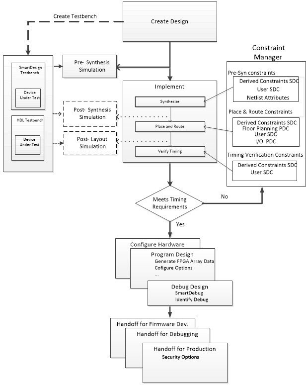

## Introduction to Constraint Manager

The Constraint Manager manages these synthesis constraints and passes them to<br /> SynplifyPro:

-   Synplify Netlist Constraint File \(`*.fdc`\)
-   Compile Netlist Constraint File \(`*.ndc`\)
-   SDC Timing Constraints \(`*.sdc`\)
-   Derived Timing Constraints \(`*.sdc`\)

### Synplify Netlist Constraints \(\*.fdc\)

These are non-timing constraints that help SynplifyPro optimize the netlist. From the Constraint<br /> Manager **Netlist Attribute** tab, import \(**Netlist Attributes &gt; Import**\) an existing FDC file or create a new FDC file in<br /> the Text Editor \(**Netlist Attributes &gt; New &gt; Create New Synplify Netlist Constraint**\). After the FDC file is created or imported, check the check<br /> box under synthesis to associate the FDC file with Synthesis.

### Compile Netlist Constraints \(\*.ndc\)

These are non-timing constraints that help Libero SoC optimize the netlist by combining I/Os with<br /> registers. I/Os are combined with a register to achieve better clock-to-out or<br /> input-to-clock timing. From the Constraint Manager **Netlist Attribute** tab, import \(**Netlist Attributes &gt; Import**\) an existing NDC file or create a new NDC file in the Text Editor<br /> \(**Netlist Attributes &gt; New &gt; Create New Compile Netlist Constraint**\). After the NDC file is created or imported, check the check<br /> box under synthesis to associate the NDC file with Synthesis.

### SDC Timing Constraints \(\*.sdc\)

These are timing constraints to guide SynplifyPro to optimize the netlist to meet the timing<br /> requirements of the design. From the Constraint **Manager Timing**<br /> tab, import \(**Timing &gt; Import**\) or create in the Text Editor<br /> \(**Timing &gt; New**\) a new SDC file. After the SDC file is<br /> created or imported, check the check box under **Synthesis** to<br /> associate the SDC file with Synthesis.

After the synthesis step, click **Edit with Constraint Editor &gt; Edit Synthesis Constraints** to add or edit SDC constraints.

### Derived Timing Constraints \(\*.sdc\)

These are timing constraints Libero SoC generates for IP cores used in your design. These IP<br /> cores are available in the Catalog and are family/device-dependent. Once they are<br /> configured, generated, and instantiated in the design, the Constraint Manager can<br /> generate SDC timing constraints based on the configuration of the IP core and the<br /> component SDC. From the**Constraint Manager Timing** tab, click<br /> **Derive Constraints** to generate the Derived Timing Constraints<br /> \(`*.sdc`\). Click the `*derived_constraints.sdc` file<br /> to associate it with synthesis.

### Place and Route Constraints

The Constraint Manager manages these constraints for the Place and Route step:

-   I/O PDC Constraints \(`*io.pdc`\)
-   Floorplanning PDC Constraints \(`*fp.pdc`\)
-   Timing SDC constraint file \(`*.sdc`\)

### I/O PDC Constraints

These are I/O Physical Design Constraints in an `*io.pdc` file. From the<br /> Constraint Manager**I/O Attribute** tab, you<br /> can import \(**I/O Attributes &gt; Import**\)<br /> or create in the Text Editor \(**I/O Attributes &gt; New**\) an `*io.pdc`<br /> file.

Check the check box under **Place and Route** to associate the file with Place<br /> and Route.

### Floorplanning PDC Constraints

These are floorplanning Physical Design Constraints in a `*fp.pdc` file. From the<br /> Constraint Manager **Floor Planner** tab, you can import<br /> \(**Floor Planner &gt; Import**\) or create in the Text Editor<br /> \(**Floor Planner &gt; New**\) a `*fp.pdc` file.<br /> Check the check box under **Place and Route** to associate the file<br /> with Place and Route.

### Timing SDC Constraint File \(\*.sdc\)

These are timing constraint SDC files for Timing-driven Place and Route. From the Constraint<br /> Manager Timing tab, you can import \(**Timing &gt; Import**\) or create<br /> in the Text Editor \(**Timing &gt; New**\) a timing SDC file. Check the<br /> check box under **Place and Route** to associate the SDC file with<br /> Place and Route. This file is passed to Timing-driven Place and Route \(**Place and Route &gt; Configure Options &gt; Timing Driven**\).

### Timing Verifications Constraints

The Constraint Manager manages the SDC timing constraints for Libero SoC’s SmartTime, which is a<br /> Timing Verifications/Static Timing analysis tool. SDC timing constraints provide the<br /> timing requirements \(for example, `create_clock` and<br /> `create_generated_clock`\) and design-specific timing exceptions \(for<br /> example, `set_false_path` and `set_multicycle_path`\) for<br /> Timing Analysis.

From the Constraint Manager **Timing** tab, you can import \(**Timing &gt; Import**\) or create an SDC timing file in the Text Editor<br /> \(**Timing New**\). Check the check box under **Timing Verifications** to associate the SDC timing constraints file with Timing<br /> Verifications.

**Note:** You might have the same set of SDC Timing Constraints for Synthesis, Place and Route, and Timing Verifications to start with in the first iteration of the design process. However, if the design does not meet timing requirements, it might be useful in subsequent iterations to have different sets of Timing SDC files associated with different tools. For example, you might want to change the set of SDC timing constraints for Synthesis or Place and Route to guide the tool to focus on a few critical paths. The set of SDC timing constraints associated with Timing Verifications can remain unchanged.

The Constraint Manager allows you to associate and disassociate constraint files with the<br /> different tools.

### Constraint Manager Components

The Constraint Manager has four tabs, each corresponding to a constraint type that Libero SoC supports:

-   I/O Attributes
-   Timing
-   Floor Planner
-   Netlist Attribute

Clicking the tabs displays the constraint file of that type managed in the Libero SoC project.

### Constraint File and Tool Association

Each constraint file can be associated or disassociated with a design tool by checking or<br /> unchecking the check box corresponding to the tool and the constraint file. When<br /> associated with a tool, the constraint file is passed to the tool for processing.

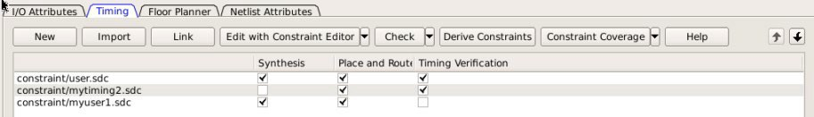

The Libero SoC Design Flow window displays the state of the tool. A green check mark<br />  indicates that the tool has run successfully. A warning icon 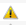 indicates invalidation of the state because the input files<br /> for the tool have changed since the last successful run. Association of a new constraint<br /> file with a tool or dis-association of an existing constraint file with a tool<br /> invalidates the state of the tool with which the constraint file is associated.

All Constraint files except Netlist Attributes can be opened, read, and edited using the<br /> following Interactive Tools that you start from the Constraint Manager:

-   I/O Editor
-   Chip Planner
-   Constraint Editor

|Constraint Type|Constraint File Extension|Location Inside Project|Associated with Design Tool|Interactive Tool \(for Editing\)|
|---------------|-------------------------|-----------------------|---------------------------|--------------------------------|
|I/O Attributes|PDC \(\*.pdc\)|&lt;proj&gt;\\constraints\\io\\\*.pdc|Place and Route|I/O Editor|
|Floorplanning|PDC \(\*.pdc\)|&lt;proj&gt;\\constraints\\fp\\\*.pdc|Place and Route|Chip Planner|
|Timing|SDC \(\*.sdc\)|&lt;proj&gt;\\constraints\\\*.sdc|Synthesis, Place and Route, Timing Verification|Constraint Editor|
|Netlist Attributes|FDC \(\*.fdc\)|&lt;proj&gt;\\constraints\\\*.fdc|Synthesis|N/A|
|NDC \(\*.ndc\)|&lt;proj&gt;\\constraints\\\*.ndc|Synthesis|N/A|

### Derive Constraints in Timing Tab

The Constraint Manager can generate timing constraints for IP cores used in your design. These IP<br /> cores, available in the Catalog, are family- and device-dependent. After they are<br /> configured, generated, and instantiated in your design, the Constraint Manager can<br /> generate SDC timing constraints based on the configuration of the IP core and the<br /> component SDC. A typical example of an IP core for which the Constraint Manager can<br /> generate SDC timing constraints is the IP core for Clock Conditioning Circuitry<br /> \(CCC\).

### Create New Constraints

From the Constraint Manager, create new constraints in one of two ways:

-   Use the Text Editor
-   Use Libero SoC’s Interactive Tools

To create new constraints from<br /> the Constraint Manager using the Text Editor:

1.  Select the tab that corresponds to the type of constraint you want to create.
2.  Click **New**.
3.  When prompted, enter a file name to store the new constraint.
4.  Enter the constraint in the Text Editor.
5.  Click **OK**.

    The Constraint file is saved and visible in the<br /> Constraint Manager in the tab you select:

    -   I/O Attributes constraint file \(`<proj>\io\*.pdc`\) in the **I/O Attributes** tab
    -   Floorplanning constraints \(`<proj>\fp\*.pdc`\) in the **Floor Planner** tab
    -   Timing constraints \(```<proj>\constraints\*.sdc```\) in the **Timing** tab
6.  \(Optional\) Double-click the constraint file in the Constraint Manager to add more constraints to the file.

<br />

Observe the following guidelines:

-   Netlist Attribute constraints cannot be created by an Interactive Tool. Netlist Attribute files can only be created with a Text Editor.
-   Except for timing constraints for Synthesis, the design needs to be in the post-synthesis state to enable editing/creation of new constraints by the Interactive Tool.
-   The `*.pdc` or `*.sdc` file the Constraint Manager creates is marked \[Target\]. This denotes that it is the target file. A target file receives and stores new constraints from the Interactive Tool. When you have multiple constraint files of the same type, you can select any one of them as target. When there are multiple constraint files but none of them is set as target, or there are zero constraint files, Libero SoC creates a new file and sets it as target to receive and store the new constraints created by the Interactive Tools.

To create new constraints from the<br /> Constraint Manager using Interactive Tools:

1.  Select the tab that corresponds to the type of constraint you want to create.
2.  Click **Edit** to open the Interactive Tools. The Interactive Tool that Libero SoC opens varies with the constraint type:
    -   I/O Editor to edit/create I/O Attribute Constraints. See the [I/O Editor User Guide](http://coredocs.s3.amazonaws.com/Libero/2025_1/Tool/io_editor_ug.pdf) for details.
    -   Chip Planner to edit/create Floorplanning constraints. See the [Chip Planner User Guide](http://coredocs.s3.amazonaws.com/Libero/2025_1/Tool/chipplanner_ug.pdf) for details.
    -   Constraint Editor to edit/create Timing Constraints. See the [Timing Constraints Editor User Guide](http://coredocs.s3.amazonaws.com/Libero/2025_1/Tool/smarttime_ce_ug.pdf) for details.
3.  Create the Constraints in the Interactive Tool. Click **Commit and Save**.
4.  Check that Libero SoC creates the following files to store the new constraints:
    -   `Constraints\io\user.pdc` file when I/O constraints are added and saved in I/O Editor.
    -   `Constraints\fp\user.pdc` file when floorplanning constraints are added and saved in Chip Planner.
    -   `Constraints\user.sdc` file when Timing Constraints are added and saved in Constraint Editor.

### Constraint File Order

When there are multiple constraint files of the same type associated with the same tool, use the<br /> Up and Down arrows to sort the order in which the constraint files pass to the<br /> associated tool. Constraint file order is important when there is a dependency between<br /> constraints files. When a floorplanning PDC file assigns a macro to a region, the region<br /> must first be created and defined. If the PDC command for region creation and macro<br /> assignment are in different PDC files, the order of the two PDC files is critical.

1.  To move a constraint file up, select the file and click the Up arrow.
2.  To move a constraint file down, select the file and click the Down arrow.

    


<br />

**Note:** Changing the order of the constraint files associated with the same tool invalidates the state of that tool.

<br />

## Import a Constraint File

Use the Constraint Manager to import a constraint file into the Libero SoC project. When a constraint file is imported, a local copy of the constraint file is created in the Libero Project.

To import a constraint file:

1.  Click the tab that corresponds to the type of constraint file you want to import.
2.  Click **Import**.
3.  Navigate to the location of the constraint file.
4.  Select the constraint file and click **Open**. A copy of the file is created and appears in Constraint Manager in the tab you have selected.

**Link a Constraint File**

Use the Constraint Manager to link a constraint file into the Libero SoC project. When a constraint file is linked, a file link rather than a copy is created from the Libero project to a constraint file physically located and maintained outside the Libero SoC project.

To link a constraint file:

1.  Click the tab that corresponds to the type of constraint file you want to link.
2.  Click **Link**.
3.  Navigate to the location of the constraint file you want to link to.
4.  Select the constraint file and click **Open**. A link of the file is created and appears in Constraint Manager under the tab you have selected. The full path location of the file \(outside the Libero SoC project\) is displayed.

### Check a Constraint File

Use the Constraint Manager to check a constraint file.

To check a constraint file:

1.  Select the tab for the constraint type to check.
2.  Click **Check.**

<br />

**Note:** You can check I/O constraints, Floorplanning constraints, Timing constraints, and Netlist Attributes only when the design is in the appropriate state. When checked, a pop-up message appears and the design state cannot be checked.

<br />

All constraint files associated with the tool are checked. Files not associated with a tool are not checked.


For Timing Constraints, select from one of the following constraint from the<br /> **Check** drop-down menu:

-   **Check Synthesis Constraints**. Checks only the constraint files associated with the Synthesis. This constraint checks the following files: `top_derived_constraints.sdc`, `user.sdc`, and `mytiming2.sdc`.

    **Check Place and Route Constraints**. Checks only the constraint files associated with<br /> Place and Route. This constraint checks the following files:<br /> `top_derived_constraints.sdc`, `mytiming.sdc`,<br /> and `mytiming2.sdc`.

    **Check Timing Verification Constraints**. Checks only the Constraint Files associated with<br /> Timing Verification. For the constraint files and tool association shown in the<br /> following figure. This constraint checks the following files:<br /> `top_derived_constraints.sdc`, `user.sdc`,<br /> `mytiming.sdc`, and `mytiming2.sdc`.

    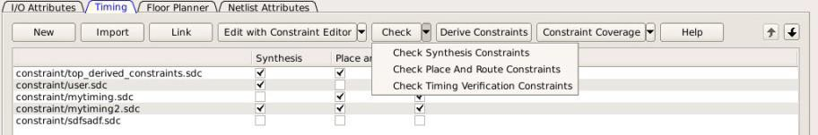


-   **Note:** The `sdfsadf.sdc` Constraint File is not checked because it is not associated with any tool.

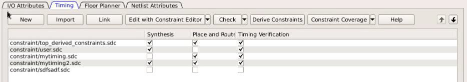


Association when a constraint file is checked, the Constraint Manager:

-   Checks the SDC or PDC syntax.
-   Compares the design objects \(pins, cells, nets, ports\) in the constraint file versus the design objects in the netlist \(RTL or post-layout ADL netlist\). Any discrepancy \(for example, constraints on a design object that does not exist in the netlist\) are flagged as errors and reported in the `*.log` file or message window.

### Check Result

If the check is successful, the following message appears.


If the check fails, the following error message appears.


|Constraint Type|Check for Tools|Required Design State Before Checks|Check Result Details|
|---------------|---------------|-----------------------------------|--------------------|
|<br /> I/O Constraints<br />|<br /> Place and Route<br />|<br /> Post-Synthesis<br />|<br /> Libero Message Window<br />|
|<br /> Floorplanning Constraints<br />|<br /> Place and Route<br />|<br /> Post-Synthesis<br />|<br /> Libero Message Window<br />|
|<br /> Timing Constraints<br />|<br /> Synthesis<br />|<br /> Pre-Synthesis<br />|<br /> synthesis\_sdc\_check.log<br />|
|<br /> Place and Route<br />|<br /> Post-Synthesis<br />|<br /> placer\_sdc\_check.log<br />|
|<br /> Timing Verifications<br />|<br /> Post-Synthesis<br />|<br /> timing\_sdc\_check.log<br />|
|<br /> Netlist Attributes \(\*.fdc\)<br />|<br /> Synthesis<br />|<br /> Pre-Synthesis<br />|<br /> \*cck.srr file<br />|
|<br /> Netlist Attributes \(\*.ndc\)<br />|<br /> Synthesis<br />|<br /> Pre-Synthesis<br />|<br /> Libero Log Window<br />|

### Edit a Constraint File

The **Edit** button in the Constraint Manager allows you to create new<br /> constraint files and edit existing constraint files \(see [Create New Constraints](GUID-9333A81C-BB0B-4CEA-98C1-AB81EA99DF44.md#)\).

<br />

**Note:** Netlist Attributes cannot be edited by an Interactive Tool. Use the Text Editor to edit the Netlist Attribute constraint \(`*.fdc` and `*.ndc`\) files.

<br />

1.  Select the tab for the constraint type to edit. An Interactive Tool opens to make the edits.
2.  Click **Edit**.
    -   All constraint files associated with the tool are edited. Files not associated with the tool are not edited.
    -   When a constraint file is edited, the constraints in the file are read into the Interactive Tool.
    -   Different Interactive Tools are used to edit different constraints/different files:
        -   I/O Editor to edit I/O Attributes \(`<proj>\io\*.pdc`\). For details, see the [I/O Editor User Guide](http://coredocs.s3.amazonaws.com/Libero/2025_1/Tool/io_editor_ug.pdf).
        -   Chip Planner to edit Floorplanning Constraints \(`<proj>\fp\*.pdc`\). For details, see the [Chip Planner User Guide](http://coredocs.s3.amazonaws.com/Libero/2025_1/Tool/chipplanner_ug.pdf) \(**Chip Planner &gt; Help &gt; Reference Manuals**\)
        -   Constraint Editor to edit Timing Constraints \(`constraints\*.sdc`\). For details, see the [Timing Constraints Editor User Guide](http://coredocs.s3.amazonaws.com/Libero/2025_1/Tool/smarttime_ce_ug.pdf) \(**Help &gt; Constraints Editor User’s Guide**\)

            **Note:** I/O constraints, Floorplanning constraints, Timing constraints can be edited only when the design is in the proper state. A message pops up if the file is edited when the design state is not proper for edits. If, for example, you open the Constraints Editor \(**Constraint Manager &gt; Edit**\) to edit timing constraints when the design state is not post-synthesis, a pop-up message appears.

            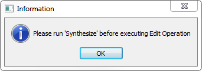

3.  For Timing Constraints, click one of the following to edit from the Edit with Constraint Editor drop-down menu.
    -   Edit Synthesis Constraints
    -   Edit Place and Route Constraints
    -   Edit Timing Verification Constraints

        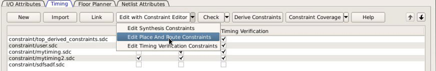

        For the constraint files and tool association shown in the following<br /> *Timing Constraint File and Tool Association*:

        -   Edit Synthesis Constraints reads the following files into the Constraint Editor:
            -   `user.sdc`
            -   `myuser1.sdc`
        -   Edit Place and Route Constraints reads the following files into the Constraint Editor:
            -   user.sdc
            -   mytiming2.sdc
            -   myuser1.sdc
        -   Edit Timing Verification Constraints reads the following files into the Constraint Editor:
            -   user.sdc
            -   mytiming2.sdc

                

4.  Edit the constraint in the Interactive Tool, save, and exit.
5.  The edited constraint is written back to the original constraint file when the tool exits.

See the [Timing Constraints Editor User Guide](http://coredocs.s3.amazonaws.com/Libero/2025_1/Tool/smarttime_ce_ug.pdf) \(**Help &gt; Constraints Editor User’s Guide**\) for details on<br /> how to enter/modify timing constraints.

**Note:** When a constraint file is edited inside an Interactive Tool, the Constraint Manager is disabled until the Interactive Tool is closed.

<br />

**Note:** Changing a constraint file invalidates the state of the tool with which the constraint file is associated. For instance, if Place and Route completed successfully with `user.sdc` as the associated constraint file, changing `user.sdc` invalidates Place and Route. Next to Place and Route, the green check mark that denotes successful completion changes to a warning icon when the tool is invalidated.

<br />

## Constraint Types

Libero SoC manages four types of constraints:

-   **I/O Attributes Constraints**: Used to constrain placed I/Os in the design. Examples include setting I/O standards, I/O banks, and assignment to Package Pins, output drive, and so on. These constraints are used by Place and Route.
-   **Timing Constraints**: Specific to the design set to meet the timing requirements of the design, such as clock constraints, timing exception constraints, and disabling certain timing arcs. These constraints are passed to Synthesis, Place and Route, and Timing Verification.

-   **Floor Planner Constraints**: Non-timing floorplanning constraints created by the user or Chip Planner and passed to Place and Route to improve Quality of Routing.
-   **Netlist Attributes**: Microchip-specific attributes that direct the Synthesis tool to synthesize/optimize the design, leveraging the architectural features of the Microchip devices. Examples include setting the fanout limits and specifying the implementation of a RAM. These constraints are passed to the Synthesis tool only.

The following table summarizes the features for each constraint type.

|Constraint Type|File Location|File Ext.|User Actions|Constraints Edited By|Constraints Used By|Changes Invalidate Design State?|
|---------------|-------------|---------|------------|---------------------|-------------------|--------------------------------|
|I/O Attributes|&lt;proj&gt;/constraints/io folder|\*.pdc|Create New, Import, Link, Edit, Check|I/O EditorOr user editing the\*.pdc file in Text<br /> Editor|Place and Route|Yes|
|Timing Constraints|&lt;proj&gt;/constraints folder|\*.sdc|Create New, Import, Link, Edit, Check|Constraint EditorOr user editing the\*.sdc file in<br /> Text Editor|SynplifyPlace and RouteVerify Timing<br /> \(SmartTime\)|Yes|
|Floor Planner Constraints|&lt;proj&gt;/constraints/fp folder|\*.pdc|Create New, Import, Link, Edit, Check|Chip PlannerOr user Editing the\*.pdc file in Text<br /> Editor|Place and Route|Yes|
|Netlist Attributes|&lt;proj&gt;/constraints folder|\*.fdc|Create New, Import, Link, Check|User to Open in Text Editor to Edit|Synplify|Yes|
|Netlist Attributes|&lt;proj&gt;/constraints folder|\*.ndc|Import, Link, Check|User to Open in Text Editor to Edit|Synplify|YES|

## Constraint Manager – I/O Attributes Tab

The I/O Attributes tab allows you to manage I/O attributes/constraints for your design’s Inputs,<br /> Outputs, and Inouts. All I/O constraint files \(PDC\) have the \*.pdc file extension and<br /> are placed in the &lt;Project\_location&gt;/constraint/io folder. Available actions<br /> are:

-   **New**: Creates a new I/O PDC file and saves it into the &lt;Project\_location&gt;\\constraint\\io folder. There are two options:
    -   Create New I/O Constraint
    -   Create New I/O Constraint From Root Module -- This will pre-populate the PDC file with information from the Root Module
    -   Having selected the create method:
        -   When prompted, enter the name of the constraint file.
        -   The file is initially opened in the text editor for user entry.

-   **Import**: Imports an existing I/O PDC file into the Libero SoC project. The I/O PDC file is copied into the

    &lt;Project\_location&gt;\\constraint\\io folder.

-   **Link**: Creates a link in the project’s constraint folder to an existing I/O PDC file \(located and maintained outside of the Libero SoC project\).
-   **Edit**: Opens the I/O Editor tool to modify the I/O PDC file\(s\) associated with the Place and Route tool.
-   **View**: Opens the I/O Editor tool to view the I/O PDC file\(s\) associated with the Place and Route tool. You cannot save/commit any changes made to the constraints file. However, you can export the PDC file\(s\) using the I/O Editor.
-   **Check**: Checks the legality of the PDC file\(s\) associated with the Place and Route tool against the gate level netlist.

When the I/O Editor tool is started or the constraint check is performed, all files associated<br /> with the Place and Route tool are being passed for processing.

When you save your edits in the I/O Editor tool, the I/O PDC files affected by the change will be<br /> updated to reflect the change made in the I/O Editor tool. New I/O constraints you add<br /> in the I/O Editor tool are written to the *Target*file \(if a target file has been<br /> set\) or written to a new PDC file \(if no file is set as target\) and stored in the<br /> &lt;project&gt;\\constraint\\io folder.

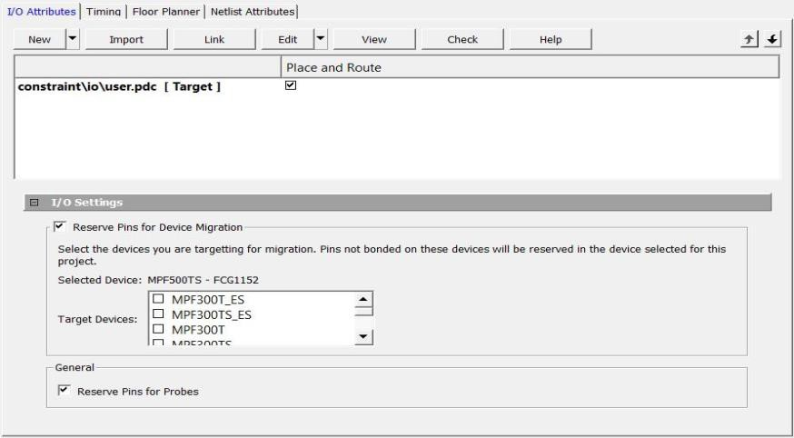

Right-click the I/O PDC files to access the available actions:

-   **Set/UnSet as Target**: Sets or clears the selected file as the target to store new constraints created in the I/O Editor tool. Newly created constraints only go into the target constraint file. Only one file can be set as target. This option is not available for linked files.
-   **Open in Text Editor**: Opens the selected constraint file in the Libero Text Editor.
-   **Clone**: Copies the file to a file with a different name. The original file name and its content remain intact. This option is not available for linked files.
-   **Rename**: Renames the file to a different name. This option is not available for linked files.
-   **Copy File Path**: Copies the file path to the clipboard.
-   **Delete**: Deletes the file from the project and from the disk. This option is not available for linked files.
-   **Unlink**: Removes the linked file from the project. The original file is untouched. This option is only available for linked files.
-   **Unlink: Copy file locally**: Removes the link and copies the file into the &lt;Project\_location&gt;\\constraint\\io folder. This option is only available for linked files.

### File and Tool Association

Each I/O constraint file can be associated or disassociated with the Place and Route tool. Check<br /> the check box under **Place and Route** to associate or disassociate<br /> the file from the tool.

### I/O Settings

<table id="TABLE_VD4_KQY_BQB"><thead><tr><th>

Setting

</th><th>

Description

</th></tr></thead><tbody><tr><td>

Reserve Pins for Device Migration

</td><td>

Reserves pins in the currently selected<br /> device that are not bonded in a device or list of<br /> devices you might later decide to migrate your<br /> design to. Select the target device\(s\) you might<br /> migrate to later to ensure that there will be no<br /> device/package incompatibility if you migrate your<br /> design to that device.

</td></tr><tr><td>

Reserve Pins for Probes

</td><td>

<br /> -   Checked = live probes can be used when debugging your design with SmartDebug.
-   Not checked = I/Os can be used as General Purpose I/Os.

<br />

</td></tr></tbody>
</table>## IO Advisor \(SmartFusion 2, IGLOO 2, and RTG4\)

The IO Advisor allows you to balance the timing and power consumption of the IOs in your design.<br /> For output I/Os, it offers suggestions about Output Drive and Slew values that meet \(or<br /> get as close as possible to\) the timing requirements and generates the lowest power<br /> consumption. For Input I/Os, it offers suggestions on On-Die Termination \(ODT\) Impedance<br /> values \(when the ODT Static is ON\) that meet \(or get as close as possible to\) the timing<br /> requirements and generates the lowest power consumption.

Timing data information is obtained from the Primary analysis scenario in SmartTime. Power data is obtained from the Active Mode in SmartPower.

From the Design Flow window, select **Manage Constraints &gt; Open Manage Constraints View &gt; I/O Attributes &gt; Edit &gt; Edit with I/O Advisor**.


### Introduction

The Introduction screen provides general information about the IO Advisor. Navigational panels<br /> allow you to navigate the following panels:

-   **Output Load**. Displays the IO load Power and Delay values for Outputs and Inouts.
-   **Output Drive and Slew**. Displays the Output Drive and Slew for Outputs and Inouts.
-   **ODT &amp; Schmitt Trigger**. Displays the ODT Static \(On/Off\), the ODT Impedance value \(Ohms\) for Inputs and Inouts and the Schmitt Trigger \(ON/OFF\).

All steps in the IO Advisor are optional.

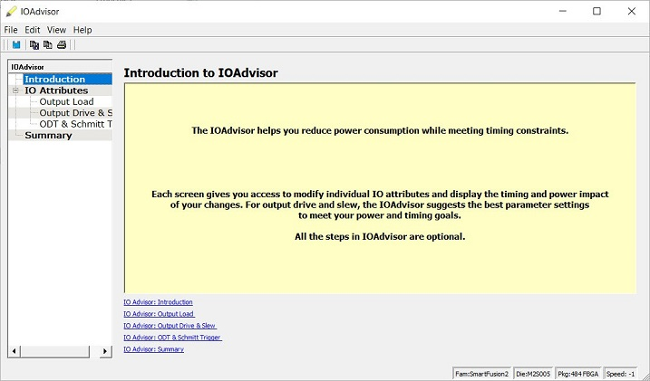

### Output Load

The Output Load panel displays the load of all output/inout ports in your design.

The display is sorted by Initial or Current value and is selectable in the **Sort By** drop-down menu.

Tooltips are available for each cell of the Table. For output and inout ports, the<br /> tooltip displays the Port Name, Macro Name, Instance Name, and Package Pin. Inout ports<br /> are identified by a blue bubble icon.


### Search and Regular Expressions

To search for a specific Port, enter the Port Name in the Port Name Search field and click<br /> Search. Regular expressions are accepted for the search. All Port Names matching the<br /> regular expression are displayed. The regular expression “FDDR\*”, for example, results<br /> in all the output ports beginning with FDDR in the Port Name appearing in the<br /> display.

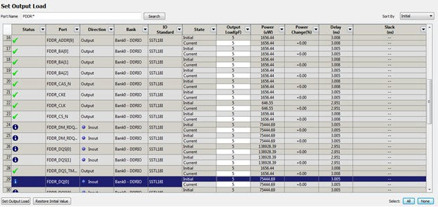

### Status Column

The icon in the Status column displays the status of the output port.

|Icon|Status|Description|
|----|------|-----------|
|<br /> <br />|<br /> OK<br />|The I/O attributes match the suggestion in the Output Drive and Slew<br /> table.|
|<br /> <br />|<br /> Error<br />|The Timing constraints for this I/O are not met in the Output Drive<br /> and Slew table.|
|<br /> <br />|<br /> Information<br />|To improve the power and/or timing of the I/O, apply the suggestion<br /> in the Output Drive and Slew table.|

### Column Display and Sorting

To hide or unhide a column, click on the drop-down menu of a column header and select<br /> **Hide Column** or **Unhide All Columns**.

To sort the contents of a column, select the column header, and from the right-click menu, select<br /> **Sort A to Z**, **Sort Z to A**,<br /> **Sort Min to Max**, or **Sort Max to Min** as<br /> appropriate.

### Set Output Load

To set the output load of a port, click the Port and click **Set Output Load**or edit the value in the Current Output Load cell. Initial value remains<br /> unchanged.

### Restore Initial Value

To restore a Port’s output load to the initial value, select the output port and click<br /> **Restore Initial Value**. The current value changes to become<br /> the same value as the initial value.

### Output Drive and Slew

The Output Drive and Slew page displays the Output Drive and Slew of all output/inout ports of your design.

The display can be sorted according to the initial current or suggested values. To change the<br /> sorting, use the **Sort By** drop-down list.

Three values are displayed for Output Drive and Slew of each IO output/inout port:

-   **Initial**. This is the initial value when the IO Advisor is launched.
-   **Current**. This is the current value which reflects any changes you have made, including suggestions you have accepted from the IO Advisor.
-   **Suggested**. This is the suggested value from the IO Advisor for optimum power and timing performance.

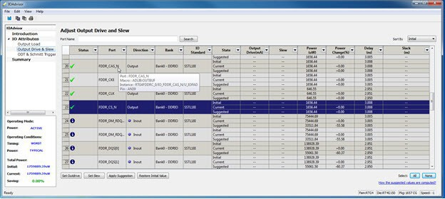

### How the Suggested Values Are Computed

The IO Advisor provides suggestions for output drive and slew values according to the following criteria:

-   If you have set no output delay constraint for the port, the IO Advisor suggests IO attribute values that generate the lowest power consumption.
-   If you set an output delay constraint on the port, the IO Advisor suggests IO attribute values that generates the lowest power consumption and positive timing slacks. If the slacks of all attribute combinations are negative, the IO Advisor suggests an attribute combination \(Drive strength and slew\) that generates the least negative slack.

In this screen, you can change the drive strength and slew of the design output I/Os.

1.  Select the out drive and/or the slew current value cell.
2.  Click the cell to open the combo box.
3.  Choose the value you want from the set of valid values.

To restore the initial values, click **Restore Initial Value**.

To change multiple I/Os, select multiple I/Os \(CTRL+Click\), click **Set Slew**or **Set Outdrive**, select the value, and click<br /> **OK**.

### Apply Suggestion

To apply the suggested value to a single output port, select the output port and click<br /> **Apply Suggestion**.

To apply the suggested values to multiple ports, select multiple ports \(CTRL+Click\) and click<br /> **Apply Suggestion**.

### Adjust ODT and Schmitt Trigger

This page allows you to set the Schmitt Trigger setting \(ON/OFF\), On-Die Termination \(ODT\) Static<br /> setting \(ON/OFF\), and the ODT Impedance \(in Ohms\) to valid values for all Input/Inout<br /> IOs of your design. The IO Advisor page instantly gives you the Power \(in uW\) and Delay<br /> \(in ns\) values when you make changes. If the suggested values meet your design’s power<br /> and/or timing requirements, you can accept the suggestions and continue with your design<br /> process.


**Note:**ODT is not allowed for 2.5V or higher single-ended signals. It is allowed for differential signals.

### Search and Regular Expressions

To search for a specific Port, enter the Port Name in the **Port Name Search** field and click **Search**. Regular<br /> expressions are accepted for the search. All Port Names matching the regular expression<br /> are displayed. For example, the regular expression `RESET*` results in<br /> the input/inout ports with the port name beginning with **RESET**<br /> appearing in the display.

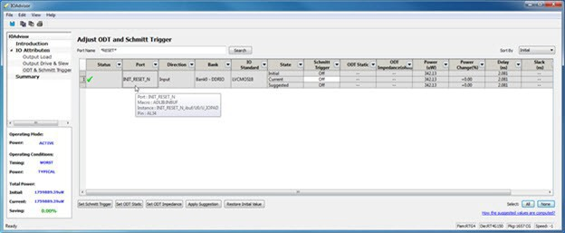

### Status Column

The icon in the Status Column displays the status of the input/inout ports.

|Icon|Status|Description|
|----|------|-----------|
|<br /> <br />|<br /> OK<br />|The I/O attributes match the suggestion in the Adjust ODT and Schmitt<br /> Trigger table.|
|<br /> <br />|<br /> Error<br />|The Timing constraints for this I/O are not met in the Adjust ODT and<br /> Schmitt Trigger table.|
|<br /> <br />|<br /> Information<br />|To improve the power and/or timing of the I/O, apply the suggestion<br /> in the Adjust ODT and Schmitt Trigger table.|

### Column Display and Sorting

To hide or unhide a column, click on the drop-down menu of a column header and select<br /> **Hide Column** or **Unhide All Columns**.

To sort the contents of a column, select the column header, and from the right-click menu, select<br /> **Sort A to Z**, **Sort Z to A**,<br /> **Sort Min to Max**, or **Sort Max to Min** as<br /> appropriate.

### Set Schmitt Trigger

For IO Standards that support the Schmitt Trigger, you can turn the Schmitt Trigger ON or OFF.<br /> Select the I/O and click **Set Schmitt Trigger**to toggle between ON and OFF. Your setting is<br /> displayed in the **Schmitt Trigger** column<br /> for the I/O.

### Set ODT Static

For IO standards that support ODT static settings, you can turn the ODT Static ON or OFF<br /> according to your board layout or design needs:

-   **ON**. The Termination resistor for impedance matching is located inside the chip.
-   **OFF**. The Terminator resistor for impedance matching is located on the printed circuit board.

To turn the ODT Static ON or OFF, click to select the input/inout port and from the pull-down<br /> menu, toggle between ON and OFF. To turn ODT Static<br /> ON or OFF, click **Set ODT Static**and toggle between ON and OFF.

### Set ODT Impedance \(Ω\)

For each input/inout in your design, valid ODT Impedance values \(in Ohms\) are displayed for you<br /> to choose from. Click to select the input/inout port and select one of the valid ODT<br /> impedance values from the pull-down list in the ODT Impedance column. You can also click<br /> **Set ODT Impedance**to choose one of the valid ODT impedance<br /> values. The Power and Delay values might vary when you change the ODT Impedance \(Ω\).

**Note:**When `ODT_static` is set to OFF, changing the<br /> `ODT_Impedance` value has no effect on the Power and Delay values.<br /> The Power and Delay values change with `ODT_Impedance` value changes only<br /> when ODT\_static is set to ON.

### Apply Suggestion

To apply the suggested value to a single input/inout port, select the port and click<br /> **Apply Suggestion**. To apply the suggested values to multiple<br /> ports, select the multiple ports \(Control-click\) and click **Apply Suggestion**.

### Restore Initial Value

To restore an input/inout port’s attribute values to the initial values, select the port and<br /> click **Restore Initial Value**. The current value changes to the<br /> same value as the initial value.

### Summary of Changes

This screen provides a summary of the timing and power changes you made in the IO Advisor.

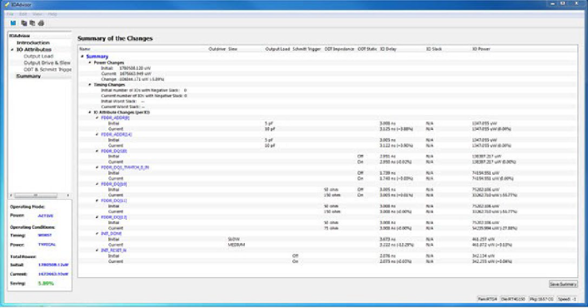

To save the summary, click **Save Summary**, select a save format \(text or<br /> CSV\), and click **OK**.

To commit IO Attribute changes you to the database \(the `*io_pdc` file\), choose<br /> **Save** from the **File** menu<br /> \(**File &gt; Save**\), an then click **OK** in<br /> the dialog that appears.

<br />

**Note:** After saving the changes into the `pdc` file and database, the summary refreshes automatically and shows the latest data as per the latest database.

<br />

## Constraint Manager: Timing Tab

The **Timing** tab allows you to manage timing constraints throughout the<br /> design process. Timing constraints files \(SDC\) have the `*.sdc` file<br /> extension and are placed in the `<Project_location>\constraint`<br /> folder.

Available options are:

-   **New**. Creates a new timing SDC file and saves it in the `<Project_location>\constraint` folder. When prompted, enter the name of the constraint file. The file is initially opened in the text editor for user entry.

    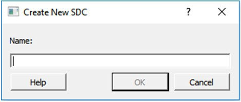


-   **Import**. Imports an existing timing SDC file into the Libero SoC project. The timing SDC file is copied into the `<Project_location>\constraint` folder.
-   **Link**. Creates a link in the project’s constraint folder to an existing timing SDC file \(located and maintained outside of the Libero SoC project\).

-   **Edit**. Opens the Timing Constraints Editor \(see the [Timing Constraints Editor User Guide](http://coredocs.s3.amazonaws.com/Libero/2025_1/Tool/smarttime_ce_ug.pdf) for details\) to modify the SDC file\(s\) associated with one of the three tools:
    -   **Synthesis**. Loads the timing SDC file\(s\) associated with the Synthesis tool into the constraints editor for editing.
    -   **Place and Route**. Loads the timing SDC file\(s\) associated with the Place and Route tool into the constraints editor for editing.
    -   **Timing Verification**. Loads the timing SDC file\(s\) associated with the Timing Verification tool into the constraints editor for editing.

        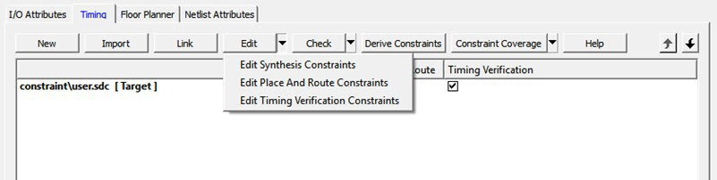

-   **Check**. Check the legality of the SDC file\(s\) associated with one of the following three tools:
    -   **Synthesis**. Check is performed against the pre-synthesis HDL design.
    -   **Place and Route**. Check is performed against the post-synthesis gate level netlist.
    -   **Timing Verification**. Check is performed against the post-synthesis gate level netlist.

        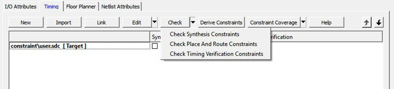


-   **Derive Constraints**. Generates a timing SDC file based on your configuration of the IP core, components, and component SDC, which includes `create_clock` and `create_generated_clock` SDC timing constraints. This file is named `<top_level_> derived_constraints.sdc`. The component SDC and the generated `<root>_derived_constraint.sdc` files are dependent on the IP cores and vary with the device family.

    ```
    create -name {REF_CLK_PAD_0} -period 5 [ get_ports { REF_CLK_PAD_0 } ]
    create_generated_clock -name {PF_TX_PLL_0/txpll_isnt_0/DIV_CLK} -divide_by 2 - source [ get_pins { PF_TX_PLL_0/txpll_isnt_0/REF_CLK_P } ] [ get_pins { PF_TX_PLL_0/txpll_isnt_0/DIV_CLK } ]
    ```


-   **Constraint Coverage**. Displays a pull-down list for selecting the Generate Place and Route Constraint Coverage report and Generate Timing Verification Constraint Coverage report.

    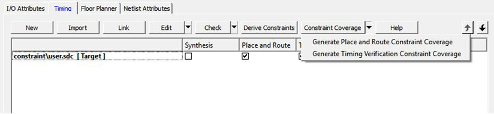


<br />

**Note:** Constraint Coverage Reports can be generated only after synthesis. A warning message appears if the design is not in the post-synthesis state when this button is clicked.

<br />

The generated report appears in the respective nodes of the report view \(**Design &gt; Reports**\).

If the SmartTime Constraint Editor tool is started or the constraint check is performed, all the<br /> files associated with the targeted tool – Synthesis, Place and Route, Timing<br /> Verification – are being passed for processing.

If you save your edits in the SmartTime Constraint Editor tool, the timing SDC files affected by<br /> the change are updated to reflect the changes you have made in the SmartTime Constraints<br /> Editor tool. New timing constraints you add in the tool are written to the *Target*file \(if a target file has been set\) or written to a new SDC file \(if no file is set<br /> as target\) and stored in the `<project>\constraint` folder.


Right-click the timing SDC files to access the available options for each constraint file:

-   **Set/Unset as Target**. Sets or clears the selected file as the target to store new constraints created in the SmartTime Constraint Editor tool. Newly created constraints only go into the target constraint file. Only one file can be set as target, and it must be a PDC or SDC file. This option is not available for the derived constraint SDC file. This option is not available for linked files.
-   **Open in Text Editor**. Opens the selected constraint file in the Libero Text Editor.
-   **Clone**. Copies the file to a file with a different name. The original file name and its content remain intact. This option is not available for linked files.
-   **Rename**. Renames the file to a different name. This option is not available for linked files.
-   **Copy File Path**. Copies the file path to the clipboard.
-   **Delete**. Deletes the selected file from the project and the disk. This option is not available for linked files.
-   **Unlink**. Removes the linked file from the project. The original file is untouched. This option is only available for linked files.
-   **Unlink: Copy file locally**. Removes the link and copies the file into the `<Project_location>\constraint` folder. This option is available for linked files only.

**File and Tool Association**

Each timing constraint file can be associated or disassociated with any one, two, or all three of the following tools:

-   Synthesis
-   Place and route
-   Timing Verification

Check the check box under **Synthesis**, **Place and Route**, or **Timing Verification** to associate the<br /> file with or disassociate the file from the tool. When a file is associated, Libero<br /> passes the file to the tool for processing.

### Example \(PolarFire\)

<br />

")

<br />

In the preceding figure, when **Edit Synthesis Constraint** is selected,<br /> `user.sdc`,`top_derived_constraints.sdc`, and<br /> `mytiming2.sdc` are read because these three files are associated with<br /> Synthesis\). The files `mytiming.sdc` and `sdfsadf.sdc` are not<br /> read because they are not associated with Synthesis. When the SmartTime Constraint Editor<br /> opens for editing, the constraints from all the files except `sdfsadf.sdc` are<br /> read and loaded into the Constraint Editor. Any changes you make and save in the Constraint<br /> Editor are written back to the files.

**Note:** The `sdfsadf.sdc` Constraint File is not checked because it is not associated with any tool.

### Example 1: RTG4, SmartFusion 2, and IGLOO 2

When **Edit Synthesis Constraint** is selected, as shown in the following<br /> figure, the files `prep1_derived_constraint.sdc` and<br /> `newtiming.sdc` are read because they are associated<br /> with Synthesis. The files `TVS_Demo_derived_constraints.sdc`<br /> and`prep1_sdc.sdc` are not read because they are not<br /> associated with Synthesis. When the SmartTime Constraints Editor opens for<br /> edit, the files `prep1_derived_constraint.sdc` and<br /> `newtiming.sdc` are read and loaded into the<br /> Constraints Editor. Any changes made to the constraints in these two files<br /> and saved in the Constraints Editor are written back to the two files.

When **Edit Synthesis Constraint** is selected, as shown in the following<br /> figure, the files **user.sdc**,<br /> **top\_derived\_constraints.sdc**, and<br /> **mytiming2.sdc** are read because they are<br /> associated with Synthesis. The files `mytiming.sdc` and<br /> `sdfsadf.sdc` are not read because they are not<br /> associated with Synthesis. When the SmartTime Constraint Editor opens for<br /> edit, the constraints from all the files except `sdfsadf.sdc`<br /> are read and loaded into the Constraint Editor. Any changes made and saved<br /> in the Constraint Editor are written back to the files.


### Example 2: RTG4, SmartFusion 2, and IGLOO 2

When **Check Synthesis Constraint** is selected, as shown in the following<br /> figure, the files `prep1_derived_constraints.sdc` and<br /> `newtiming.sdc` are checked because these two files<br /> are associated with Synthesis and the files<br /> `TVS_Demo_derived_constraints.sdc` and`prep1_sdc.sdc` are not checked because they are not<br /> associated with Synthesis.

When **Check for Timing Verification** is selected, the files<br /> `prep1_derived_constraints.sdc`,<br /> `newtiming.sdc`, and `prep1_sdc.sdc`<br /> are checked because they are associated with Timing Verification. The file<br /> `TVS_Demo_derived_constraints.sdc` is not checked<br /> because it is not associated with Timing Verification.

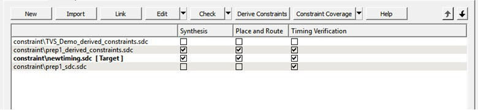

## Derived Constraints

Libero SoC can generate SDC timing constraints for design components when the root of the design<br /> is defined. Click **Derive Constraints** in the Constraint Manager’s<br /> **Timing** tab to generate SDC timing constraints for your<br /> design’s components.

The generated constraint file is named `<root>_derived.sdc` and is created<br /> by instantiating component SDC files created by IP configurators \(for example, CCC\) and<br /> oscillators used in the design.

The `<root>_derived.sdc` file is associated by default to the Synthesis,<br /> Place and Route, and Timing Verification tool. You can change the file association in<br /> the Constraint Manager by checking or unchecking the check box under the tool.

Use the following procedure to generate SDC timing<br /> constraints for IP cores.

**Tip:** To derive constraints accurately, Microchip recommends you use the IP configurators to generate your design's components when applicable \(for example, CCC\).

1.  Configure and generate the IP Core.
2.  From the Constraint Manager’s **Timing** tab, click **Derive Constraints** \(**Constraint Manager &gt; Timing &gt; Derive Constraints**\).

    The Constraint Manager generates the<br /> `<root>_derived_constraints.sdc` file and places it in<br /> the **Timing** tab along with other user SDC constraint<br /> files.

3.  When prompted about whether you want the Constraint Manager to automatically associate the derived SDC file to Synthesis, Place and Route, and Timing Verification, click **Yes** to accept automatic association or **No**, and then check or uncheck the appropriate check box for tool association.

    Microchip recommends the<br /> `<root>_derived_constraints.sdc` be always associated<br /> with all three tools: Synthesis, Place and Route, and Verify Timing. Before<br /> running SynplifyPro Synthesis, associate the<br /> `<root>_derived_constraints.sdc` file with Synthesis<br /> and Place and Route. This will ensure that the design objects \(such as nets and<br /> cells\) in the `<root>_derived_constraints.sdc` file are<br /> preserved during the synthesis step and the subsequent Place and Route step will<br /> not error out because of design object mismatches between the post-synthesis<br /> netlist and the `<root>_derived_constraints.sdc`<br /> file.


<br />

**Note:** The complete hierarchical path names are used to identify design objects in the generated SDC file. The **Derive Constraints** button is available for HDL-based and SmartDesign-based design flows. It is not available for Netlist Designs \(**Project &gt; Project Settings &gt; Design Flow &gt; Enable Synthesis** \[not checked\]\).

<br />

## Automatic Clock Jitter Constraint

Libero SoC calculates a design's "system jitter" automatically based on the device's<br /> global net clock jitter of the clock domain with the highest load. Libero assumes that<br /> the average toggle rate in each domain is 30%. For cases where 30% avg. toggle rate is<br /> not appropriate, see the device datasheet global clock jitter specifications to estimate<br /> the global net clock jitter at different effective toggle rates. After the global clock<br /> jitter is ascertained for the design's highest loaded clock domain, you can override the<br /> automatically calculated system jitter using the `set_system_jitter` SDC<br /> constraint \(see the [Timing Constraints Editor User Guide](http://coredocs.s3.amazonaws.com/Libero/2025_1/Tool/smarttime_ce_ug.pdf)\).

Libero SoC also calculates the clock generation path contribution to the clock jitter<br /> based on the device datasheet specifications for blocks such as CCCs, internal RC<br /> Oscillators, and XCVRs \(PolarFire, PolarFire SoC, RT PolarFire, and RTG4\).

You are responsible for specifying input clock jitter on externally sourced clocks \(see<br /> the `set_input_jitter` SDC constraint in the [Timing Constraints Editor User Guide](http://coredocs.s3.amazonaws.com/Libero/2022_2/Tool/smarttime_ce_ug.pdf)\).

For RTG4, you should account for the device datasheet Input Buffer clock jitter<br /> specification when specifying the input jitter on external clock inputs. This guidance<br /> also applies to CCC/PLL reference clocks sourced from I/O buffers. In addition, RTG4<br /> users should account for the device datasheet specification on effective recovered clock<br /> jitter from the CCC SpaceWire Clock Recovery circuits by applying the<br /> `set_input_jitter` constraint to the clock object created on the<br /> SpaceWire STROBE input.

For each clock domain, Libero SoC creates a clock uncertainty constraint whose value is<br /> the larger of the system jitter or the clock's individual clock generation/input path.<br /> The project's `/designer/<root>/` subfolder will contain<br /> `place_route.sdc` and `verify_timing.sdc` that<br /> contains the automatic clock uncertainty constraints used for the Place and Route and<br /> Verify Timing design flow steps. These tool-generated files are not to be modified by<br /> end-users.

After Place and Route and Verify Timing, Libero SoC generates jitter report files called<br /> `place_and_route_jitter_report.txt` and<br /> `timing_analysis_jitter_report.txt`, respectively. This report<br /> appears in the Libero SoC reports tab and is stored on disk in the project's<br /> `/designer/<root>/` subfolder.

If you have separate SDC files for Place and Route versus Verify Timing, make sure the<br /> desired `set_input_jitter` and `set_system_jitter`<br /> constraints exist in both files.

To obtain more clock jitter margin, you can also specify<br /> `set_clock_uncertainty` constraints in your SDC input files for Place<br /> and Route and Verify Timing. The user clock uncertainty will be added to the Libero SoC<br /> automatically derived clock uncertainty values, with the sum reflected in the<br /> `place_route.sdc` and`verify_timing.sdc` files,<br /> respectively. Microchip recommends reviewing the applied clock jitter values in the<br /> respective `jitter_report.txt` files.

When determining a clock domain's system jitter, Libero SoC considers the impact of<br /> switching activity from loads in synchronous clock domains. This means that loads on<br /> synchronous domains are counted together when determining the largest clock domain to<br /> use for the design's global net system jitter calculation. By default, external clock<br /> inputs are considered to be asynchronous to each other for the purposes of calculating<br /> the system jitter.

During timing analysis and when viewing expanded path reports, a **clock jitter** line item appears in the calculation corresponding to the applied<br /> clock uncertainty. By default, hold time \(min-delay\) calculations on a single clock edge<br /> of a single clock domain do not have clock jitter constraints applied. In contrast,<br /> paths involving multiple clock domains, multiple clock edges, or external interfaces<br /> include clock jitter in the timing analysis.

## Constraint Manager: Floor Planner Tab

The **Floor Planner** tab allows you to manage floorplanning constraints.<br /> Floorplanning constraints files \(PDC\) have the `*.pdc` file extension and<br /> are placed in the &lt;Project\_location&gt;\\constraint\\fp folder.

Available options are:

-   **New**. Creates a new floorplanning PDC file and saves it into the `<Project_location>\constraint\fp` folder.
-   **Import**. Imports an existing floorplanning PDC file into the Libero SoC project. The floorplanning PDC file is copied into the `<Project_location>\constraint\fp` folder.

-   **Link**. Creates a link in the project’s constraint folder to an existing floorplanning PDC file located and maintained outside of the Libero SoC project.
-   **Edit**. Opens the [Chip Planner](https://coredocs.s3.amazonaws.com/Libero/12_4_0/Tool/chipplanner_ug.pdf) tool to modify the floorplanning PDC file\(s\) associated with the Place and Route tool.
-   **View**. Opens the Chip Planner tool to view the floorplanning PDC file\(s\) associated with the Place and Route tool. You cannot save/commit any changes made to the constraints file. However, you can export the PDC file\(s\) using Chip Planner.
-   **Check**. Checks the legality of the PDC file\(s\) associated with the Place and Route tool against the gate level netlist.

When the Chip Planner tool is started or the constraint check is performed, all<br /> files associated with the Place and Route tool are passed for processing.

When you save your edits in the Chip Planner tool, the floorplanning PDC files affected by the<br /> change are updated to reflect the change you made in the Chip Planner tool. New<br /> floorplanning constraints that you add in the Chip Planner tool are written to the<br /> *Target*file \(if a target file has been set\) or written to a new PDC file \(if<br /> no file is set as target\) and stored in the &lt;project&gt;\\constraint\\fp folder.

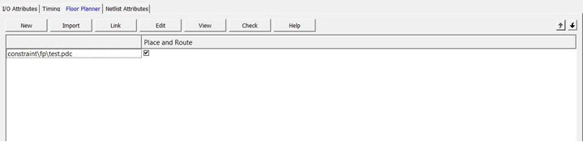

Right-click the floorplanning PDC files to access the available options:

-   **Set/Unset as Target**. Sets or clears the selected file as the target to store new constraints created in the Chip Planner tool. Newly created constraints only go into the target constraint file. Only one file can be set as target. This option is not available for linked files.
-   **Open in Text Editor**. Opens the selected constraint file in the Libero Text Editor.
-   **Clone**. Copies the file to a file with a different name. The original file name and its content remain intact. This option is not available for linked files.
-   **Rename**. Renames the file to a different name. This option is not available for linked files.
-   **Copy File Path**. Copies the file path to the clipboard.
-   **Delete**. Deletes the selected file from the project and the disk. This option is not available for linked files.
-   **Unlink**. Removes the linked file from the project. The original file is untouched. This option is only available for linked files.
-   **Unlink: Copy file locally**. Removes the link and copies the file into the &lt;Project\_location&gt;\\constraint\\fp folder. This option is only available linked files only.

### File and Tool Association

Each floorplanning constraint file can be associated or disassociated to the Place and Route<br /> tool. Check the check box under **Place and Route**to associate or<br /> disassociate the file from the tool.

When a file is associated, Libero passes the file to the tool for processing.

## Constraint Manager: Netlist Attributes Tab

The **Netlist Attributes** tab allows you to manage netlist attribute<br /> constraints to optimize your design during the synthesis and/or compile process. Timing<br /> constraints must be entered using SDC files managed in the Timing tab. Netlist Attribute<br /> constraints files are placed in the `<Project_location>\constraint`<br /> folder. Libero SoC manages two types of netlist attributes:

-   FDC constraints are used to optimize the HDL design using Synopsys SynplifyPro synthesis engine and have the`*.fdc` extension.
-   NDC constraints are used to optimize the post-synthesis netlist with the Libero SoC compile engine and have the \*.ndc file extension.

Available options are:

-   **New**. Creates a new FDC or NDC netlist attribute constraints file in the `<Project_location>\constraint` folder.
-   **Import**. Imports an existing FDC or NDC netlist attribute constraints file into the Libero SoC project. The FDC or NDC netlist attribute constraints file is copied into the `<Project_location>\constraint` folder.
-   **Link**. Creates a link in the project’s constraint folder to an existing FDC or NDC netlist attribute constraints file \(located and maintained outside of the Libero SoC project\).
-   **Check**. Checks the legality of the FDC and NDC file\(s\) associated with the Synthesis or Compile tools.

When the constraint check is performed, all files associated with the Synthesis or<br /> Compile tools are passed for processing.

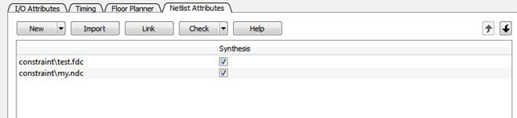

Right-click the FDC or NDC files to access the available options:

-   **Open in Text Editor**. Opens the selected constraint file in the Libero SoC Text Editor.
-   **Clone**. Copies the file to a file with a different name. The original file name and its content remain intact. This option is not available for linked files.
-   **Rename**. Renames the file to a different name. This option is not available for linked files.
-   **Copy File Path**. Copies the file path to the clipboard.
-   **Delete**. Deletes the file from the project and the disk. This option is not available for linked files.
-   **Unlink**. Removes the linked file from the project. The original file is untouched. This option is only available for linked files.
-   **Unlink: Copy file locally**. Removes the link and copies the file into the `<Project_location>\constraint` folder. This option is only available for linked files.

### File and Tool Association

Each netlist attributes constraint file can be associated with or disassociated from the Synthesis tool.

Check the check box under **Synthesis** \(Compile\) to associate/disassociate<br /> the file from Synthesis \(Compile\). When a file is associated, Libero passes the file to<br /> Synthesis \(Compile\) for processing when Synthesis is run.

When Synthesis is ON \(**Project &gt; Project Settings &gt; Design Flow &gt; Enable synthesis**\[checked\]\) for a project, the Design Flow Synthesis action<br /> runs both the synthesis engine and the post-synthesis compile engine.

When Synthesis is OFF \(**Project &gt; Project Settings &gt; Design Flow &gt; Enable synthesis** \[not checked\]\) for a project, the Design Flow Synthesis action<br /> is replaced by the Compile action and runs the compile engine on the gate-level netlist<br /> \(EDIF or Verilog\) available in the project.

**Note:** Linked files in Constraint Manager are shown as a relative path if the relative<br /> option is set for linked files. If a constraint file is missing during an environment<br /> variable change or if a path in an environment variable changes, the Constraint Manager<br /> does show any broken links. Therefore, if a constraint file is missing, an error message<br /> appears in the log window if you try to access the file.


