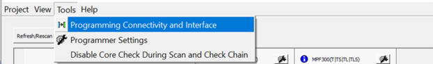
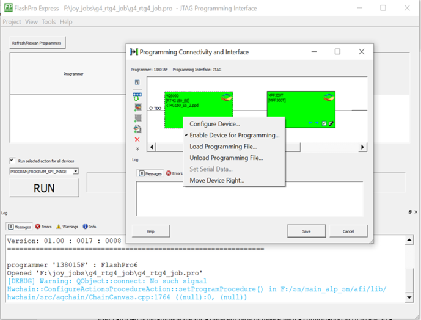

# Programming Connectivity and Interface

The **Programming Connectivity and Interface**option can be selected from the **Tools** menu.

By default, the tool selects the first enabled programmer and opens the Programming Connectivity and Interface dialog box with an existing JTAG chain or SPI Target device. The user can disable all programmers, except the one which is used by the FlashPro Express tool.

The selected programmer and current programming interface are shown in the dialog box for the user reference. The main window’s programmer table is cleared as soon as the chain dialog box is opened and will be populated with saved changes or restored to previous state if changes are canceled when the dialog box is closed.

In developer mode, if there is no programmer connected, user can manually construct chain.

For JTAG Interface, the same configure chain options are available as in Libero SoC tool.

For SPI Target interface, the following options are available:

-   **Set Programming Interface**: Selects JTAG or SPI Target mode.
-   **Add Microsemi Device**: Adds a Microsemi device to the chain.
-   **Delete device**: Deletes selected devices in the grid.
-   **Zoom In**: Zoom into the grid.
-   **Zoom Out**: Zoom out of the grid.

The devices used in FlashPro Express tool have the following context menu options:

-   **Configure Device**: Configure device is same as the one in Libero SoC tool. Configure device option allows to configure device by loading programming file \(but not a SPI Flash file\) or to set device family and die.
-   **Enable/Disable Device for Programming**: Enables or disables device for programming.
-   **Load Programming File**: Loads the programming file.
-   **Unload Programming File**: This option is enabled if programming file loaded.
-   **Load SPI Flash File**: Loads a SPI Flash file. This option is always enabled. It is available for PolarFire and PolarFire SoC devices.
-   **Unload SPI Flash File**: This option is enabled if SPI Flash file is loaded. It is available for PolarFire and PolarFire SoC devices.
-   **Set Serial Data**: This option is disabled; serialization is not supported.
-   **Move Device**: to left/right

There is no option to configure/select programming action or SPI Flash action. This option is only available in the main table because it depends on the developer mode option to run one programming action for all devices or run an action selected for each device.

From Libero SoC v12.6 onwards, you can change a device type by loading the programming file for a different device type. This is consistent with Libero flow.

In the chain dialog box and in the main table, the user can load the programming file for a different device type with a GUI confirmation. The chain tool also allows the user to reconfigure the device by selecting a different family and a die. In this case, no confirmation is required.

In the batch mode, a programming file is loaded with a warning.

