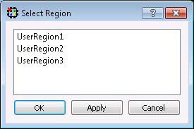
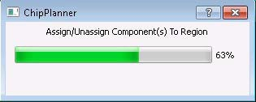

# Region Assignments

When you right click an item in one of the tabs in the Main Object  Browser, you can choose from available options, which can include placing an item to a  location, unplacing an item from a location, locking the placement, and assigning a  region.

Multiple items can be selected and assigned to the same region at the same  time. You can also select a region assignment by right clicking an item and choosing **Region Assign**. The dialog box opens as shown in the following  figure. This option is not available for objects in the Region tab.

The progress of All Region Assign and Unassign commands is as shown in  the following figure.

**Note:** This dialog shows only the progress, and does not allow the user to cancel the operation. Closing the dialog does not terminate the operation.

**Parent topic:**[Operating Modes](GUID-BA522578-5894-4CAA-9E78-66546C3F5B81.md)

