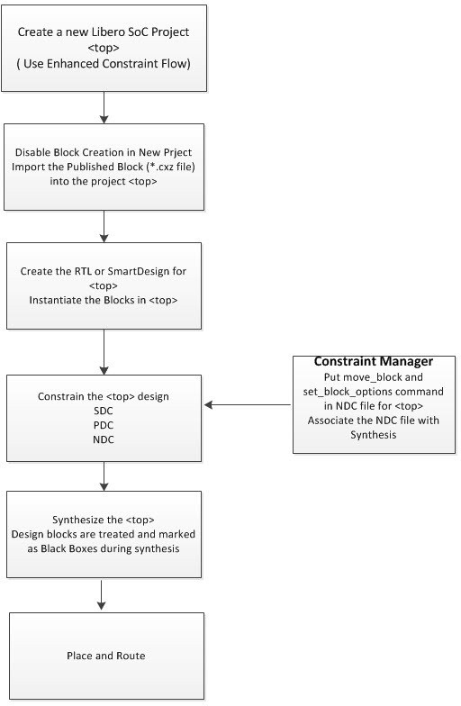

# Create a Top-Level Design that Uses Blocks

Use SmartDesign or HDL to create a top-level design. If you use HDL, you can create HDL for the top-level or import a top-level HDL file.

**Parent topic:**[Instantiating Blocks in the Top-Level Design](GUID-6553B10E-4A23-48FE-947B-E7478778CBCB.md)

