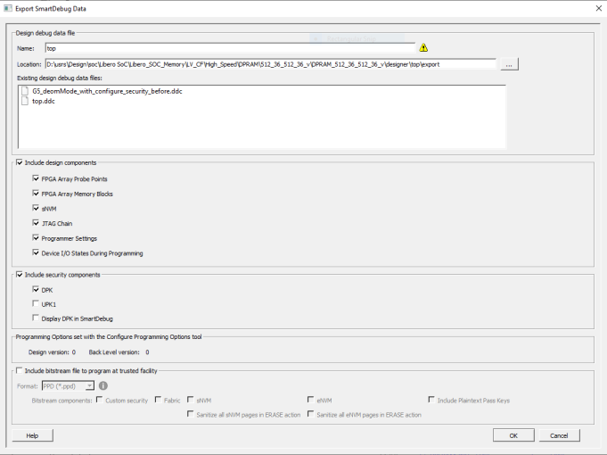

# Handoff Design for Debugging

## Exporting SmartDebug Data

The following procedure describes how to export SmartDebug Data from Libero to the stand-alone SmartDebug environment. You can export SmartDebug data to any location that has read/write permission without connecting the hardware.

1.  In the Design Flow window, expand **Handoff Design for Production**.
2.  Expand **Handoff Design for Debugging**, right-click **Export SmartDebug Data**, and click **Export**. The Export SmartDebug Data dialog box appears.
3.  Select the design debug data \(`*.ddc`\) file you want to export.

You can use this file to create a stand-alone SmartDebug project \(see the following figure for an example\).

<table id="TABLE_LGK_4KL_JPB"><thead><tr><th>

Field

</th><th>

Description

</th></tr></thead><tbody><tr><td>

Name

</td><td>

Name of the design.

</td></tr><tr><td>

Location

</td><td>

Location of the exported debug file. By default, the `*.ddc` file has the `*.ddc` file extension and exports to the `<project_location>/designer/<design>/export` folder.

</td></tr><tr><td>

Existing design debug data files

</td><td>

You can export `*.ddc` files in the export folder after running Generate FPGA Array Data for the design in the Libero® Design Flow. You can also export SmartDebug data directly after running Synthesize on the design. Other tools, such as Place and Route and Generate FPGA Array Data\) are run implicitly before the Export SmartDebug Data dialog box is displayed.

</td></tr><tr><td>

Include design components

</td><td>

A `*.ddc` file can contain the following components:-   FPGA Array Probe Points: Check to export Live and Active probes information \(`<design>_probe.db` file\) into the `*.ddb` container file.
-   FPGA Array Memory Blocks: Check to export the following information about FPGA memories \(`<design>_sii_block.db`\) into the `*.ddb` container file:
    -   Names and addresses of the memory blocks instantiated by the design.
    -   Data formats you selected in the design.
-   sNVM: Appears if sNVM is in your design. Check to export sNVM components.
-   Security: Contains the security locks, keys, and security policy information for debugging. This might be default or custom security \(`<design>.spm` file\). This is hidden if security is not supported for the device.
-   Display DPK or UPK1 in SmartDebug: Enabled when custom security is provided. Default: not checked
-   JTAG Chain: Device chain information configured using Programming Connectivity and Interface in Libero. Check to export chain data, including devices, their programming files if loaded, and device properties, to the `<design>.pro` file. If not checked, the default JTAG chain with Libero design device is added only to the `*.ddc` file.
-   Programmer Settings: If not checked, the default programmer settings are added to the `*.ddc` file.
-   Device I/O States During Programming \(`<design>.ios` file\): Used by some SmartDebug features for programming sNVM. It is not used during device programming in SmartDebug; programming files used to program devices already have I/O states data.

</td></tr><tr><td>

Include security components

</td><td>

Choices are:DPK \(Debug Pass Key\): If security is configured and DPK is set, this option is selected by default. UPK1 \(User Pass Key 1\): If security is configured and DPK is set, this option is selected by default. If DPK is not set, this option is selected by default.Display DPK In SmartDebug/Display UPK1 In SmartDebug: This option is not selected by default. Select this option to display DPK or UPK1 in the Standalone SmartDebug tool.If DPK is selected, DPK is passed to \(\*.ddc\) for unlocking the debug features. Similarly, if UPK1 is selected, UPK1 is passed to \(\*.ddc\) for unlocking the debug features. If both DPK and UPK1 are selected, both are passed to \(\*ddc\), but only DPK is used for unlocking the debug features.**Attention:** If DPK is permanently disabled for PolarFire®, UPK1 is used for unlocking the device.

</td></tr><tr><td>

Programming Options set with the Configure Programming Options tool

</td><td>

Read-only values that show the design version and back level version set in the Configure Programming Options Wizard. From these values, you can use the bitstream file information for programming the device in Standalone SmartDebug.Info and warning messages appear based on the value set for the back level version.

</td></tr><tr><td>

Include bitstream file to program at trusted facility

</td><td>

Choices are:-   Format: Select the bitstream file format you want to export. Choices are PPD and STAPL.
-   Bitstream components: Choices are:
    -   Custom security: Appears if Custom Security is selected in the Configure Security Wizard.
    -   Fabric/sNVM: If the Fabric Bitstream component is programmed, the sNVM Bitstream component must be programmed, and it is selected by default. In this case, sNVM is disabled for you to unselect. Otherwise, the sNVM component can be enabled or disabled for programming. If selected, Custom Security is enabled by default and grayed-out.
    -   eNVM: Supported for PolarFire only.
    -   Include Plaintext Pass Keys: By default, all exported bitstream files exclude plaintext pass keys. You must explicitly select to include them if desired. Use bitstream files that include plaintext pass keys only in trusted environments. FlashLock/Pass keys are needed to unlock any locked features. If selected, Custom Security is enabled by default and grayed-out. If a user design has security configured, this option is required to include the plaintext passkeys along with programming bitstream file for REPROGRAM/ERASE actions in SASD.
    -   Sanitize all sNVM pages in ERASE action. Available if Fabric/sNVM component is selected for at least one master file or update file. Supported for PolarFire only.

Sanitize all eNVM pages in ERASE action: Available if eNVM is configured and selected for at least one master or update file. Supported for PolarFire SoC only.

</td></tr></tbody>
</table>