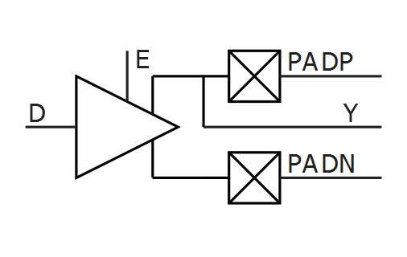
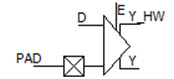
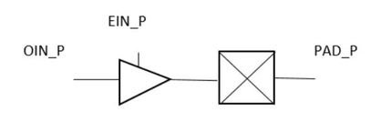
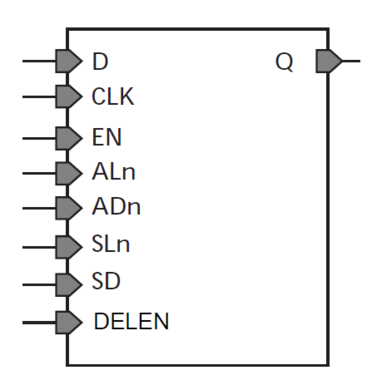

# IO1

## BIBUF

Bidirectional Buffer.

|Input|Output|
|-----|------|
|D, E, PAD|PAD, Y|

|MODE|E|D|PAD|Y|
|----|---|---|---|---|
|OUTPUT|1|D|D|D|
|INPUT|0|X|Z|X|
|INPUT|0|X|PAD|PAD|

## BIBUF\_DIFF

Bidirectional Buffer, Differential I/O.

|Input|Output|
|-----|------|
|D, E, PADP, PADN|PADP, PADN, Y|

|MODE|E|D|PADP|PADN|Y|
|----|---|---|----|----|---|
|OUTPUT|1|0|0|1|0|
|OUTPUT|1|1|1|0|1|
|INPUT|0|X|Z|Z|X|
|INPUT|0|X|0|0|X|
|INPUT|0|X|1|1|X|
|INPUT|0|X|0|1|0|
|INPUT|0|X|1|0|1|

## CLKBIBUF

Bidirectional Buffer with Input to global network.

|Input|Output|
|-----|------|
|D, E, PAD|PAD, Y|

|D|E|PAD|Y|
|---|---|---|---|
|X|0|Z|X|
|X|0|0|0|
|X|0|1|1|
|0|1|0|0|
|1|1|1|1|

## CLKBUF

Input Buffer to global network.

|Input|Output|
|-----|------|
|PAD|Y|

|PAD|Y|
|---|---|
|0|0|
|1|1|

## CLKBUF\_DIFF

Differential I/O macro to global network, Differential I/O.

|Input|Output|
|-----|------|
|PADP, PADN|Y|

|PADP|PADN|Y|
|----|----|---|
|Z|Z|Y|
|0|0|X|
|1|1|X|
|0|1|0|
|1|0|1|

## INBUF

Input Buffer.

|Input|Output|
|-----|------|
|PAD|Y|

|PAD|Y|
|---|---|
|Z|X|
|0|0|
|1|1|

## INBUF\_DIFF

Input Buffer, Differential I/O.

|Input|Output|
|-----|------|
|PADP, PADN|Y|

|PADP|PADN|Y|
|----|----|---|
|Z|Z|X|
|0|0|X|
|1|1|X|
|0|1|0|
|1|0|1|

## IOINFF\_BYPASS

The I/O input bypass macro is available in post-layout netlist only.

|Input|Output|
|-----|------|
|A|Y|

|A|Y|
|---|---|
|0|0|
|1|1|

## IOENFF\_BYPASS

The I/O enable bypass macro is available in post-layout netlist only.

|Input|Output|
|-----|------|
|A|Y|

|A|Y|
|---|---|
|0|0|
|1|1|

## IOOUTFF\_BYPASS

The I/O output bypass macro is available in post-layout netlist only.

|Input|Output|
|-----|------|
|A|Y|

|A|Y|
|---|---|
|0|0|
|1|1|

## IOPAD\_BI

The I/O output bypass macro is available in post-layout netlist only.

|Input|Output|
|-----|------|
|D, E, PAD|PAD, Y, Y\_HW|

|MODE|E|D|PAD|Y|Y\_HW|
|----|---|---|---|---|-----|
|OUTPUT|1|D|D|D|D|
|INPUT|0|X|Z|X|X|
|INPUT|0|X|PAD|PAD|PAD|

## IOPADP\_BI

The I/O PAD bi-directional macro is available in post-layout netlist only.

|Input|Output|
|-----|------|
|N2PIN\_P, OIN\_P, EIN\_P, PAD\_P|PAD\_P, IOUT\_P, IOUT\_HW\_P|

|MODE|EIN\_P|OIN\_P|PAD\_P|N2PIN\_P|IOUT\_P|OUT\_HW\_P|
|----|------|------|------|--------|-------|----------|
|OUTPUT|1|0|0|1|0|0|
|OUTPUT|1|1|1|0|1|1|
|INPUT|0|X|Z|Z|X|X|
|INPUT|0|X|0|0|X|X|
|INPUT|0|X|1|1|X|X|
|INPUT|0|X|0|1|0|0|
|INPUT|0|X|1|0|1|1|

## IOPADN\_BI

The I/O PAD bi-directional macro is available in post-layout netlist only.

|Input|Output|
|-----|------|
|OIN\_P, EIN\_P, PAD\_P|PAD\_P, N2POUT\_P|

|MODE|EIN\_P|OIN\_P|PAD\_P|N2POUT\_P|
|----|------|------|------|---------|
|OUTPUT|1|1|0|0|
|OUTPUT|1|0|1|1|
|INPUT|0|X|Z|X|
|INPUT|0|X|0|X|
|INPUT|0|X|1|X|
|INPUT|0|X|0|0|
|INPUT|0|X|1|1|

## IOPADP\_IN

The I/O PAD input macro is available in post-layout netlist only.

|Input|Output|
|-----|------|
|PAD\_P, N2PIN\_P|IOUT\_P, IOUT\_HW\_P|

|PAD\_P|N2PIN\_P|IOUT\_P|IOUT\_HW\_P|
|------|--------|-------|-----------|
|Z|X|X|X|
|0|X|0|0|
|1|X|1|1|

## IOPADN\_IN

The I/O PAD input macro is available in post-layout netlist only.

|Input|Output|
|-----|------|
|PAD\_P|N2POUT\_P|

|PAD\_P|N2POUT\_P|
|------|---------|
|0|1|
|1|0|

## IOPADP\_TRI

The I/O PAD tristate output macro is available in post-layout netlist only.

|Input|Output|
|-----|------|
|OIN\_P, EIN\_P|PAD\_P|

|OIN\_P|EIN\_P|PAD\_P|
|------|------|------|
|X|0|Z|
|OIN\_P|1|OIN\_P|

## IOPADN\_TRI

The I/O PAD tristate output macro is available in post-layout netlist only.

|Input|Output|
|-----|------|
|OIN\_P, EIN\_P|PAD\_P|

|OIN\_P|EIN\_P|PAD\_P|
|------|------|------|
|X|0|Z|
|0|1|1|
|1|1|0|

## IO\_DIFF

The I/O Differential macro is available only in post-layout netlist \(place holder to reserve the N location\).

Input = YIN

## IOTRI\_OB\_EB

The I/O feed through macro is available in post-layout netlist only.

|Input|Output|
|-----|------|
|D, E|DOUT, EOUT|

|D|DOUT|
|---|----|
|0|0|
|1|1|

|E|EOUT|
|---|----|
|0|0|
|1|1|

## IOBI\_IB\_OB\_EB

The I/O feed through macro is available in post-layout netlist only.

|Input|Output|
|-----|------|
|D, E, YIN|DOUT, EOUT, Y|

|D|DOUT|
|---|----|
|0|0|
|1|1|

|E|EOUT|
|---|----|
|0|0|
|1|1|

|YIN|Y|
|---|---|
|0|0|
|1|1|

## OUTBUF

Output buffer.

|Input|Output|
|-----|------|
|D|PAD|

|D|PAD|
|---|---|
|0|0|
|1|1|

## OUTBUF\_DIFF

Output buffer, Differential I/O.

|Input|Output|
|-----|------|
|D|PADP, PADN|

|D|PADP|PADN|
|---|----|----|
|0|0|1|
|1|1|0|

## TRIBUFF

Tristate output buffer.

|Input|Output|
|-----|------|
|D, E|PAD|

|D|E|PAD|
|---|---|---|
|X|0|Z|
|D|1|D|

## TRIBUFF\_DIFF

Tristate output buffer, Differential I/O.

|Input|Output|
|-----|------|
|D, E|PADP, PADN|

|D|E|PADP|PADN|
|---|---|----|----|
|X|0|Z|Z|
|0|1|0|1|
|1|1|1|0|

## DDR\_IN

The DDR\_IN macro is available for both pre-layout and post-layout simulation flows. It consists of two SLE macros and a latch. The input D must be connected to an I/O.

|Input|Output|
|Name|Function|Name|
|-----|------|
|----|--------|----|
|D|Data input|QRQF|
|CLK|Clock input|
|EN|Active High CLK enable|
|ALn|Asynchronous load. This active low signal either sets the register or clears the register depending on the value of ADn.|
|ADn[1](GUID-99BD87EC-7492-4845-B792-D3977528DE90.md#GUID-CC1BA696-3B7F-456E-85A0-D9F70BE48391)|Static asynchronous load data. When ALn is active, QR and QF go to the complement of ADn.|
|SLn|Synchronous load. This active low signal either sets the register or clears the register depending on the value of SD, at the rising edge of CLK.|
|SD[1](GUID-99BD87EC-7492-4845-B792-D3977528DE90.md#GUID-CC1BA696-3B7F-456E-85A0-D9F70BE48391)|Static synchronous load data. When SLn is active \(that is,  low\), QR and QF go to the value of SD at the rising edge of CLK.|

**Note:**

1.  ADn and SD are static inputs defined at design time and need to be tied to 0 or 1.

|ALn|CLK|EN|SLn|dfn+1 \(Internal Signal\)|QRn+1|QFn+1|
|---|---|---|---|-------------------------|-----|-----|
|0|X|X|X|!ADn|!ADn|!ADn|
|1|Not rising|X|X|dfn|QRn|QFn|
|1|↑|0|X|dfn|QRn|QFn|
|1|↑|1|0|dfn|SD|SD|
|1|↑|1|1|dfn|D|dfn|
|1|↓|X|X|D|QRn|QFn|

## DDR\_OUT

The DDR\_OUT macro is an output DDR cell and is available for pre-layout simulation. It consists of two SLE macros. The output Q must be connected to an I/O.

|Input|Output|
|Name|Function| |
|-----|------|
|----|--------|---|
|DR|Data input \(Rising Edge\)|Q|
|DF|Data input \(Falling Edge\)|
|CLK|Clock input|
|EN|Active High CLK enable|
|ALn|Asynchronous load. This active low signal either sets the register or clears the register depending on the value of ADn.|
|ADn[1](GUID-99BD87EC-7492-4845-B792-D3977528DE90.md#GUID-A031828C-AC1E-4DDB-9AF0-63C94E73923C)|Static asynchronous load data. When ALn is active, Q goes to the complement of ADn.|
|SLn|Synchronous load. This active low signal either sets the register or clears the register depending on the value of SD, at the rising edge of CLK.|
|SD[1](GUID-99BD87EC-7492-4845-B792-D3977528DE90.md#GUID-A031828C-AC1E-4DDB-9AF0-63C94E73923C)|Static synchronous load data. When SLn is  active \(that is, low\), Q goes to the value of SD at the rising edge of  CLK.|

**Note:**

1.  ADn and SD are static inputs defined at design time and need to be tied to 0 or 1.

|ALn|CLK|EN|SLn|QRn+1|QFn+1|Qn+1|
|---|---|---|---|-----|-----|----|
|0|X|X|X|!ADn|!ADn|!ADn|
|1|1|X|X|QRn|QFn|QRn|
|1|↑|0|X|QRn|QFn|QRn+1|
|1|↑|1|0|SD|SD|QRn+1|
|1|↑|1|1|DR|DF|QRn+1|
|1|0|X|X|QRn|QFn|QFn|

## DDR\_OE\_UNIT

The DDR\_OE\_UNIT macro is an output DDR cell that is only available for post-layout simulations. Every DDR\_OUT instance is replaced by DDR\_OE\_UNIT during compile. The DDR\_OE\_UNIT macro consists of a DDR\_OUT macro with inverted data inputs and SDR control.

|Input|Output|
|Name|Function| |
|-----|------|
|----|--------|---|
|DRn|Data input \(Rising Edge\)|Q|
|DFn|Data input \(Falling Edge\)|
|CLK|Clock input|
|EN|Active High CLK enable|
|ALn|Asynchronous load. This active low signal either sets the register or clears the register depending on the value of ADn.|
|ADn|Static asynchronous load data. When ALn is active, Q goes to the complement of ADn.|
|SLn|Synchronous load. This active low signal either sets the register or clears the register depending on the value of SD, at the rising edge of CLK.|
|SD|Static synchronous load data. When SLn is  active \(that is, low\), Q goes to the value of SD at the rising edge of  CLK.|
|SDR|Controls whether the cell operates in DDR \(SDR = 0\) or SDR \(SDR = 1\) modes.|

|SDR|ALn|CLK|EN|SLn|QRn+1|QFn+1|Qn+1|
|---|---|---|---|---|-----|-----|----|
|0|0|X|X|X|!ADn|!ADn|!ADn|
|0|1|1|X|X|QRn|QFn|QRn|
|0|1|↑|0|X|QRn|QFn|QRn+1|
|0|1|↑|1|0|SD|SD|QRn+1|
|0|1|↑|1|1|!DRn|!DFn|QRn+1|
|0|1|0|X|X|QRn|QFn|QFn|

## IOIN\_IB

Buffer macro available in post-layout netlist only.

|Input|Output|
|-----|------|
|YIN, E|Y|

**Note:** E input is not used.

|YIN|Y|
|---|---|
|Z|X|
|0|0|
|1|1|

## IOPAD\_IN

Input I/O macro available in post-layout netlist only.

|Input|Output|
|-----|------|
|PAD|Y, Y\_HW|

|PAD|Y, Y\_HW|
|---|--------|
|Z|X|
|0|0|
|1|1|

## IOPAD\_TRI

Tri-state output buffer available in post-layout netlist only.

|Input|Output|
|-----|------|
|D, E|PAD|

|D|E|PAD|
|---|---|---|
|X|0|Z|
|0|1|0|
|1|1|1|

## IOINFF

Registered input I/O macro available only in post-layout netlist.

|Input|Output|
|-----|------|
|Name|Function|Q|
|D|Data|
|CLK|Clock|
|EN|Enable|
|ALn|Asynchronous Load \(Active-Low\)|
|ADn[1](GUID-99BD87EC-7492-4845-B792-D3977528DE90.md#GUID-8D5D8F5E-7E24-411E-9DEA-BF27B23366EA)|Asynchronous Data \(Active-Low\)|
|SLn|Synchronous Load \(Active-Low\)|
|SD[1](GUID-99BD87EC-7492-4845-B792-D3977528DE90.md#GUID-8D5D8F5E-7E24-411E-9DEA-BF27B23366EA)|Synchronous Data|
|DELEN[1](GUID-99BD87EC-7492-4845-B792-D3977528DE90.md#GUID-8D5D8F5E-7E24-411E-9DEA-BF27B23366EA)|Enable Single-event Transient mitigation|

**Note:**

1.  ADn, SD, and DELEN are static signals defined at design time and need to be tied to 0 or 1.

|ALn|ADn|CLK|EN|SLn|SD|D|Qn+1|
|---|---|---|---|---|---|---|----|
|0|ADn|X|X|X|X|X|!ADn|
|1|X|Not rising|X|X|X|X|Qn|
|1|X|↑|0|X|X|X|Qn|
|1|X|↑|1|0|SD|X|SD|
|1|X|↑|1|1|X|D|D|

## IOOEFF

Registered output I/O macro available only in post-layout netlist. The IOOEFF is an SLE\_RT with an inverted data input.

|Input|Output|
|-----|------|
|Name|Function|Q|
|D|Data|
|CLK|Clock|
|EN|Enable|
|ALn|Asynchronous Load \(Active Low\)|
|ADn[1](GUID-99BD87EC-7492-4845-B792-D3977528DE90.md#GUID-0D7F28D4-B43C-415C-B712-6DAC169FFDCA)|Asynchronous Data \(Active Low\)|
|SLn|Synchronous Load \(Active Low\)|
|SD[1](GUID-99BD87EC-7492-4845-B792-D3977528DE90.md#GUID-0D7F28D4-B43C-415C-B712-6DAC169FFDCA)|Synchronous Data|
|DELEN[1](GUID-99BD87EC-7492-4845-B792-D3977528DE90.md#GUID-0D7F28D4-B43C-415C-B712-6DAC169FFDCA)|Enable Single-event Transient mitigation|

**Note:**

1.  ADn, SD, and DELEN are static signals defined at design time and need to be tied to 0 or 1.

|ALn|ADn|CLK|EN|SLn|SD|D|Qn+1|
|---|---|---|---|---|---|---|----|
|0|ADn|X|X|X|X|X|!ADn|
|1|X|Not rising|X|X|X|X|Qn|
|1|X|↑|0|X|X|X|Qn|
|1|X|↑|1|0|SD|X|SD|
|1|X|↑|1|1|X|D|!D|

