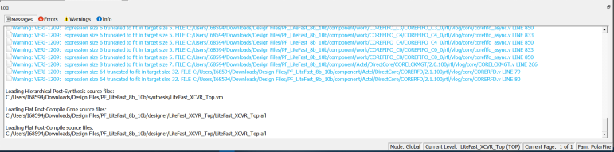

# Log Window

The **Log** window displays the following:

-   Informational messages such as the location and name of the files used to display the view.
-   Any syntax errors in the HDL file if the HDL file is opened with the **Open File Location** option \(right click design object &gt; **Open File Location**\).

**Important:** The **Log** window displays by default when the **Netlist Viewer** opens. Hiding the **Log** window will leave more display area for the Canvas view. To get a larger display area for the Canvas view, hide the **Log** window \(**Netlist Viewer** &gt; **Windows** and uncheck \(**Show Log**\).

-   **[Status Bar](GUID-EEEB345A-AD02-40D0-9D54-C8FA2BB5A121.md)**  

**Parent topic:**[Netlist Viewer Windows](GUID-29F3E93D-3ECA-4F8B-9478-64D63D5F1873.md)

