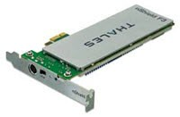

# HSM Hardware Modules used by SPPS

SPPS uses nShield Edge \([Figure   1](GUID-9B2AD506-2924-445F-9207-5C672A750DDB.md#FIG_UL5_1MR_SNB)\) and nShield Solo \([Figure   2](GUID-9B2AD506-2924-445F-9207-5C672A750DDB.md#FIG_XF2_CMR_SNB)\)  hardware security modules \(HSMs\) manufactured by Thales. Both modules carry a FIPS140-2  Level 3 security certificate.

nShield Edge is a USB-attached module.

 

 

nShield Solo is PCIe-based, and can be installed on regular and compact size PC boxes  with a PCIe port.

 

 

nShield Edge HSMs have an integrated smart card reader. The included card reader for  nShield Solo HSMs is external.

In performance, nShield Solo surpasses nShield Edge. nShield Solo is optimal for use in  U‑HSM for performance-intensive programming Authentication Code and one-time passcode  generation. nShield Edge is optimal for use in M‑HSM for handling lightweight bit stream  generation operations. From the software and setup perspective, both the modules are  interchangeable, and module type selection is typically based on specific use conditions  and the size of the SmartFustion2/IGLOO2 devices they serve.

The HSM module has standard Thales-provided cryptographic algorithms and can execute  custom algorithms within the security boundaries provided by the HSM module.

The HSM module has limited internal nonvolatile memory size for storing the module  initiater key and Job Ticket information such as Ticket binding data, overbuild  protection data, so on. All other information that requires protection by HSM is stored  on the hard disk of the host PC.

For more information about nShield Edge and nShield modules, see the *nShield Edge Solo User Guide* from Thales.

**Parent topic:**[HSM Servers](GUID-8655628F-64C1-4EED-AA0C-2F15C461DFAB.md)

