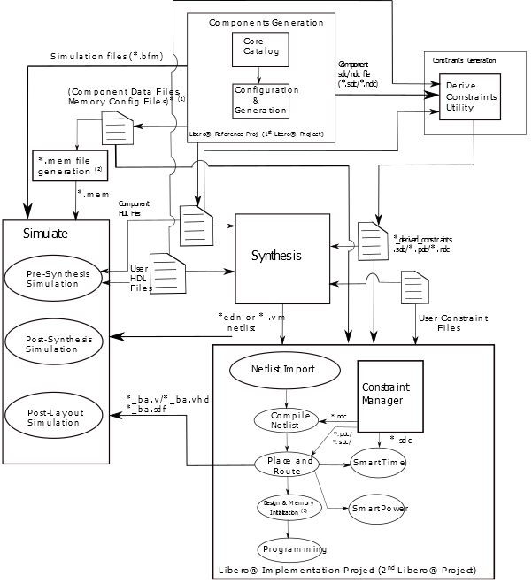

# Custom Flow

The following figure shows how Libero SoC can be integrated as a part of the larger FPGA design flow with the third-party synthesis and simulation tools outside the Libero SoC environment. The following figure shows various steps involved in the flow, starting from design creation and stitching all the way to programming the device. The figure also shows the data exchange \(inputs and outputs\) that must occur at each design flow step.

**Tip:**

1.  Component Data Files and Memory Config Files:
    1.  Component Data Files and Memory Config Files:
        1.  SmartFusion 2/IGLOO 2: \*.reg files for MDDR/FDDR/SerDes blocks.
    2.  Memory Config Files:
        1.  SmartFusion 2/IGLOO 2: ENVM.cfg.
        2.  RTG4: UPROM.cfg.
        3.  PolarFire: SNVM.cfg, UPROM.cfg.
2.  \*.mem file generation for Simulation for different families:
    1.  SmartFusion 2: pa4mssenvmgen.exe takes ENVM.cfg as input and generates ENVM\_init.mem.
    2.  IGLOO 2: pa4mssenvmgen.exe takes \*.reg files for MDDRR/FDDR/SerDes blocks and ENVM.cfg as input and generates ENVM\_init.mem.
    3.  RTG4, PolarFire: pa4rtupromgen.exe takes UPROM.cfg as input and generates UPROM.mem.
3.  For PolarFire only.

The following are the steps in the custom flow:

1.  Component configuration and generation:
    1.  Create a first Libero project \(to serve as a Reference Project\).
    2.  Select the Core from the Catalog. Double-click the core to give it a component name and configure the component.

        **Important:** For SmartFusion 2 and IGLOO 2 System Builder and SmartFusion 2 MSS blocks, generate the component in the SmartDesign canvas after configuration of the SmartFusion 2 MSS block and System Builder block.

        This automatically exports component data and files. A [Component Manifests](GUID-CBA28D38-9B16-4D6E-B465-EF0C370A2E37.md) is also generated. See [Component Manifests](GUID-CBA28D38-9B16-4D6E-B465-EF0C370A2E37.md) for details. For more details, see [Component Configuration](GUID-21EFBB2D-7F99-4C6B-B52B-40B50BBF57D9.md).

2.  Complete your RTL design outside of Libero:
    1.  Instantiate the component HDL files.
    2.  The location of the HDL files is listed in the [Component Manifests](GUID-CBA28D38-9B16-4D6E-B465-EF0C370A2E37.md) files.
3.  Generate SDC/PDC/NDC constraints for the components. Use Derive Constraints utility to generate the floorplanning .\*pdc \(only for SmartFusion 2/IGLOO 2\), the timing .\*sdc, and netlist constraints .\*ndc \(in RTG4 designs using RTG4FCCCECALIB core\) files based on:

    1.  Component HDL files
    2.  Component SDC/NDC files
    3.  User HDL files
    For more details, see [Appendix D—Derive Constraints](GUID-C2F68D32-B5A8-46EF-B1F8-020E2627B30E.md).

4.  Synthesis tool/simulation tool:
    1.  Get HDL files, stimulus files, and component data from the specific locations as noted in the [Component Manifests](GUID-CBA28D38-9B16-4D6E-B465-EF0C370A2E37.md).
    2.  Synthesize and simulate the design with third-party tools outside Libero SoC.
5.  Firmware tool \(SmartFusion 2 only\):
    1.  Get drivers from the specific locations as noted in the manifest.
    2.  Edit source code to enable run time initialization for specific components C compile firmware project.
6.  Create your second \(Implementation\) Libero Project.
7.  Remove synthesis from the design flow tool chain \(**Project** &gt; **Project Settings** &gt; **Design Flow** &gt; clear the **Enable Synthesis** check box\) if it is a netlist file.
8.  Import the design source files \(post-synthesis `*.edn` or `*.vm netlist` from synthesis tool\):
    -   For SmartFusion 2 and IGLOO 2, import post-synthesis `*.edn netlist` \(**File**&gt; **Import** &gt; **Others\)**.
    -   For PolarFire, import post-synthesis `*.vm` netlist \(**File**&gt;**Import**&gt; **Synthesized Verilog Netlist \(VM\)**\).
    -   Component metadata such as `*.reg` files for MDDR/FDDR/SerDes \(SmartFusion 2 and IGLOO 2\), `*.cfg` file for eNVM \(SmartFusion 2 and IGLOO 2\), and `*.cfg` file for uPROM \(RTG4\), `*.cfg` files for uPROM and/or sNVM \(PolarFire\).
9.  Import any Libero SoC block component files. The block files must be in the `*.cxz` file format. For more information on how to create a block, see [PolarFire Block Flow User Guide](https://coredocs.s3.amazonaws.com/Libero/2021_3/Tool/pf_block_flow_ug.pdf) and [SmartFusion2, IGLOO2, and RTG4 Block Flow User’s Guide](http://ww1.microchip.com/downloads/aemdocuments/documents/fpga/core-docs/Libero/11_7_3/Tool/sf2_block_flow_ug.pdf).
10. Import the design constraints:
    -   Import I/O constraint files \(**Constraints Manager** &gt; **I/OAttributes** &gt; **Import**\).
    -   Import floorplanning `*.pdc` files \(**Constraints Manager** &gt; **Floor Planner** &gt; **Import**\). If your design contains CoreConfigP \(SmartFusion 2 and IGLOO 2\), import the PDC file generated with the Derive Constraints utility \(generate SDC and PDC constraints for the components\).
    -   Import `*.sdc` timing constraint files \(**Constraints Manager** &gt; **Timing**&gt;**Import**\). Import the SDC file generated through Derive Constraint tool.
    -   Import `*.ndc` constraint files \(**Constraints Manager** &gt; **NetlistAttributes** &gt; **Import**\), if any. In RTG4 designs using the RTG4FCCCECALIB core, import the NDC file generated through Derive Constraints utility outside of Libero.
11. Constraint file and tool association
    -   In the Constraint Manager, associate the `*.pdc` files to place and route, the `*.sdc` files to place and route and timing verifications, and the `*.ndc` files to compile netlist.
12. Complete design implementation
    -   Place and route, verify timing and power, configure design initialization data and memories \(PolarFire only\), and programming file generation.
13. Validate the design
    -   Validate the design on FPGA and debug as necessary using the design tools provided with the Libero SoC design suite.

**Parent topic:**[Overview](GUID-A37221FD-A433-48C8-92E2-E0E51BC1034D.md)

