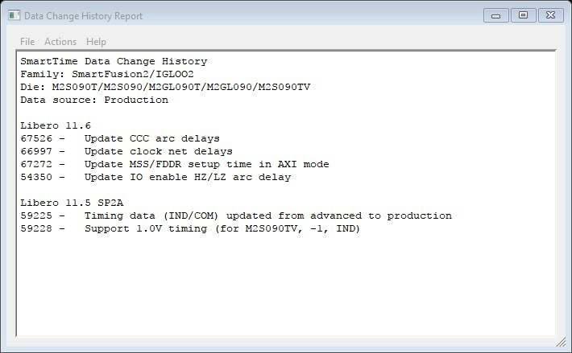

# Data Change History—SmartTime

The data change history lists features, enhancements, and bug fixes for the current software  release that may impact timing data of the current design.

To generate a data change history, choose **Data Change History** from the  **Help** menu to display a data change history in text  format.

**Parent topic:**[SmartTime Dialog Boxes](GUID-F96D2B4E-7DDD-4507-8621-C49A84F55C81.md)

