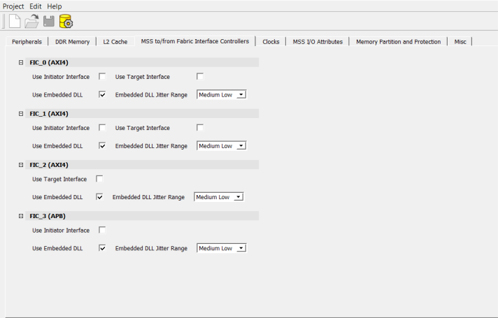

# MSS To/From Fabric Interface Controllers

Using the **MSS to/from Fabric Interface Controllers** tab, any combination of  **FIC\_0**, **FIC\_1**,  **FIC\_2**, and **FIC\_3** can be enabled and  configured to support initiator and target interfaces. For more information, see the [PolarFire SoC FPGA MSS Technical Reference Manual](https://ww1.microchip.com/downloads/aemDocuments/documents/FPGA/ProductDocuments/ReferenceManuals/PolarFire_SoC_FPGA_MSS_Technical_Reference_Manual_VC.pdf).

**FIC\_0**, **FIC\_1**, and **FIC\_2**  support AXI4 interfaces, while **FIC\_3** supports APB.

For **FIC\_0** and **FIC\_1** interfaces, both initiator and  target interfaces can be enabled at the same time. **FIC\_2**  interface can support only target interface, and **FIC\_3** interface  can only support initiator interface \(MSS is initiator\).

**FIC\_0** and **FIC\_1** have both initiator and target  interfaces to and from the FPGA fabric, while **FIC\_2** and  **FIC\_3** support target or initiator interfaces,  respectively.

The **Jitter Range** for the Embedded DLLs can be selected in the  **Fabric Interface Controller** tab. The **Embedded DLL Jitter Range** drop-down has the following options:

-   Low
-   Medium Low
-   Medium High
-   High

**Important:** The default selection is Medium Low.

The following figure shows all FIC options available and enabled. By default, the DLLs of  all the FICs are enabled.

**Important:** The FIC interface can operate up to 250 MHz. The FIC clock is independent of the MSS clock. If the frequency of the FIC block is greater than or equal to 125 MHz, the embedded DLL must be enabled to remove the clock insertion delay. If the frequency of the FIC block is less than 125 MHz, the embedded DLL must be bypassed.

When an initiator interface is enabled for a FIC, that initiator interface must be connected to a  target in the fabric. When a target interface is enabled for an FIC, that target  interface must be connected to an initiator in the fabric.

There is a clock domain crossing logic in the FIC block to address the asynchronous MSS and Fabric clocks and therefore, user logic is not required to implement clock domain crossing synchronization for this interface.

**Note:** The MSS SmartDesign component is visible only after importing the MSS CXZ file.

**Parent topic:**[Using the PolarFire SoC MSS Configurator GUI](GUID-E11D45E3-7975-4122-BA81-72D6BDD0CD1A.md)

**Previous topic:**[Clocks](GUID-0F5E29F2-5A05-4EFF-B799-AB3DF7C74301.md)

**Next topic:**[Peripherals](GUID-D560CB4A-6A33-4FAD-B89B-92B0556648BE.md)

