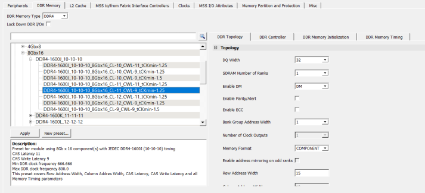
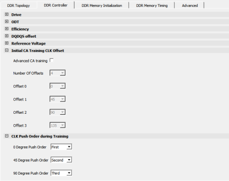
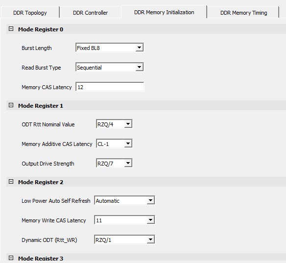
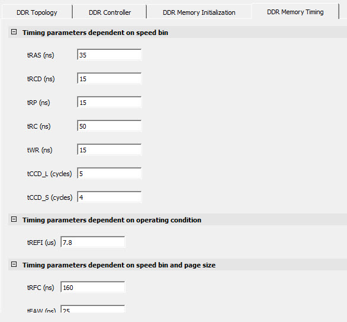
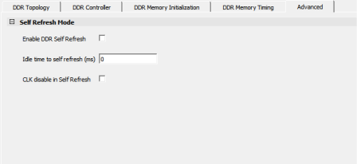

# DDR Memory

Select the required DDR type from the **DDR Memory Type** pull-down. The  DDR configuration options are available on the **DDR Topology**,  **DDR Controller**, **DDR Memory Initialization**, and  **DDR Memory Timing** tabs \(see the following figure\).

For more information about the architecture and functional blocks of MSS DDR Controller, see  [PolarFire SoC FPGA MSS Technical Reference Manual](https://ww1.microchip.com/downloads/aemDocuments/documents/FPGA/ProductDocuments/ReferenceManuals/PolarFire_SoC_FPGA_MSS_Technical_Reference_Manual_VC.pdf). This  section describes the options available in the **MSS Configurator** &gt; **DDR Memory** tab for configuring MSS DDR Controller.

The **DDR Topology** tab, in the following figure, controls the physical  aspects of the memory, such as data and address widths, enabling of ECC and DM, and setting  the clock frequency.

-   For DDR3 and DDR4, the COMPONENT, UDIMM, RDIMM, LRDIMM, and SODIMM memory formats are supported.
-   For LPDDR3/4, only the COMPONENT memory format is supported.

**Important:**

-   Enable the Lock Down DDR I/Os option to lock all the DDR I/Os.
-   Configure the DDR parameters according to the data sheet from the DDR vendor.

The **DDR Controller** tab controls the DQS Drive, ODT, Precharge  look-ahead, and Address Ordering.

The **DDR Memory Initialization** tab controls the DDR mode register  configuration according to the JEDEC specification. In the PolarFire SoC FPGA DDR  architecture, these parameters are passed to the start-up code running on the E51 monitor  core, which then performs the DDR initialization sequence and configures the mode  registers.

The following figure shows the memory initialization configuration.

The **DDR Memory Timing** tab controls the timing parameters, which  are translated to the appropriate configuration values for the DDR subsystem IP.

The **Advanced** tab controls the self refresh mode parameters \(idle time  to self refresh and clock disable in self refresh\).

**Important:** This tab is only supported for LPDDR3 and LPDDR4.

 

 

**Parent topic:**[Using the PolarFire SoC MSS Configurator GUI](GUID-E11D45E3-7975-4122-BA81-72D6BDD0CD1A.md)

**Previous topic:**[MSS I/O Attributes](GUID-6392C9C4-AA6E-4EBA-A8EA-249C4AD964F3.md#)

**Next topic:**[Misc](GUID-7B406484-CA58-47D9-A0C6-E20B090D565C.md)

