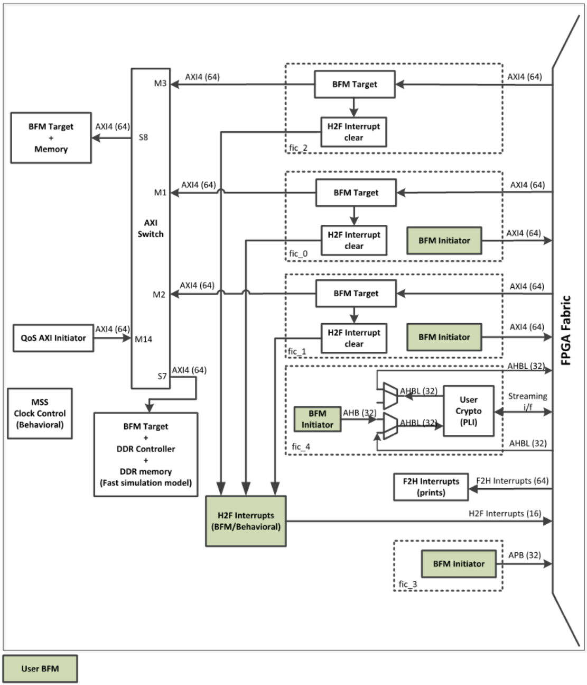

# Introduction

The PolarFire® SoC Microcontroller Subsystem \(MSS\) is modeled with Microchip AMBA Bus  Functional Model \(BFM\) to support functional simulation.

**Important:**

 

1.  For information on the supported instructions and the BFM commands syntax, see [DirectCore Advanced Microcontroller Bus Architecture - Bus Functional Model User's Guide](https://ww1.microchip.com/downloads/aemDocuments/documents/FPGA/ProductDocuments/UserGuides/CoreAMBA_BFM_UG.pdf).

    The MSS BFM based simulation model  provides a simulation environment for the PolarFire SoC FPGA fabric logic by replacing  the MSS system block in a design. Simulation can be useful in the following  applications:

    -   Verifying the connectivity with the FPGA fabric logic.
    -   Addressing peripherals, memories, and so on in the FPGA fabric that are connected to the MSS using the Fabric Interface Controllers \(FICs\).
    -   Accessing MSS-DDR from the FPGA fabric initiator using FICs.
    -   Accessing the Crypto from the FPGA fabric through AHB and streaming interface.
    -   Generation of H2F and F2H interrupts.
    -   Accessing MSS-CPU’s L2-LIM from the FPGA fabric initiator using FICs.
2.  PolarFire SoC MSS simulation model does not support simulation of any of the Peripherals, MSS CPU Core or Core Complex, DDR-RTL Simulation, Cached DDR, MPU, eNVM, and SCB bus.
3.  Older versions of this documentation, uses the terms **Master** and **Slave**. The equivalent Microchip terminology used in this document is **Initiator** and **Target** respectively.

 

The following figure shows the MSS Simulation Model Architecture:

