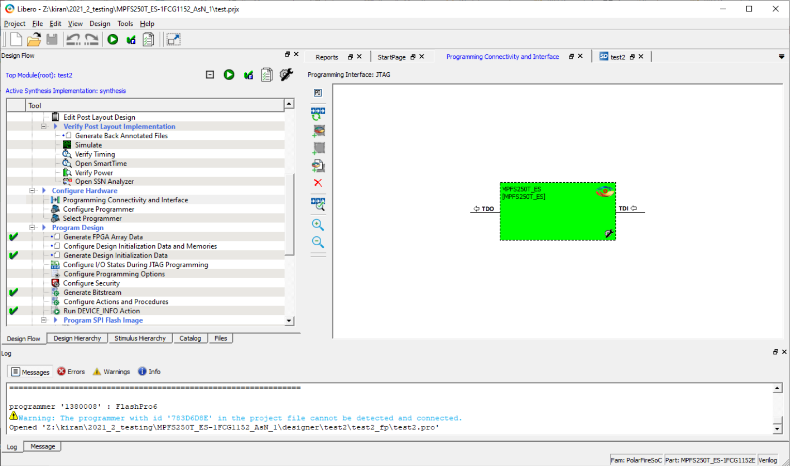
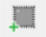
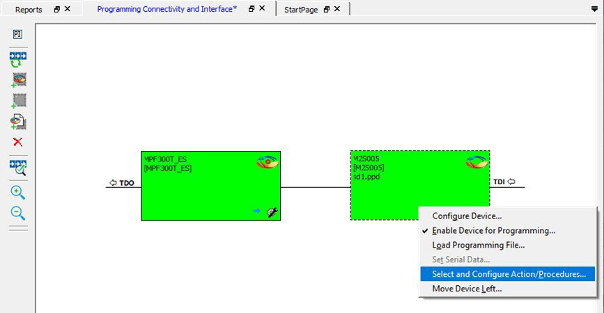
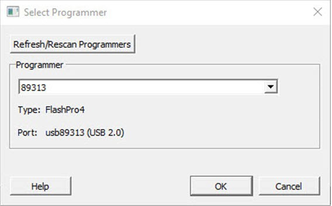

# Configure Hardware

The following sections provide information about configuring the hardware for your designs.

## Programming Connectivity and Interface

The Programming Connectivity and Interface window shows the physical chain from TDI to  TDO or SPI Slave configuration. To open this window, expand **Configure Hardware** in the Libero SoC Design Flow window, and then double-click  **Programming Connectivity and Interface**.

The Programming Connectivity and Interface view provides options for performing the following  actions on non-target devices.

**Note:** If any FlashPro6 programmers are out of date, a message prompts you to update them. Do not disconnect your programmers during the update.

<table id="TABLE_OJP_BGS_J4B"><thead><tr><th>

Option

</th><th>

Icon

</th><th>

Description

</th></tr></thead><tbody><tr><td>

Select Programming Interface

</td><td>

  

 

</td><td>

Select JTAG or SPI Slave mode. SPI Slave mode is supported by  FlashPro6 for PolarFire devices. JTAG is the default interface.

</td></tr><tr><td>

Construct Chain Automatically

</td><td>

  

 

</td><td>

Constructs the physical chain automatically.

</td></tr><tr><td>

Add Microsemi Device

</td><td>

  

 

</td><td>

Adds a Microchip device to the chain.

</td></tr><tr><td>

Add Non-Microsemi Device

</td><td>

  

 

</td><td>

Adds a non-Microchip device to the chain.

</td></tr><tr><td>

Add Microsemi Devices From Files

</td><td>

  

 

</td><td>

Adds a Microchip device from a programming file.

</td></tr><tr><td>

Delete Selected Devices

</td><td>

  

 

</td><td>

Deletes selected devices in the grid.

</td></tr><tr><td>

Scan and Check Chain

</td><td>

  

 

</td><td>

Scans the physical chain connected to the programmer and check if it  matches the chain constructed in the grid.

</td></tr><tr><td>

Zoom In

</td><td>

  

 

</td><td>

Zooms into the grid.

</td></tr><tr><td>

Zoom Out

</td><td>

  

 

</td><td>

Zooms out of the grid.

</td></tr></tbody>
</table>### Hover Information

If you hover your pointer over a device in the grid, the device tooltip shows the  following device information.

|Tooltip|Description|
|-------|-----------|
|Name|User-specified device name. If you have two or more identical devices  in your chain, use this field to give them unique names.|
|Device|Name of the device.|
|File|Path to the programming file.|
|Programming action|When a programming file is loaded, select a programming action for  any device that is not a Libero design device.|
|IR|Length of the device instruction.|
|TCK|Maximum clock frequency, in Hz, to program a specific device; Libero  uses this information to ensure that the programmer operates at a  frequency lower than the slowest device in the chain.|

### Device Chain Details

The device within the chain contains the following details.

<table id="TABLE_MR4_MSS_J4B"><thead><tr><th>

Detail

</th><th>

Description

</th></tr></thead><tbody><tr><td>

Libero design device

</td><td>

Red circle within Microsemi logo. Libero design device cannot be  disabled.

</td></tr><tr><td>

Left/right arrow

</td><td>

Moves the device left or right according to the physical  chain.

</td></tr><tr><td>

Enable device

</td><td>

Enables the device for programming.-   Green: device is enabled.
-   Gray: device is disabled.

</td></tr><tr><td>

Name

</td><td>

Name of your specified device.

</td></tr><tr><td>

File

</td><td>

Path to the programming file.

</td></tr><tr><td>

Set as Libero Design Device

</td><td>

Sets the Libero design device when there are multiple identical  Libero design devices in the chain.

</td></tr></tbody>
</table>### Right-Click Options

The following figure shows the options that appear when you right-click on your  design.

 

 

Right-clicking a device displays the following options.

<table id="TABLE_ZDQ_QTS_J4B"><thead><tr><th>

Option

</th><th>

Description

</th></tr></thead><tbody><tr><td>

Set as Libero Design Device

</td><td>

Sets the Libero design device when there are multiple identical  Libero design devices in the chain.

</td></tr><tr><td>

Configure Device

</td><td>

Reconfigures the device. For a Libero SoC target device, the dialog  box appears, but only the device name can be edited.

</td></tr><tr><td>

Enable Device for Programming

</td><td>

Enables the device for programming.-   Green: enabled devices.
-   Gray: disabled devices.

</td></tr><tr><td>

Load Programming File

</td><td>

Loads the programming file for the selected device. This option is  not supported for Libero SoC target design devices.

</td></tr><tr><td>

Set Serial Data

</td><td>

Displays the Serial Settings dialog box, where you can set your  serialization data.

</td></tr><tr><td>

Select and Configure Action/Procedure

</td><td>

This option applies to devices other than the Libero SoC target  design device. Choices are: -   Select an action to program: Selected action is programmed in the Libero environment and saved to an exported FlashPro Express job.
-   Configure actions and procedures:
    -   Actions: List of programming actions for your device.
    -   Procedures: Advanced option that allows you to customize the list of recommended and optional procedures for an action.

 

</td></tr><tr><td>

Move Device Left/Right

</td><td>

Moves the device in the chain to left or right.

</td></tr></tbody>
</table>## Programmer Settings

For the JTAG interface, you can set specific voltage and force TCK frequency values for  your programmer. For the SPI Slave interface, you can set specific voltage and force SCK  frequency values for your programmer. You perform these actions using the Programmer  Settings dialog box.

To display the Programmer Settings dialog box, in the Libero SoC Design Flow window,  expand **Configure Hardware** and double-click **Configure Programmer**

OR

Right-click **Configure Programmer** and choose **Programmer Settings**.

 

**Note:** SPI Slave mode is supported by FlashPro6 for PolarFire devices.

 

")

 

The Programmer Settings dialog box has options for FlashPro6/5/4/3/3X. The following  table lists the TCK frequency limitations for the selected programmer:

|Programmer|Limitations|
|----------|-----------|
|FlashPro6|1, 2, 3, 4, 5, 6, 7, 8, 9, 10, 11, 12, 13, 14, 15, 16, 17, 18, 19, 20  MHz|
|FlashPro5|1, 2, 3, 4, 5, 6, 10, 15, 30 MHz|
|FlashPro4|1, 2, 3, 4, 5, 6 MHz|
|FlashPro3/3X|1, 2, 3, 4, 6 MHz|

For information about TCK frequency limits by target device, see the target device  datasheet.

During execution, the frequency set by the FREQUENCY statement in the Program-Debug Data  Base \(PDB\)/Standard Test and Programming Language \(STAPL\) file overrides the TCK  frequency setting in the Programmer Settings dialog box. To prevent this override, check  **Force TCK Frequency**

The following list provides the SCK frequency limitations for the selected programmer:

-   1.00 MHz
-   2.00 MHz
-   2.50 MHz
-   3.33 MHz
-   4.00 MHz
-   5.00 MHz
-   6.67 MHz
-   8.00 MHz
-   10.00 MHz
-   13.33 MHz
-   20.00 MHz

### FlashPro5/4/3/3X Programmer Settings

By default, **Force TCK Frequency** is not checked. This setting instructs the  FlashPro5/4/3/3X to use the TCK frequency specified by the Frequency statement in the  PDB/STAPL file\(s\). If you check **Force TCK Frequency**, select the  appropriate MHz frequency.

For FlashPro4/3X settings, you can switch the TCK mode between **Free Running Clock** and **Discrete Clocking**. By default,  **TCK Mode** is set to **Free Running Clock**.  Use **Discrete Clocking** when there is a JTAG non-compliant device  in a chain with Microchip devices.

After you make your selections, click **OK**.

 

**Note:** The **Set Vpump** check box is removed. For older projects prior to Libero SoC v12.5, if **Set Vpump** was checked, the warning `"Set Vpump parameter is obsolete. VPUMP will not be sensed or driven for all devices."` appears in the log window when the design opens for the first time in Libero SoC v12.5.

 

### TCK Setting \(Force TCK Frequency\)

If **Force TCK Frequency** is checked in **Programmer Setting**, the selected TCK value is set for the programmer and the  Frequency statement in the PDB/STAPL file is ignored.

### Default TCK Frequency

If the IPD/STAPL file or Chain does not exist, the default TCK frequency is set to 4 MHz. If more  than one Microchip flash device is targeted in the chain, the  FlashPro Express software passes through all the files and  searches for the `freq` keyword and the MAX\_FREQ  **Note** field. The FlashPro  Express software uses the lowest value of all the TCK frequency  settings and the MAX\_FREQ **Note** field  values.

## Select Programmer

The Select Programmer dialog box allows you to select the programmer you want to use.

To display the Select Programmer dialog box, in the Libero SoC Design Flow window, expand  **Configure Hardware** and double-click **Select Programmer**.

OR

Right-click **Select Programmer**.

Use the drop-down list to select the programmer you want to use. If no programmers are connected,  connect a programmer without closing the dialog box, and then click  **Refresh/Rescan Programmers** to display the connected  programmer in the drop-down list.

