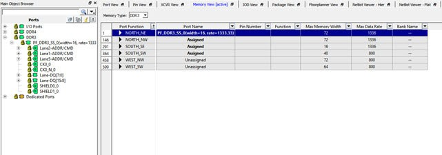

# Memory Type

The supported Memory Interface types include:

-   DDR3
-   DDR4
-   LPDDR3
-   QDRII+

Use the pull-down menu to select the type of Memory Interface used in the design. Only the specific type of memory used in the design are displayed in the pull-down list.

The Ports view also displays the memory width and data rate of the DDR instance in the design \(if it exists in the design\) in the top left row under the Port Name column, as shown in the following figure.

**Parent topic:**[Memory Interface View](GUID-04C2F3E6-C9E6-4210-AF6D-16C492A0BAAA.md)

