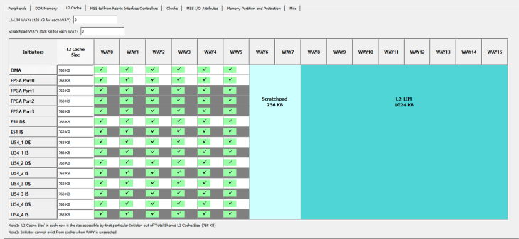

# L2 Cache

Level2 memory subsystem has three operating modes – Cache, Loosely-Integrated-Memory \(LIM\), and Scratchpad. These modes can be configured in MSS configurator using the options in the L2 Cache tab based on user needs. The goal is to make the configuration options easier to use and understand for the users.

You can allocate L2 memory for the processor or peripheral using the **L2 Cache** tab, as shown in the following figure.

In the L2 Cache tab:

-   There are 16 WAYs. WAY0 is always allocated for Cache.
-   In the GUI, the default L2-LIM size will be set at 15 \(WAY1 – WAY15\). This means that 1 WAY \(128 Kbytes\) is configured as L2 cache and 1920 Kbytes is configured as LIM. User can increase or decrease the L2-LIM size to configure the LIM as Cache memory for various processors and peripherals.
-   In the GUI, all the WAYs are enabled for Cache by default. The user can disable the selection to allocate it for Scratchpad.
-   Cache size shows the amount of memory available and is shared among all processors and peripherals.

**Important:**

-   All AXI4 front way ports must be identical.
-   The core D and I Ways have to be identical and hence ways for port 1, 2, 3, and ways for core I are disabled for selection.

**Parent topic:**[Using the PolarFire SoC MSS Configurator GUI](GUID-E11D45E3-7975-4122-BA81-72D6BDD0CD1A.md)

**Previous topic:**[Misc](GUID-7B406484-CA58-47D9-A0C6-E20B090D565C.md)

**Next topic:**[Crypto](GUID-2BCF0FE7-8951-47C2-A2E6-D143E8C923AD.md)

