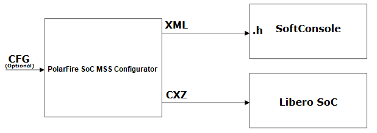

# Installing the PolarFire SoC MSS Configurator

The PolarFire SoC MSS Configurator bundled with Libero is available at the following  location in the Libero installation section:

-     `Windows: <$Installation_Directory>\Microsemi\Libero_SoC_vX.X\Designer\bin64\pfsoc_mss.exe` 

-     `Linux: <$Installation_Directory>\Microsemi\Libero_SoC_vX.X\bin64\pfsoc_mss` 

The PolarFire SoC MSS Configurator can also be installed as a stand-alone  application.

For more information about how to install Libero, see [Libero SoC v12.0 and later](https://www.microchip.com/en-us/products/fpgas-and-plds/fpga-and-soc-design-tools/fpga/libero-software-later-versions#downloads).

## Input and Output Files

The following sections describe the PolarFire SoC MSS Configurator input and output  files.

### Output Files

The PolarFire SoC MSS Configurator generates the output file formats as shown in  the following figure.

-     **XML Configuration File** — Contains the MSS memory map, clock,  DDR memory controller, and peripheral configuration. The XML file is used to generate  hardware files required for building the firmware project.

-   **CXZ File** — Encapsulates the hardware design of the MSS block and can be imported into Libero SoC project.

### Input files

The PolarFire SoC MSS Configurator can be invoked without any input files. A configuration file  `(.cfg)` from an earlier MSS configurator session can be optionally provided  to the PolarFire SoC MSS Configurator.

**Note:** A `.cfg` file and a report file can also be generated from the PolarFire SoC MSS Configurator.

