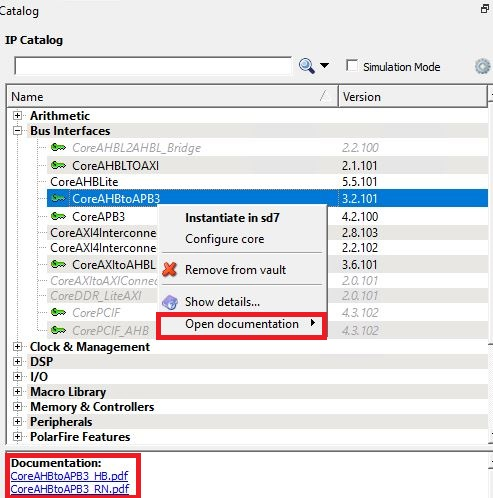

# Appendix-Accessing IP Core Documentation

The IP cores are integrated with the Libero® SoC Design Suite. The use of IP  cores not only shortens the design cycle time but also provides proven and reliable  design components for re-use in multiple applications. The IP Catalog in Libero provides  an interface to access and manage the entire set of IP cores and their documentation.

To access the IP Core documentation, follow the steps:

1.  In Libero SoC, click the **Catalog** tab and select an IP core. The documentation associated with the IP core are listed under the **Documentation** view on the **Catalog** tab.
2.  Alternatively, right click on any IP core in the IP **Catalog**.
3.  Select **Open Documentation** from the context menu that appears. A list of the various documents available for the selected core appears.
4.  Click on the required document to open it.

