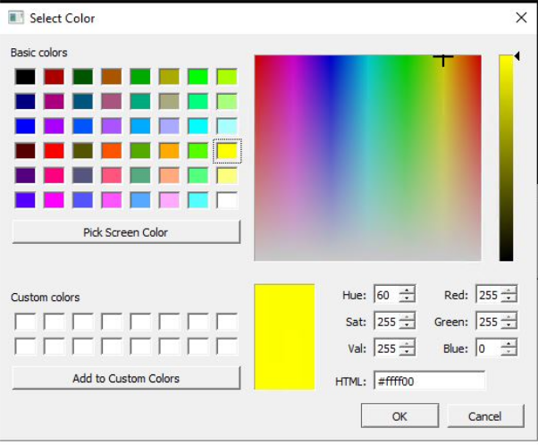

# Changing the Color Setting

To change the color from the default settings and set your own preference:

1.  Click the color icon of the item you want to change.
2.  In the color palette dialog box, drag the cross-bar across the color spectrum and select the desired color.
3.  Click **OK**.

**Parent topic:**[Color Selection](GUID-4C76A995-B0CA-4C88-9E8A-0A91AB36D9A2.md)

